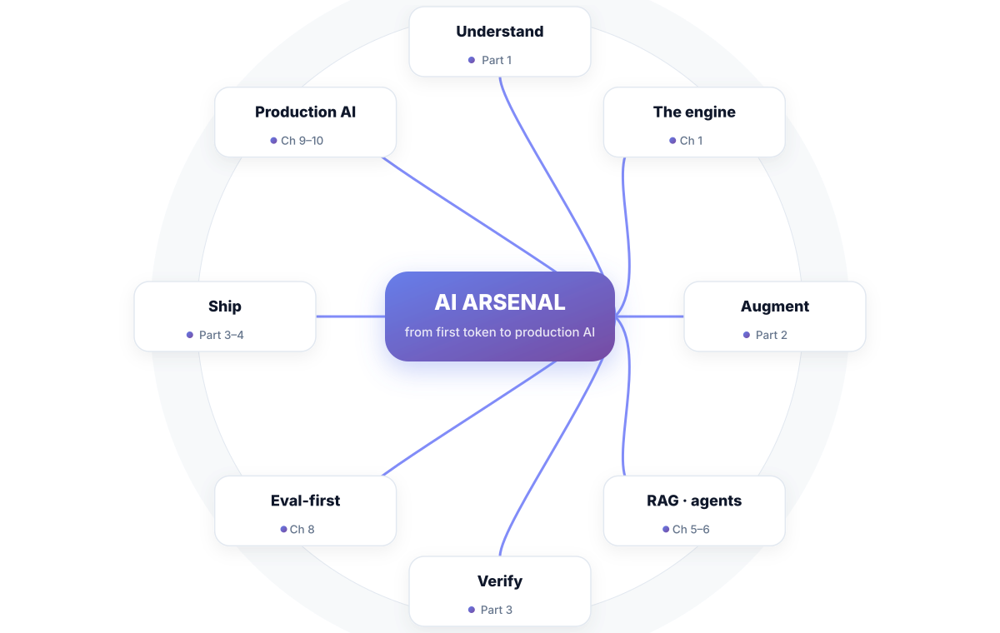
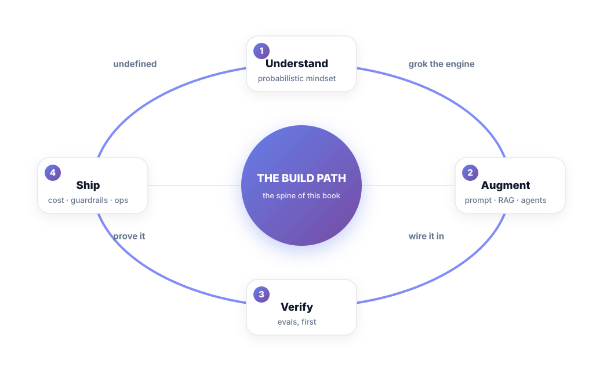
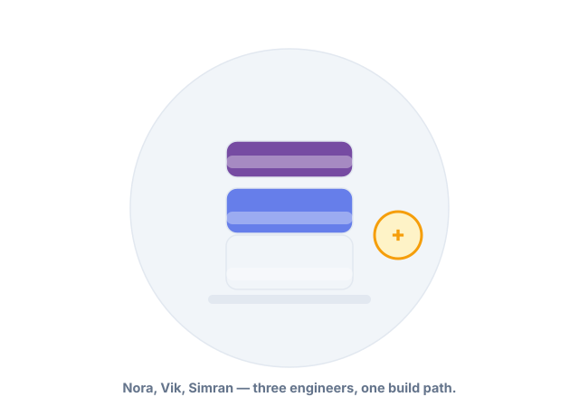
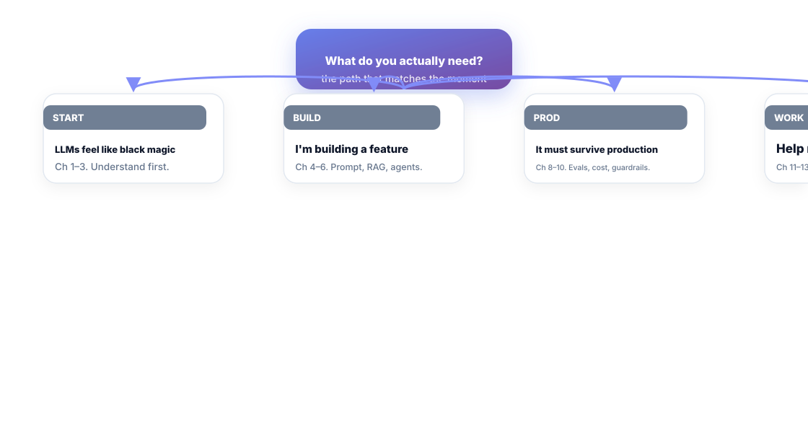

# AI Arsenal

**Real Engineering — Beyond the Tutorial**

*LLMs, RAG, AI-assisted coding, and production AI — practical tools for the engineer who wants to stay ahead of the shift.*

---

## Preface

The revolution ships in tokens, and nobody sends a memo.

Somewhere up the stack, your team is asked to "put AI in it" — and the tutorials stop exactly where the work starts. Prompt-wizardry got you a demo; it won't get you a feature. What the shift actually demands isn't more hype — it's an **engineer's toolkit**: knowing what an LLM really is, how to wire one into a real system without it silently lying, how to measure it, and how to budget it until it's boring. Boring is the goal. Every reliable AI system you've used is boring on purpose.

This book is that toolkit. It exists because AI features die in production not from model capability but from a missing method: no way to define success, no way to judge it, no idea what a request actually costs. The Build Path fixes that with a constant loop: **Understand → Augment → Verify → Ship**, evaluation first, always.

You are Nora, Vik, or Simran in every chapter. Nora is putting an LLM feature into a real product and needs it to behave. Vik is a backend engineer who wants AI-assisted coding to make him faster and not braver. Simran owns evals and the production AI stack, and her rule is: if it isn't scored, it doesn't ship. They're not characters — they're your three seats, and the Build Path runs in all three.

One promise before we start: ship one small, measured, boring AI tool inside twelve weeks, and the hype stops being noise. The measured win is the product. This book is the build plan.

Welcome to the build path.

---

## Introduction — How to Use This Book

*The whole book, on one page. The path is the book.*

One idea carries the whole thing:

> **The Build Path — Understand → Augment → Verify → Ship.** Every production AI skill is one stage of this path, and the book runs the path in order.

- **Part 1 — Understand the Engine.** Chapters 1–3. What an LLM actually is, what it's good at, and how to make a random machine behave on purpose.
- **Part 2 — Augment.** Chapters 4–7. Prompting as engineering, retrieval, agents, and fine-tuning — the tools that turn a chat model into a feature.
- **Part 3 — Verify & Ship.** Chapters 8–10. Eval-first development, token math, latency, and the guardrails that make AI safe enough to run.
- **Part 4 — The Working Engineer.** Chapters 11–13. AI-assisted coding done deliberately, picking projects with real ROI, and the 12-week build plan.

### The pattern in every chapter

Same skeleton as the whole book family: **Scenario → the idea → figures → Short version → Do this → Knowledge check.** Plus prompt snippets and eval sketches where they belong — this book's advice is buildable by a working engineer, this quarter.

### Three engineers, three seats

- **Nora** — platform/data engineer building an LLM feature. Follows Parts 1–3.
- **Vik** — backend engineer adopting AI-assisted coding. Follows Part 4 first, then Part 2.
- **Simran** — owns evals and production AI. Lives in Part 3 and carries the scorecards.

---

## Reader Navigator — Start Where It Hurts

| If you are… | Start with… | Then… |
| :--- | :--- | :--- |
| LLMs feel like black magic | Ch 1–3 | Ch 4 (prompting) |
| Building an AI feature | Ch 4–6 | Ch 8 (evals) |
| It must survive production | Ch 8–10 | Ch 9 (cost, latency) |
| Help me work smarter | Ch 11–13 | Ch 11 (coding) |

If you only ever read one chapter, it's **Chapter 8 — Eval-First Development.** Everything else clicks once you can score an output instead of vibing it.

---

## A Living Book

Models, tooling, and token prices drift fast, so this book is versioned like software, and refined editions are part of what you bought.

| Version | What changed |
| :--- | :--- |
| 1.0 | First edition. The Build Path, 13 chapters, eval kit + artifact kits. |
| 1.x | Model changes, price-shock notes, road-tested prompts. **Free for buyers.** |

Now open Chapter 1 — and remember: an LLM is not a computer. It's a guesser with a context window. That single fact explains every triumph and every disaster that follows.

---

## The Build Path — Postcard

> **UNDERSTAND** — tokens, context, and a next-token guesser that is not a computer (Ch 1–3).
> **AUGMENT** — prompting, retrieval, agents, tuning; the tools, used deliberately (Ch 4–7).
> **VERIFY** — eval-first development; you only improve what you score (Ch 8).
> **SHIP** — token math, latency budgets, guardrails; AI that survives contact (Ch 9–10).
> **WORK** — AI-assisted coding and the 12-week plan (Ch 11–13).
> **RUN** — the AI self-audit and the five numbers (back matter).