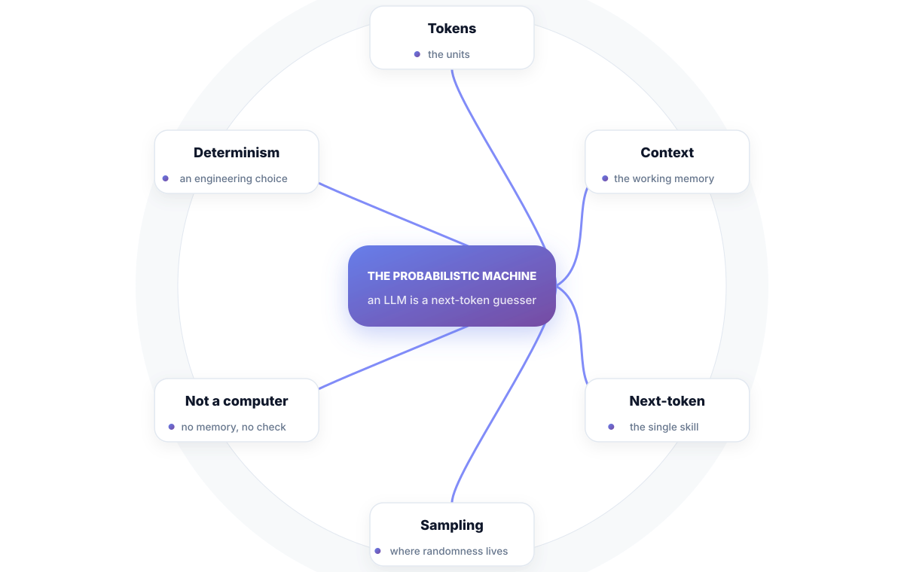
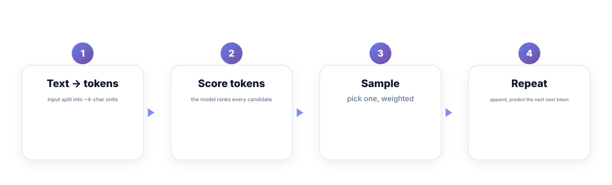
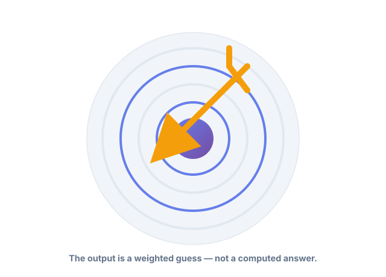

# Chapter 1. The Probabilistic Machine

## Scenario

Nora's team demoes a review-summarizer. It nails the demo three times, then answers "how many servers do we run?" with a confident number — 47 — that is entirely invented. The room laughs; the boss frowns. Nora has no idea what just happened.

The answer is the machine itself. This chapter explains what an LLM actually is — and why "47" was a guaranteed coincidence, not a bug.

## The machine is not a computer

An LLM is a **next-token guesser**. You hand it a string, and it hands you back its best guess for what comes next — one tiny unit at a time. That's the entire engine. Everything else is plumbing.

1. **Tokens** — the units it reads. Roughly four characters each. "Hello world" is usually three or four tokens.
2. **Context** — the working memory. Everything in the window influences the next guess; everything outside it *does not exist to the model*.
3. **Next-token** — the one skill. It isn't answering; it's continuing the story in a plausible way.
4. **Sampling** — where randomness lives. The model scores every candidate token, then picks — usually weighted toward the best, sometimes not.

That's the whole thing. There is no memory chip, no fact database, no inner check for "is this true?". The machine optimizes for *smoothness of continuation*, and smoothness is not truth.

## Why it lies so confidently

A computer guarantees: same input → same output → same meaning. An LLM offers none of those. It produces the *most plausible-sounding* continuation, and plausibility has no opinion about the facts.

That's not a bug you can patch — it's the definition of the machine. Which is why the entire discipline of working with these things is about the *surroundings*, not the model: you control the input, you constrain the output, you score results, and you design so that a fabricated answer costs your users nothing.

## Short version

- An LLM is a next-token guesser: it writes the most plausible continuation.
- Tokens are its units; the context window is its entire working memory.
- Randomness lives at sampling time — temperature is the dial on it.
- Smoothness is not truth. Design for that, not against it.

## Do this

Run one session with temperature=0 and the same prompt five times, then with temperature=1. Count how the answers vary. Then change one word in the prompt and watch the whole meaning swing. You'll never again describe an LLM to someone as "a really smart computer" — and that phrase should now make you wince, because it's the root of every expectation this book exists to correct.

## Knowledge check

1. What is the one skill an LLM has, in four words?
2. Where does "randomness" actually live in generation?
3. Why is "it's a smarter computer" a harmful way to think about it?