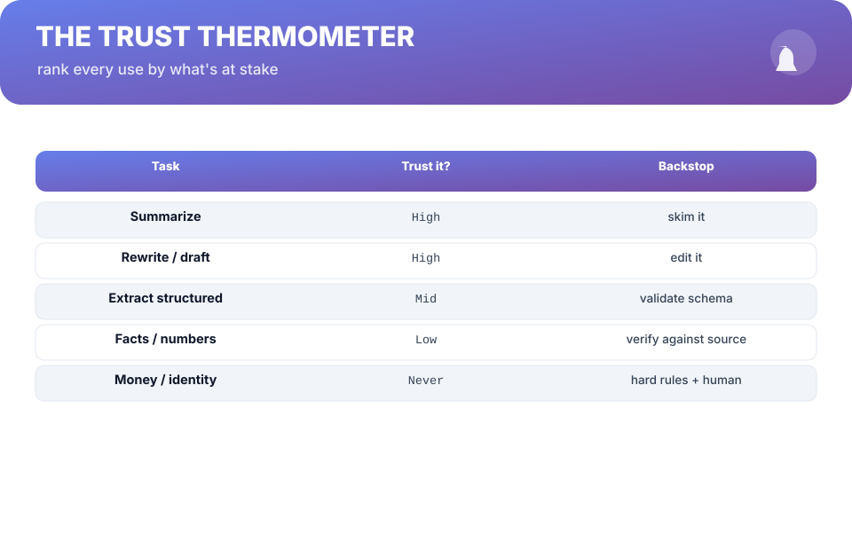
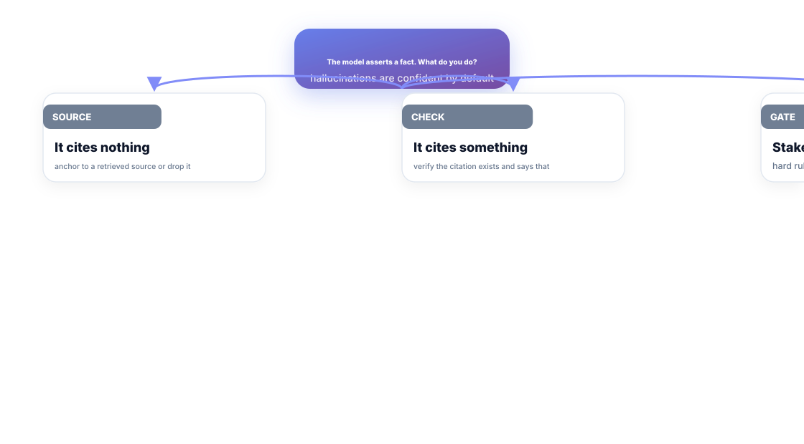
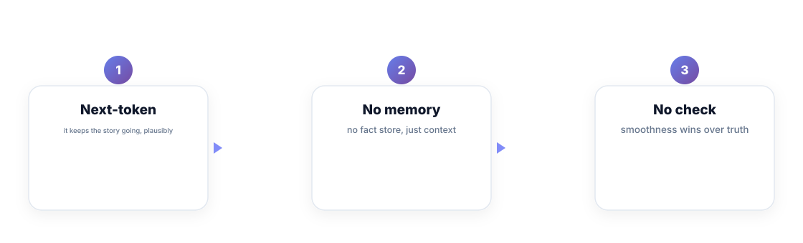

# Chapter 2. Capabilities and Honest Limits

## Scenario

Vik pushes an LLM that rewrites support replies — then it "fixes" a customer's order number. Nobody catches it for a day. The feature wasn't malicious; it was *unbounded*. Vik trusted a guesser with money.

This chapter is the budget of trust: what these models genuinely own, and what they must never be left alone with.

## The trust thermometer

Rank every idea by two questions: **What's the cost of a wrong answer?** and **Can a machine check itself?** The answers put every task on a ladder:

- **Skim / rewrite** — high trust. A wrong summary costs seconds; a human reads it anyway.
- **Extract structured data** — mid. Validate the *shape*, not the content.
- **Facts, numbers, money, identity** — never. Those get hard rules and human gates, always.

The pattern: **trust in proportion to consequence, and backstop in proportion to trust.** The model doesn't get more reliable on high-stakes tasks; the *system around it* gets stricter.

## Hallucinations are the default setting

A hallucination isn't a glitch where the model "breaks" — it's the model *working exactly as designed* and slotting in the most plausible-sounding thing for a gap it can't fill. Three things make it dangerous:

1. It's confident. The guess has zero internal uncertainty signal you can read.
2. It's smooth. "47 servers" reads like a sentence a human verified.
3. It varies. The same question, re-asked, produces a different confident number.

## What the machine is genuinely good at

Hold onto the honest list, because it's long and useful:

- Rewriting tone, first drafts, summaries, boilerplate.
- Pattern work: classification into buckets you define, formatting, translation between styles.
- Drafting code and tests — best when a human reviews the shape.
- Acting as an *accelerant for a person who verifies*, never as a judge in the loop that decides money or identity.

## Short version

- Trust in proportion to consequence; backstop in proportion to trust.
- Hallucination is the default, not a bug — it's the model being smooth.
- No internal signal tells you when the guess is wrong.
- High-stakes AI is a people-and-rules problem wearing a model wrapper.

## Do this

Take your AI feature idea and draw the trust thermometer for it: write the one sentence of "what happens if the model is wrong here". If that sentence costs time, keep the model with a human edit pass. If it costs money, identity, or a customer's trust — give the model zero authority, and make the human approval the only path through. Then say the sentence out loud in the next review. It's the cheapest risk audit you will ever run.

## Knowledge check

1. When does "trust it, human backstops" apply?
2. Why is a hallucination not a software crash?
3. Which class of task should a model never decide on alone?