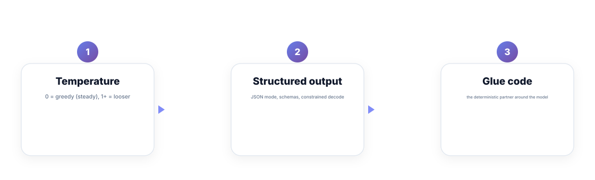
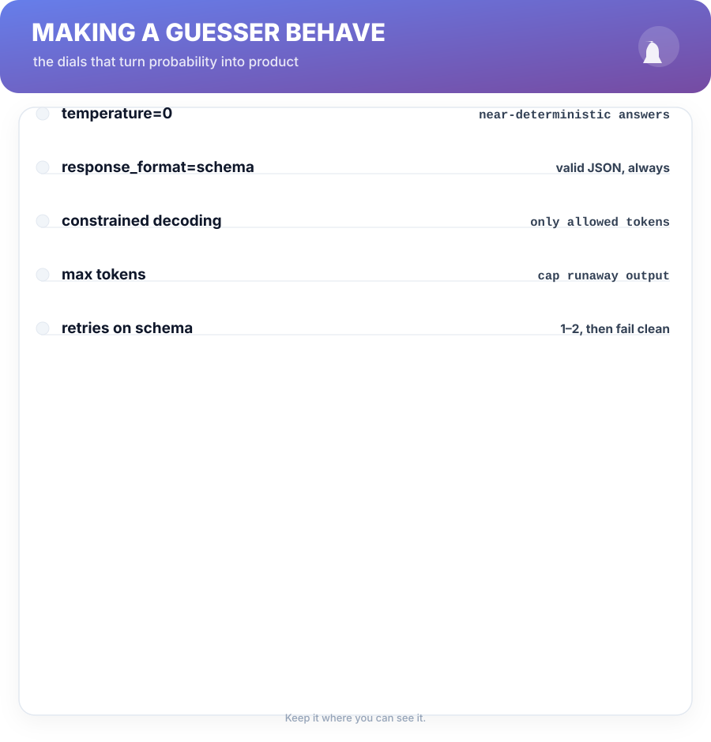
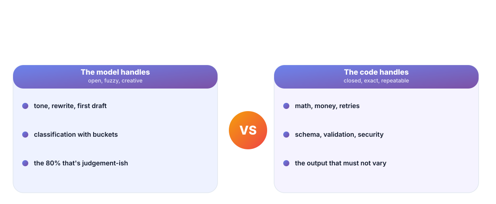

# Chapter 3. Determinism on Purpose

## Scenario

Simran's feature returns `{"result":"OK"}` one call and `{"Result": "ok"}` the next. The integration tests flap. The FE engineers demand stability; the model refuses to be a database.

They're right, and the answer isn't "prompt better" — it's **make the unpredictable thing predictable by design**: the dials, the structure, and the glue.

## The dials that turn probability into product

Three levers, in order of power:

1. **Temperature** — 0 is near-greedy (same input, near-same output); higher values loosen the pick. Set it to 0 for anything a test touches; raise it only where variation is the product (drafting, ideation).
2. **Structured output** — JSON mode and response schemas force the shape. The model may still hallucinate *values*; it can no longer hallucinate *format*.
3. **Glue code** — the deterministic partner. Validation, retries, type checks, and fallbacks live in *your* code, not the prompt.

Key number: **temperature=0 + schema-constrained output** shrinks the surprise space from "every token" to "garbage in the value slots". That's the whole trick.

## Structured output, done right

Ask for a schema and the API guarantees valid JSON — but not correct JSON, and not valid-for-your-domain JSON. Validate on your side:

- Parse and type-check every field. A wrong key now is a crash later.
- Re-run once on schema failure; then return a clean error. Infinite retries just burn tokens on a model that's having a bad day.
- Treat "yes/no/unknown" as three classes, not two. Forced binary on a guesser is how you get confident nonsense.

## Glue code is the real AI feature

The boring parts are the product. The model *suggests*; the code *decides*. Money math, permissions, retries, schema, security — none of it belongs in the prompt, because none of it can tolerate guesswork. A well-built AI feature is 10% model and 90% the deterministic system that lets the 10% add value without being trusted.

## Short version

- Temperature 0 for anything a test touches; higher only when variation is the product.
- Schemas and structured output fix the format, never the facts.
- Validation, retries, and fallbacks are your code, not your prompt.
- The real feature is the deterministic system around the model.

## Do this

Take one prompt you use repeatedly and make it return a schema: define the exact JSON, set temperature to 0, and write the five-line validator for it on your side. Then re-run the same ten inputs and confirm the output shape never varies. That's the moment deterministic AI gets real — format locked, validator passing, variety exiled to the value slots where your code can handle it.

## Knowledge check

1. What does temperature=0 actually do to generation?
2. What does structured output guarantee, and what does it not?
3. Why should validation, retries, and fallbacks live in code rather than the prompt?