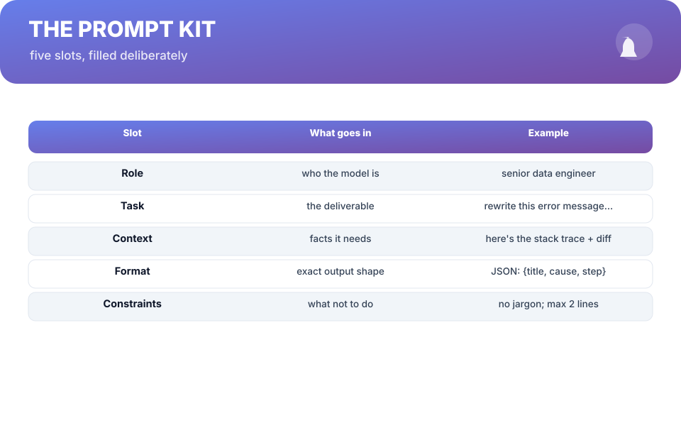
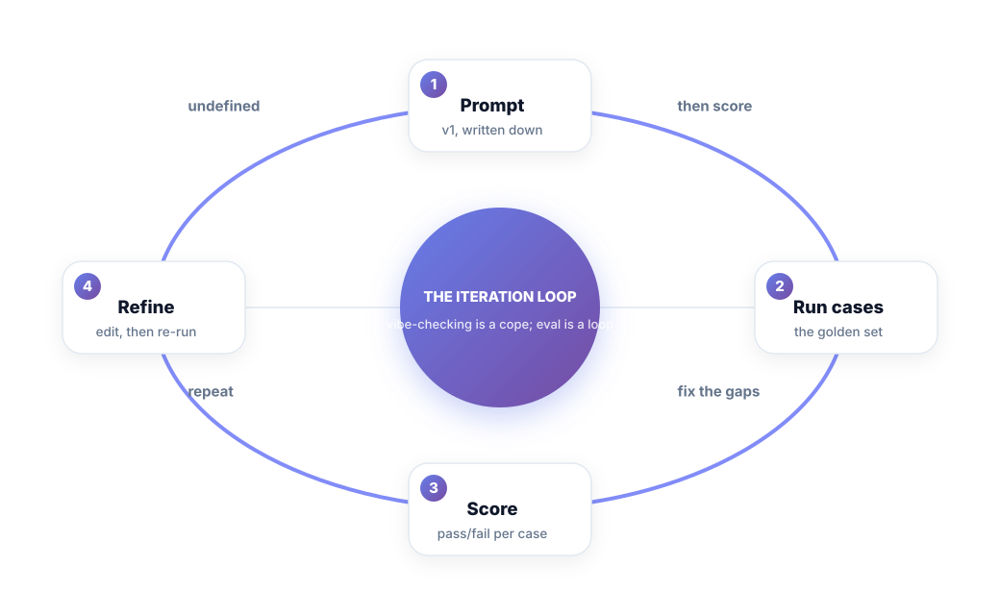
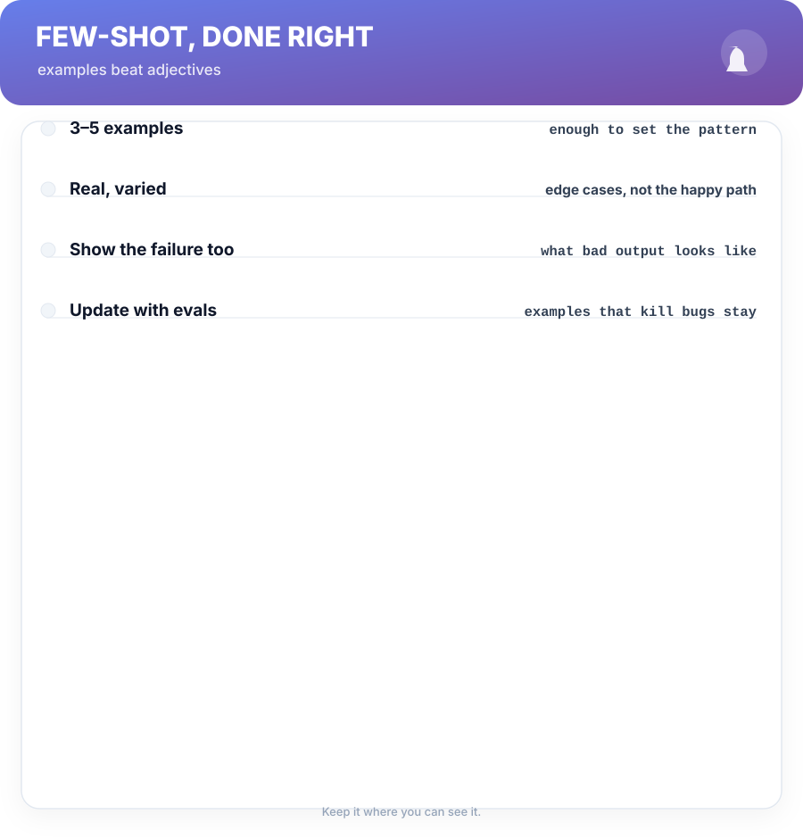

# Chapter 4. Prompting as Engineering

## Scenario

Vik's team has a prompt. It works, mostly, and nobody can say why. When it fails, someone mutates a phrase, "tests" it on two examples that happened to look good, and ships. The prompt is a roulette wheel with good intentions.

This chapter replaces roulette with a kit and a loop.

## The prompt kit

Every prompt that earns its place in your codebase fills five slots on purpose:

1. **Role** — who the model is being. "Senior data engineer" beats "assistant" because it biases tone and format.
2. **Task** — the deliverable, stated as a verb. "Rewrite this error message…" not "help with errors".
3. **Context** — the facts the task needs, and nothing else. Clutter is not a feature; it's drift.
4. **Format** — the exact output shape, first-class. A schema in the prompt is half the game.
5. **Constraints** — the negative space: what not to do, what not to invent, where to stop.

The kit's point is *reproducibility*: two prompts that differ by one word should differ *because you chose that*, not by accident. Version your prompts like code. A prompt you can't show your future self is a liability, not a lever.

## The iteration loop — eval, not vibe

The amateur loop is feel: tweak a word, look at one output, guess. The engineering loop is measurement:

1. **Prompt, v1** — written down, versioned, from the kit.
2. **Run cases** — the golden set (Chapter 8 builds it): 20–50 real inputs, each with an expected output.
3. **Score** — pass/fail per case. A number, on a sheet.
4. **Refine** — edit against the failures *you can see*, then re-run.

Two passes of this loop outperform a week of "vibe-checking". And "the prompt works" stops being an opinion and becomes "it scored 47/50 on this set, and these three failures are the known gaps".

## Few-shot, done right

Examples beat adjectives. Instead of "be concise and professional", show three real input→output pairs. Rules for the examples:

- 3–5 examples is usually enough; more is often noise.
- Make them real and varied — the edge cases and failure modes included, not just the happy path.
- Show a *bad* output once, labeled as such. Models learn "what to avoid" faster than you'd think.
- Feed the loop: when an eval fails a case, the case joins the prompt as an example. The prompt literally grows a memory of its own mistakes.

## Short version

- Fill the five-slot kit: role, task, context, format, constraints.
- Version prompts like code; reproducibility is the point.
- Iterate with a scored golden set, not with vibes.
- Few-shot: 3–5 real examples, edge cases included, mistakes taught.

## Do this

Rewrite your current prompt into the five-slot kit in a new file called `prompt-v2.md`. Then run the same ten real inputs through v1 and v2, side by side, and grade each output pass/fail *before you look at it*. Show the two score columns to your team. If v2 isn't equal or better, you've still learned exactly where the kit is weak — on a labelled set, in an afternoon, with a number. That's engineering.

## Knowledge check

1. Name the five slots of the prompt kit.
2. What makes the engineering loop different from "tweak a word and look"?
3. Why would you ever include a bad example in your few-shot set?