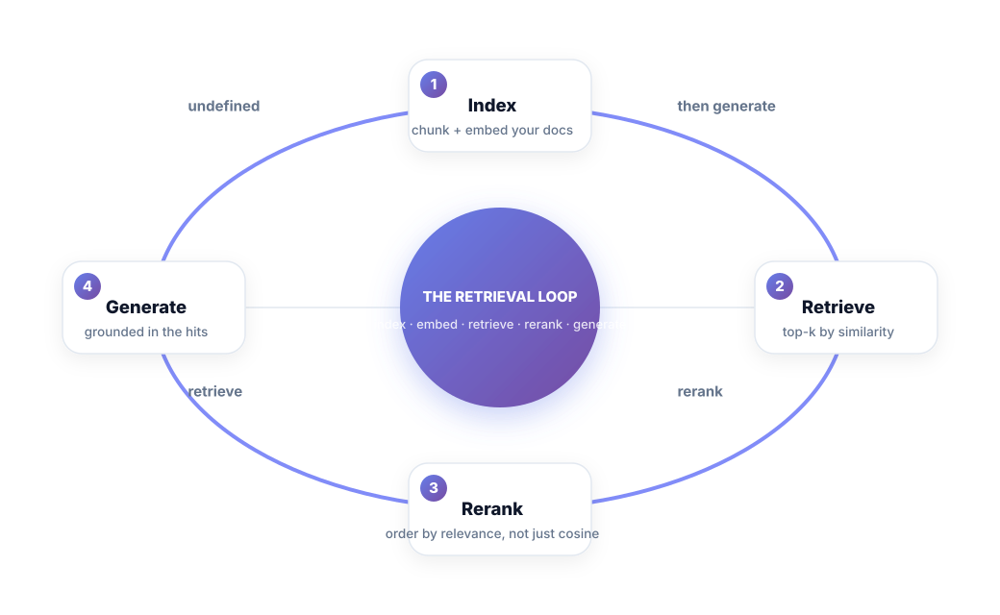
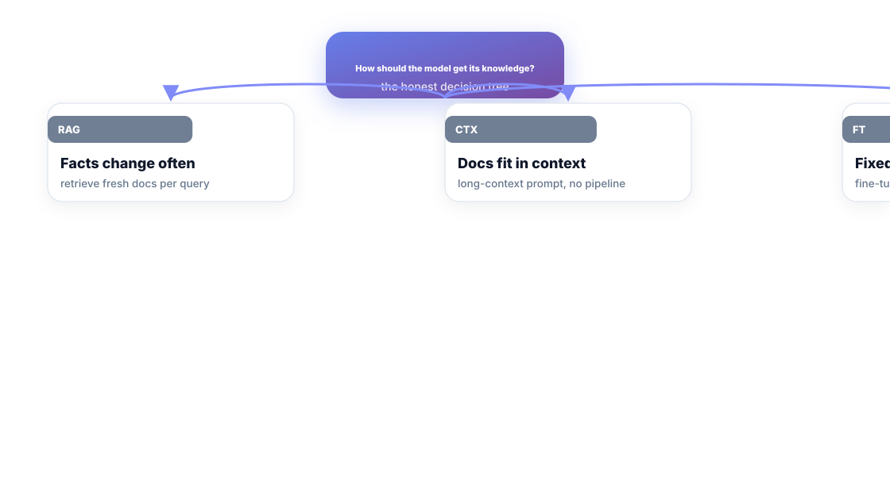
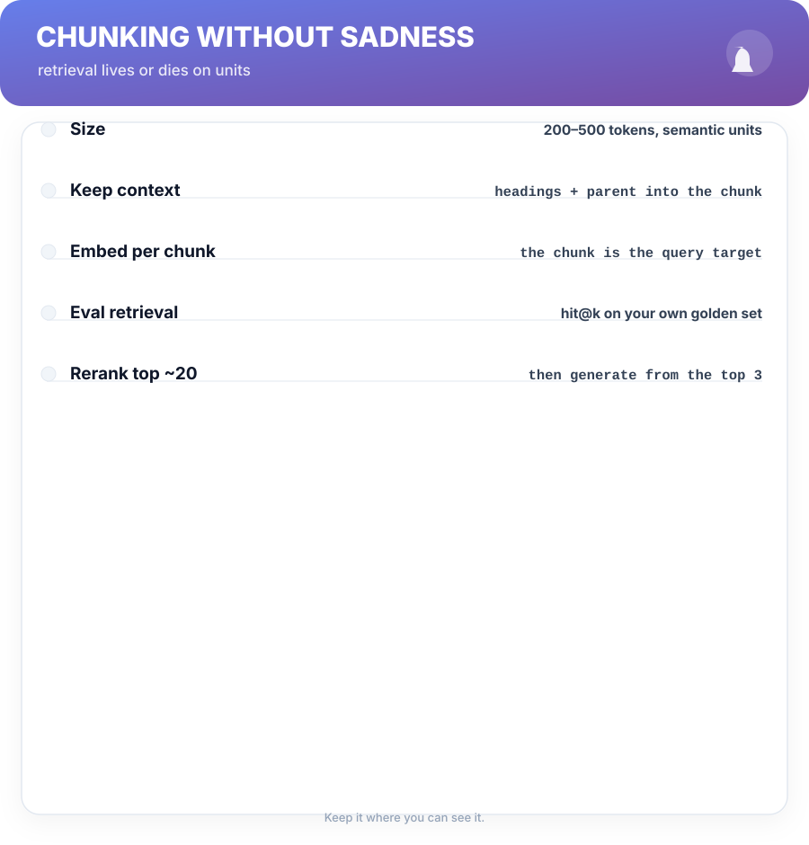

# Chapter 5. RAG Done Right

## Scenario

Nora builds a document assistant over her company's 4,000-page knowledge base. First version: dump everything in the prompt. Latency explodes, and the model answers fine on page 12 of the docs but confidently wrong about page 3,404 — because it never got that far.

Retrieval-Augmented Generation fixes the wrong axis: instead of *more context*, it finds the *right context*, then grounds the answer in it.

## The retrieval loop

1. **Index** — chunk your documents into semantic units and embed each chunk (a vector that captures its meaning).
2. **Retrieve** — embed the question, grab the top-k most similar chunks.
3. **Rerank** — reorder by true relevance. Cosine similarity is a filter, not a verdict.
4. **Generate** — answer with only those hits in the context, and instruct the model to cite them.

The whole loop exists to make this sentence true: **the model's answers are grounded in chunks the user's question actually pulled.** What's not retrieved cannot be invented into the context; what's in the context has a source you can check.

## The honest decision tree

RAG is not the default answer for every "knowledge" problem:

- **Facts change often** → RAG. Fresh retrieval beats stale weights.
- **Docs fit in the context window** → long-context prompt, no pipeline. Simpler is better.
- **Fixed style, many forms** → fine-tune (Chapter 7). You're teaching form, not facts.
- **Facts are big and static** → RAG, and invest in retrieval quality, not more tokens.

## Chunking without sadness

The unit you chunk determines everything downstream:

- **Size** — 200–500 tokens, split on semantic boundaries (sections, paragraphs), not hard character counts.
- **Carry context** — embed heading + parent section into every chunk, or retrieval returns lose orphans.
- **Quality over count** — an average of 400 chunks done well beats 4,000 chunks done dumb.
- **Eval your retrieval** — hit@k on your own golden set (Chapter 8). If the right chunk isn't in the top 3, the RAG is broken — and no amount of prompt polish fixes a retrieval gap.

## Short version

- Index → retrieve → rerank → generate: ground every answer in retrieved chunks.
- Use RAG for facts that change; long context for docs that fit; tuning for form.
- Chunk on meaning, 200–500 tokens, heading context carried along.
- Measure retrieval with hit@k. No eval, no idea if it works.

## Do this

Take ten real questions your assistant must answer. For each, open the source doc, find the exact chunk/paragraph that holds the answer, and write those ten (question → chunk-id) pairs into a working file. That's your retrieval golden set — before you write a single line of RAG. Build the retrieval, then score hit@3 on the set. If any right chunk isn't in the top three, the pipeline is broken before generation even runs; fix retrieval first.

## Knowledge check

1. What does "chunk on semantic boundaries" mean, concretely?
2. When should you NOT use RAG for a knowledge problem?
3. What would "hit@3 = 0.7" tell you about your retrieval?