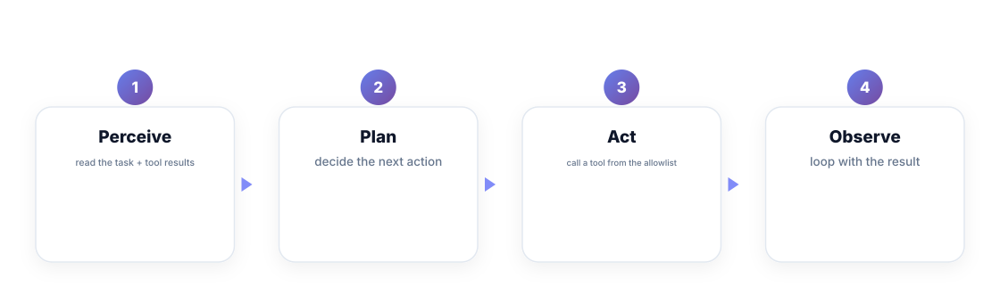
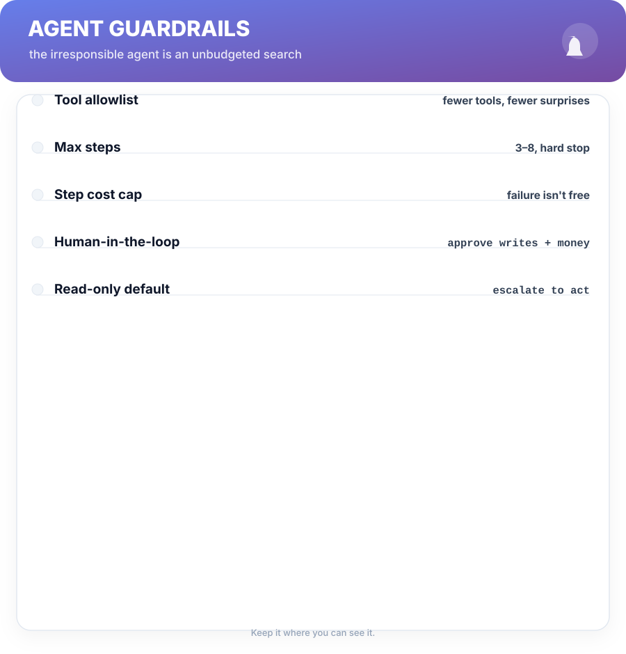
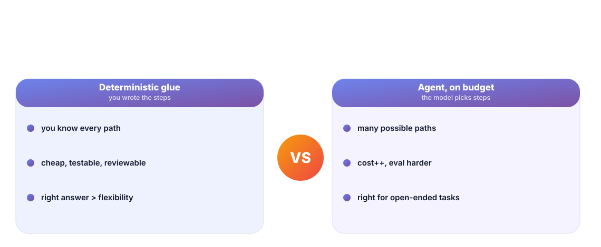

# Chapter 6. Agents & Tool Use

## Scenario

Simran's team ships an "agent" that can query the database. It's magnificent. Two weeks later it has run a runaway loop of 1,400 calls, spent a weekend's GPU budget, and nobody is sure exactly what it touched before the kill switch. The agent worked, and that was the problem.

The irresponsible agent is usually a failed *budget*. This chapter sets the budgets.

## The agent loop

An "agent" is just the loop from Chapter 1 with tools: the model reads a task, picks an action, calls a tool (search, database, code), reads the result, and repeats. The power and the danger are the same thing — **the model chooses the steps**:

- **Perceive** — read the task and the last tool result.
- **Plan** — decide the next action, from a list you gave it.
- **Act** — call a tool on the allowlist, with your parameters and budget.
- **Observe** — fold the result back in and loop. Until you stop it.

## Guardrails are the product

The loop is untamed by default. Before it touches anything, wire the caps:

- **Tool allowlist** — fewer tools, fewer surprises. Only the ones whose outcomes you can predict.
- **Max steps** — 3–8, hard stop. Not "until it's done"; a number. A loop that can't end has no business running.
- **Cost cap** — a per-run token budget. Failure isn't free; the budget makes failure finite.
- **Read-only default** — write and money actions require human approval. The agent proposes; the human disposes.
- **Kill switch** — one command, known to the team, documented where the run logs start.

An agent with these five is a *tool*; an agent without them is a *liability with good luck*.

## When an agent is actually the right tool

Most workflows that "feel agentic" shouldn't be. If you know the steps — call, then format, then the fixed retry — write the loop yourself. It's cheaper, testable, and you've seen every path. Save the agent for genuinely open-ended tasks: "find and fix the failing tests on this branch" has an unbounded step space, and that's exactly where an allowlisted, budgeted agent earns its keep.

The filter: **if you can write the loop, write the loop.** Let the model choose steps only when you genuinely can't enumerate them.

## Short version

- An agent is the next-token loop with tools: perceive, plan, act, observe.
- The danger of choosing steps is answered with allowlists and budgets.
- Set a max step count, a cost cap, and a kill switch before first run.
- If you can write the loop, write the loop; agents are for the open-ended.

## Do this

Write the five guardrails for your would-be agent on one index card — tool allowlist, max steps, cost cap, human approval for writes, kill switch — and put it where the run logs start. Then wire three of them before the first real run: allowlist, a hard step cap, and the cost cap. You've just converted "we have an agent" from a brag into a budgeted tool its maintainers can sleep next to.

## Knowledge check

1. What are the four stages of the agent loop?
2. Why is "until it's done" not a valid stopping condition?
3. When is deterministic glue code better than an agent?