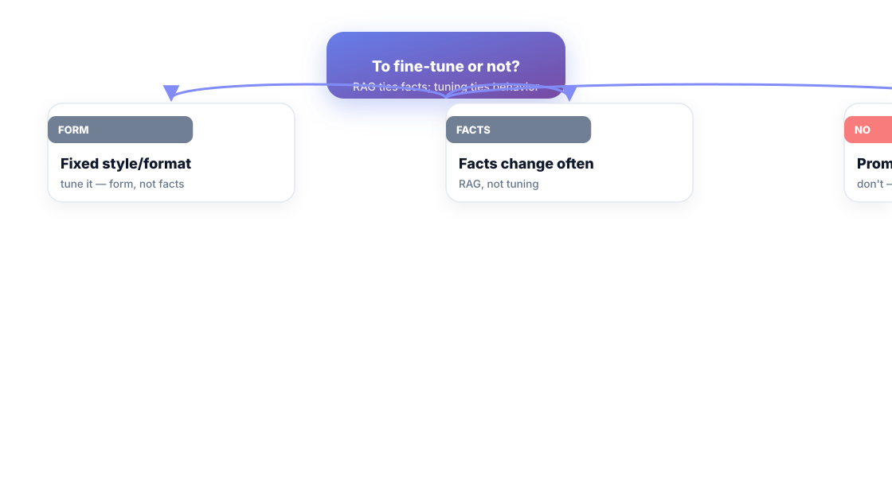
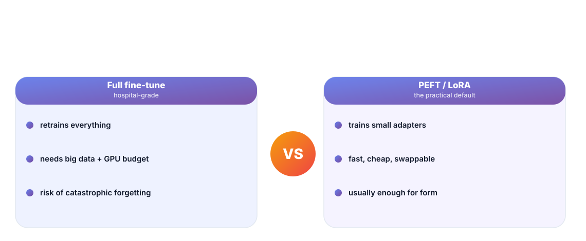
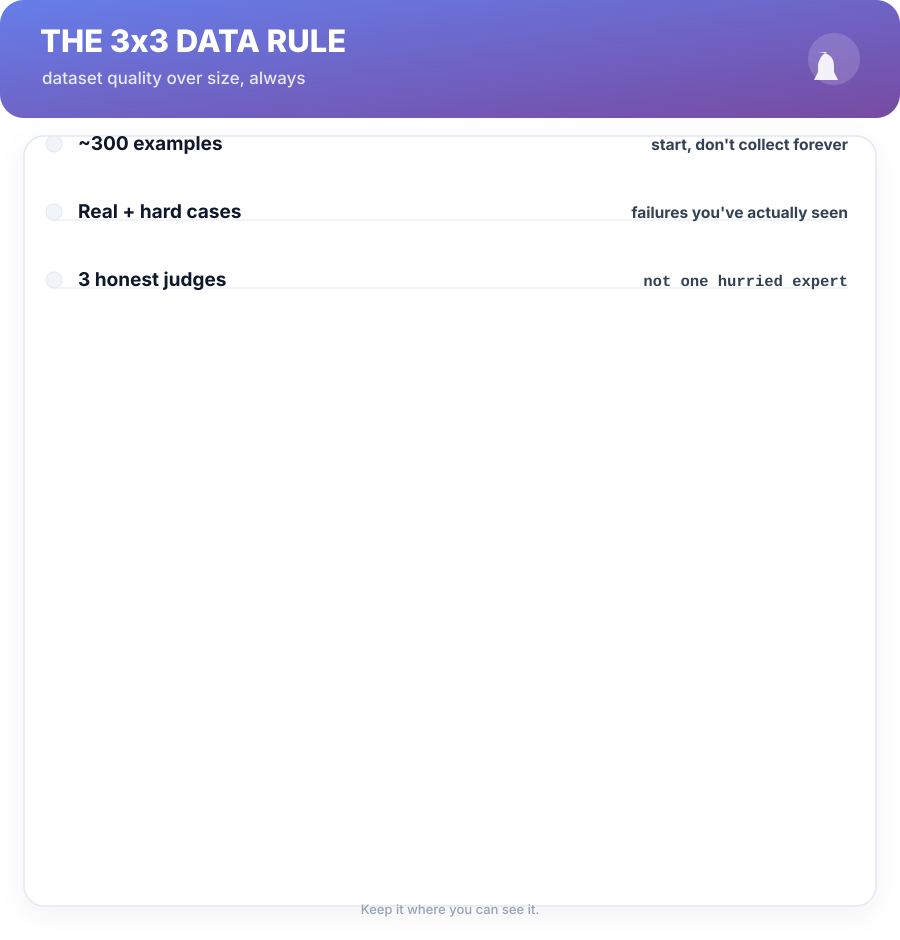

# Chapter 7. Fine-Tuning When It's Worth It

## Scenario

Nora's support feature needs the model to write in the company's house style, every time, tone and format locked. Prompting got 80% there; the last 20% won't budge. Someone mentions fine-tuning, and suddenly there's talk of GPU budgets, data pipelines, and a three-week detour.

Fine-tuning has a narrow job in this book — and it's *not* teaching new facts. This chapter draws the line.

## The honest decision tree

Three questions before any fine-tune conversation:

- **Is it form or is it facts?** Form — tone, structure, format, refusal style → fine-tuning *can* help. Facts — "what is the price of X" — → facts belong in retrieval or context, not weights.
- **Does the data change?** If your answers are stale in weeks, don't bake them into weights. You'll be retraining to get today's prices.
- **Does prompting already pass the eval?** Then you're done. Evals first, always — a fine-tune that scores the same as a good prompt is a week of GPU spent on a noun.

## The form-not-facts rule, at the button

The rule earns its keep as a boundary:

- **Form** — tone, output structure, how it refuses, labeling conventions. Robust, learnable from a few hundred examples.
- **Facts** — specific claims, numbers, identities. Never reliable in weights, and toxic when they're plausible and wrong.

When form is the goal, the practical mechanism is **PEFT/LoRA**, not a full fine-tune: train a small adapter on top of the base model. It's fast enough for a laptop-driven experiment, cheap, and swappable per task — you can hold five adapters on one base model and switch by context.

## Dataset quality over size, always

A fine-tune's ceiling is set by the data long before the GPU. Three non-negotiables:

1. **Start at ~300 examples**, collected from real usage and real failures — not generated happy-path filler.
2. **Load the hard cases** — the ones your prompt gets wrong *today*. You're tuning against a measured gap, not a vibe.
3. **Judge with three honest reviewers**, on criteria written down — one hurried expert's taste is how bad datasets happen.

Then the loop from Chapter 4 applies all over again: fine-tune → score on the *same* golden set → ship only if it beats the prompting baseline. If it doesn't, the base model with a better prompt is your answer, and nothing was wasted except some cloud credits.

## Short version

- Fine-tune for form (tone, structure), never for facts.
- New facts belong in retrieval or context, not in weights.
- Use PEFT/LoRA — small adapters, cheap, swappable per task.
- Data quality rules: ~300 real cases, hard failures included.

## Do this

Before anyone spends a GPU: write down the answer to "what, exactly, does the fine-tune change that a prompt can't?" — tone and output shape, or knowledge content? If the answer is facts, go re-read Chapter 5 and stop the meeting. If it's form, collect your 300 real cases *from production logs*, mark the 50 failures your current prompt makes, and dogfood a LoRA adapter against the golden set in one afternoon. Let the numbers decide.

## Knowledge check

1. What does "form, not facts" mean in practice?
2. Why LoRA/PEFT over a full fine-tune as the default?
3. What does the eval loop have to do with deciding whether to fine-tune at all?