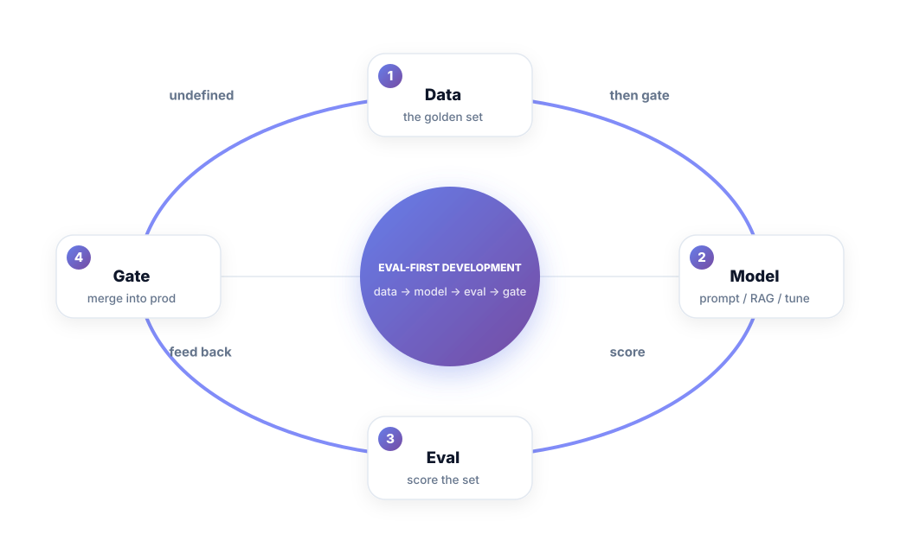
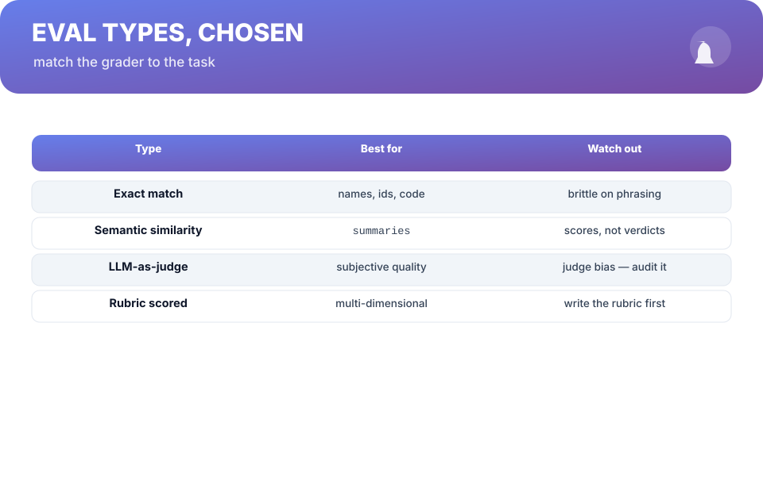
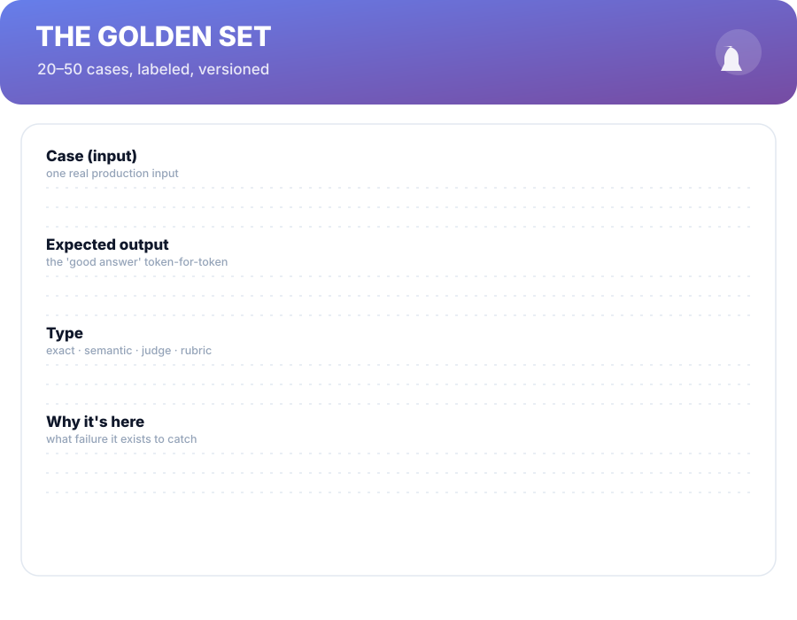

# Chapter 8. Eval-First Development

## Scenario

Simran's feature is "pretty good" — everyone agrees, in the demo. Then the QA person runs it on the *hard inputs*, the ones marketing swore were handled, and three out of five are quietly embarrassing. The team's confidence was an opinion; nobody had a number.

The fix isn't strictness. It's the **eval loop**: a small labelled set, a score, and a rule that improvement is measured against it. If you only improve what you score, everything else in this book gets sharper.

## The eval loop

1. **Data** — the golden set: 20–50 real inputs, each with the expected output and a reason it's there.
2. **Model** — whatever you're changing: prompt, RAG pipeline, fine-tune, agent.
3. **Eval** — score the set. Pass/fail per case, on definitions written *before* you grade.
4. **Gate** — a score threshold, enforced like a test suite: below it, no merge, no demo.

The loop is powerful because it converts every debate — "is the prompt better?" — into a number *on the same cases, every time*. The set is the memory of the feature's mistakes: every fixed failure joins the set, so regressions become impossible to walk into twice.

## Choosing the grader

Match the grader to the task:

- **Exact match** — identifiers, code, option labels. Strict but brittle on phrasing.
- **Semantic similarity** — summaries, "close enough". Gives scores, not verdicts.
- **LLM-as-judge** — subjective quality, judged by another model. Powerful, faster than humans, but the judge has taste: **audit it on 20 cases against a human grader first**, and spot-check it, and document the disagreements. A judge you don't audit is a rubber stamp with a label.
- **Rubric scored** — multi-dimensional (completeness, tone, safety). Write the rubric *before* grading; it's the spec.

All of them degenerate into vibes if the golden set is weak. The grader is a tool; the set is the authority.

## The golden set, built once, kept forever

Five sentences of structure make the set outlive its authors:

1. **Start from production** — real inputs, real customers, real failure edges.
2. **Label the expected output** — token-for-token where the grader is exact.
3. **Mark the type** — exact · semantic · judge · rubric, per case.
4. **Write the "why it's here"** — every case exists to catch a specific failure; if it doesn't, cut it.
5. **Version it** — the set lives in the repo, reviewed like code, and its history is the feature's.

## Short version

- Eval-first: define success, build a golden set, score, and gate on it.
- The golden set is 20–50 real inputs with expected outputs and reasons.
- Match the grader to the task — and audit any LLM-as-judge first.
- Every fixed failure joins the set. Regressions become impossible to repeat.

## Do this

Build a 20-case golden set for your current feature this week, from real production inputs, labeled with expected outputs and the failure each case is guarding against. Run your current prompt against it and record the pass score as the baseline — no fixing, just the number. Then, and only then, start improving; every change faces the same twenty cases. That baseline number, on a sticky note by your monitor, is the feature's report card for the rest of its life.

## Knowledge check

1. What are the four stages of the eval loop, in order?
2. Why must you audit an LLM-as-judge before trusting it?
3. Why does every fixed failure get added to the golden set?