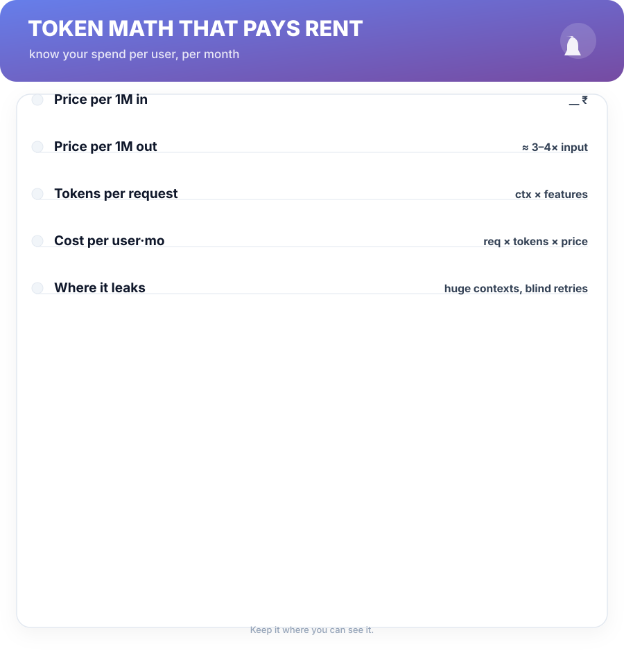
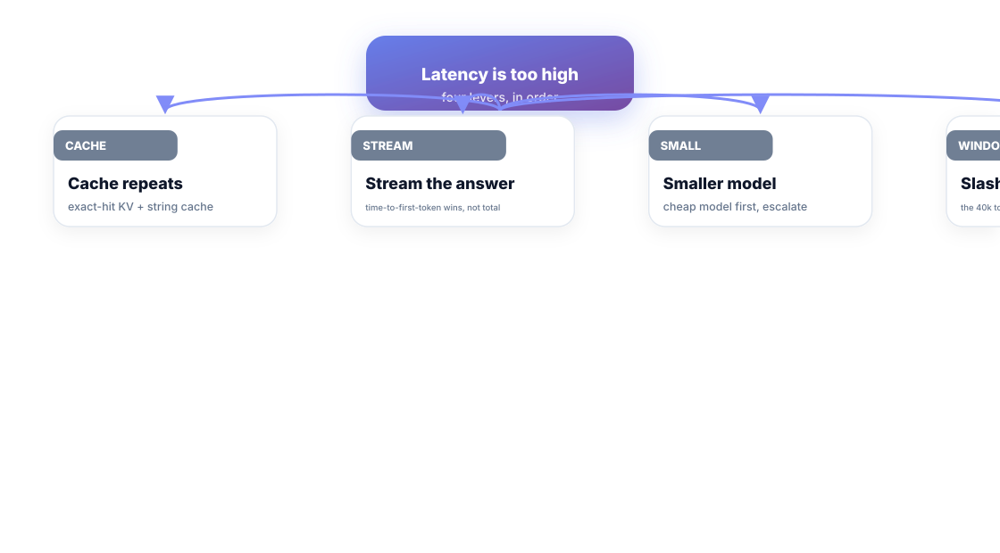
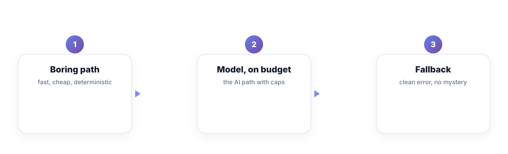

# Chapter 9. Production AI — Token Math, Latency, Cost

## Scenario

Vik ships an AI feature and the bill is a horror story: a context window that grew to 40k tokens per request, blind retries on every failure, and a small but vocal user base doing the same query seventy times a day. The feature is loved, and loves to spend.

The fix is boring math. Token cost and latency are the two numbers any production AI engineer can recite in their sleep.

## Token math that pays rent

The pricing model is honest: input tokens cost less than output tokens, and the cost is *linear in what you send*. Five numbers to know:

1. **Price per 1M input tokens** — your per-token baseline.
2. **Output price** — typically ~3–4× input for the same model.
3. **Tokens per request** — context window size × how much you actually reuse.
4. **Cost per user·month** — requests × tokens × price. This is the number your CFO reads back to you.
5. **Where it leaks** — giant contexts, blind retries, logging the whole conversation.

The leakiest habit in this book's experience: **sending 40k tokens of context to answer a one-token question.** Every token you ship equals money whether the answer used it or not.

## Latency: time-to-first-token is the feeling

Users don't time *total generation*; they feel the wait for the first word. The levers, in order:

1. **Cache the repeats** — identical queries hit a cache. Same question asked seventy times a day is seventy saved calls.
2. **Stream the answer** — the first token lands in milliseconds; the feeling of speed is the *time-to-first-token*, not the total.
3. **Model-size ladder** — start at the small/cheap model; escalate only on a measured miss. The expensive model is for the hard 10%, not the default.
4. **Slash context** — the fastest request is the one with fewer tokens in it. Retrieval (Chapter 5) exists to shrink what you send.

## The boring AI stack

Production AI that survives contact with customers shares one architecture: a **boring fallback ladder**.

1. **Deterministic path** — the plain pipeline: rule-based answers, cached hits, exact matches. Fast, cheap, provable.
2. **Model, on budget** — the AI step, with a token cap, a step cap, and a max-cost per request.
3. **Clean fallback** — a human-readable error and a retry path. No mystery, no black box, no surprise bill.

The model is a *step* in the ladder, not the ladder. When the ladder is in place, "the AI went down" becomes "the deterministic path caught it" — which is how you get an AI feature your team stops being scared of.

## Short version

- Cost = tokens sent × price. Output is ~3–4× input; context bloat is the leak.
- Time-to-first-token is the latency users feel; stream everything you can.
- Cache repeats, ladder models by size, shrink context with retrieval.
- The boring fallback ladder is how an AI feature survives its own hype.

## Do this

Compute the cost per user·month for your feature in the next hour, on a napkin: take average requests per user per month, multiply by average tokens per request, then price it with your provider's per-1M numbers. Write the number under the feature's name in the spec. Then add one cap — max tokens per request — and one cache — exact-match hits over the last 30 days. You have just turned "we have AI" into "we have AI with a price tag", which is the only sentence a CFO believes.

## Knowledge check

1. Why are output tokens typically more expensive than input tokens?
2. What's the difference between latency and time-to-first-token, for users?
3. What makes the deterministic path the right first rung of the fallback ladder?