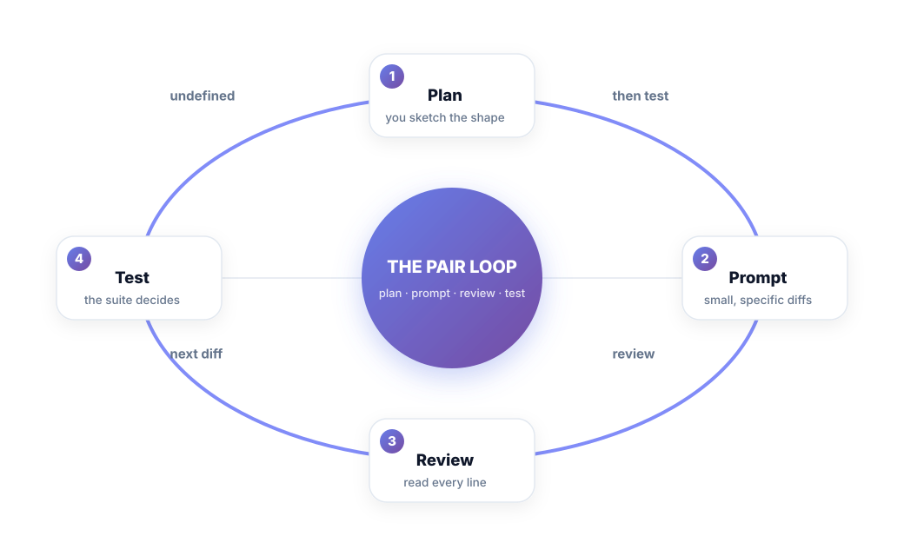
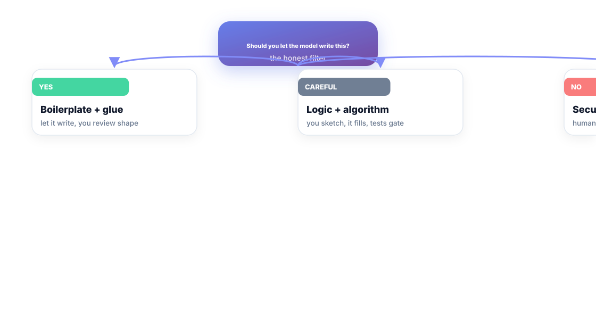
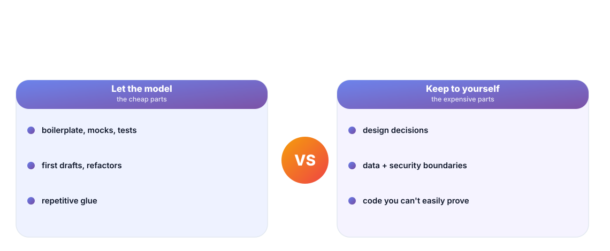

# Chapter 11. AI-Assisted Coding, Deliberately

## Scenario

Vik pairs with an AI coding tool for a month. His velocity feels enormous. Then a review catches a subtle security hole the model wrote with total confidence — in code Vik has already shipped and mostly skimmed. The speed was real; the *understanding* didn't keep up.

The fix is the **pair loop**: the model drafts, and the engineer does the work a junior engineer owes the team — shape, review, test.

## The pair loop

1. **Plan** — you sketch the shape. The design decision is yours; the model executes.
2. **Prompt** — small, specific diffs, not "build the whole feature". A good prompt contains a mini-spec: signature, edge cases, the test you expect to add.
3. **Review** — read every line the model produced as if a stranger wrote it. Because a stranger did.
4. **Test** — the suite decides, not the diff. The prompt has no authority; the CI gate does.

The loop's rhythm is the point: **small inputs, small outputs, verified.** The "wow" of a 300-line single-shot scaffold is exactly how blind spots get shipped.

## The honest trust filter

- **Boilerplate and glue** — let it write. Mocks, CRUD, migration scaffolding, tests for code you know. You review the shape, not the spelling.
- **Logic and algorithms** — careful. You sketch the approach; it fills the blanks; the tests gate.
- **Security, money, data** — hand-written, human-reviewed, no delegation. These aren't where a guesser's suggestion earns its keep.

The filter runs on one question per task: **"if this line is subtly wrong, how expensive is it?"** Expensive → human hand. Cheap → model's job.

## Let the model be the mapper; keep the map yourself

- **Let the model:** boilerplate, first drafts, test scaffolding, refactors of code with tests, conversions between languages and formats, docs you'll never read twice.
- **Keep to yourself:** the design decisions, the data and security boundaries, the code you can't prove with a test, and — this is the one that compounds — **the understanding**. If you can't explain the diff, the velocity was borrowed.

The rule that separates a compounding workflow from an accident: **never merge a line you didn't read, and never trust generated confidence over a passing test.**

## Short version

- Pair loop: plan → prompt → review → test. Small diffs, verified every time.
- Trust by cost: boilerplate yes, security/money never by delegation.
- You sketch the shape; it fills the blanks; the suite decides.
- Never merge a line you didn't read on purpose.

## Do this

Resume one existing branch or ticket, and make a rule for the rest of the task: every AI-generated change comes in a diff under 50 lines with a written one-line "what this does and why" from *you*, and nothing merges until the test suite is green on that diff. Then do a retro at the end of the week: count the diffs you could explain cold, and the ones you couldn't. Every unexplainable line is debt — and the loop's whole purpose is to make "explainable" the default, not the exception.

## Knowledge check

1. What are the four stages of the pair loop, in order?
2. What question decides whether a line is the model's to write?
3. Why is it worth asserting "model generated this, I reviewed it" on every AI diff?