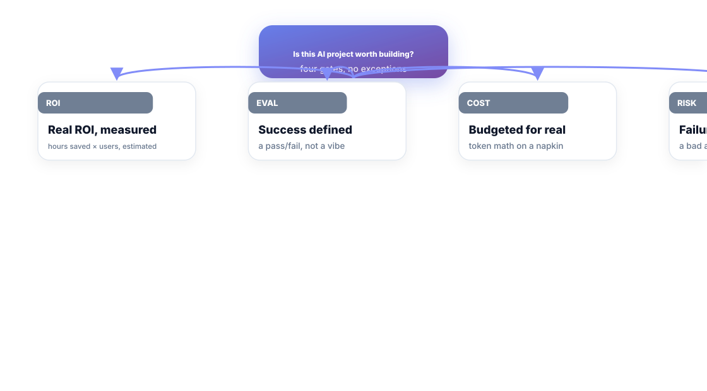
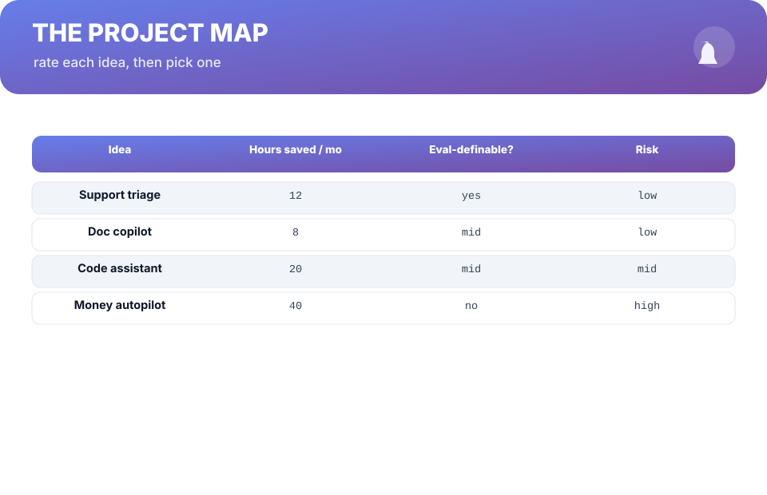
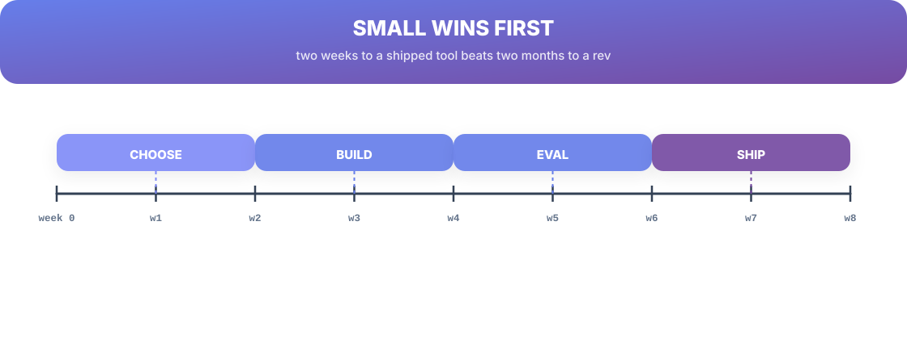

# Chapter 12. Picking AI Projects With Real ROI

## Scenario

Simran's team brainstormed eleven "AI ideas" in one sprint. Four are login-screen features that don't need AI, three are RAG chatbots for things nobody asked for, and one is a "money autopilot" that could technically be built and should never be trusted. Eleven ideas, one is a project.

The ROI filter collapses the list before a token is spent.

## The four gates, no exceptions

Before an idea becomes a build, it clears four gates:

1. **ROI, measured** — "hours saved × users" estimated to a number, and the number beats the effort to build it. A number you can defend beats a vibe you can't.
2. **Success, definable** — a pass/fail you could write today (Chapter 8). If you can't define "good", you can't score "worth it".
3. **Cost, budgeted** — token math on a napkin (Chapter 9). A feature that costs more than it saves is a hobby.
4. **Risk, acceptable** — the worst wrong answer is cheap. Money, identity, and irreversible actions fail this gate by definition, unless a human gates every action.

## The project map

Rate every idea on the two axes that predict everything else: **hours saved per month** and **how evaluable the success is**. The winners are the ones that are *mid effort, high hours-saved, easy to evaluate* — small automations, triage, drafting, summarization, doc copilots. The graveyard is "it's cool" — no measured hours, no defined success, high risk.

Not building is often the best build. The discipline of the map is that it makes "no" a *decision with reasons*, not a slowdown.

## Small wins first, always

The fastest way to get a team's AI program funded is one boring tool that saved four hours a week, with a number on it. Sequence it:

1. **Pick the smallest cleared gate idea** — one user, one job, weeks not quarters.
2. **Build it boring** — the fallback ladder, the cost cap, the eval set.
3. **Ship it, measure it, tell the number** — hours saved, requests handled, cost per hour saved.
4. **Reinvest** — the second project rides on the credibility of the first.

## Short version

- Four gates: measured ROI, definable success, budgeted cost, acceptable risk.
- Rate ideas by hours-saved and evaluability; mid + cheap + easy wins.
- "No" with reasons is a decision, not a slowdown.
- Small wins first — the number on the first tool funds the second.

## Do this

Take your current idea list and run every item through the four gates in a table: ROI estimate, success definition, cost napkin, worst-wrong-answer. Cross out every item that fails a gate with one line of reasoning. Among the survivors, circle the smallest one — and put its "hours saved per month" estimate on it as the build's definition of done. Then delete the rest of the list until the first tool ships. That deletion is the discipline the whole book has been training.

## Knowledge check

1. Name the four gates an idea must clear.
2. Why does "it's cool" fail the project map every time?
3. Why should the first build be the *smallest* cleared idea?