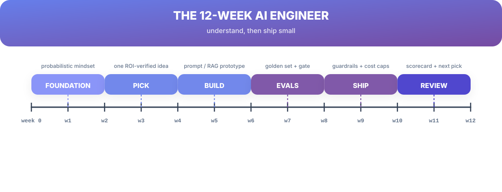
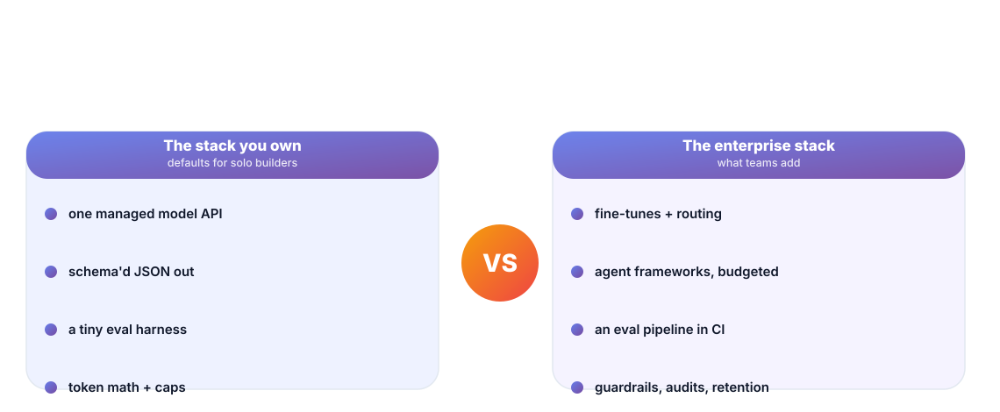
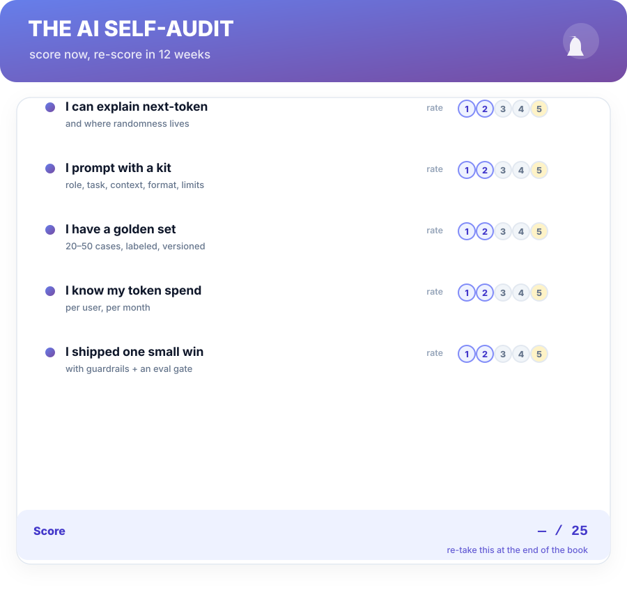

# Chapter 13. The 12-Week AI Engineer

## Scenario

Vik wants to be "dangerous" with AI, then clears his calendar for a six-week course, buys a GPU he doesn't need, and learns three frameworks that will be renamed by the time he finishes. Three months later, nothing is shipped, and the only number he can quote is the course price.

The plan in this book is the opposite of a course: it's twelve weeks with one shipped, measured tool.

## The 12-week build path

| Weeks | Phase | Outcome you should hold |
| :--- | :--- | :--- |
| 1–2 | Foundation | explain next-token, temperature, and context — out loud. |
| 3–4 | Pick | one idea clears all four gates and survives the map (Ch 12). |
| 5–6 | Build (prototype) | prompt + retrieval prototype on the golden set's first 10 cases. |
| 7–8 | Evals | golden set at 20+ cases; a scored baseline and a gate on it. |
| 9–10 | Ship | guardrails, cost caps, fallback ladder, audit log — live. |
| 11–12 | Review | the numbers: hours saved, cost per hour, next pick. |

The plan's spine is the content of the whole book — it looks like a course schedule but it *is* Part 4's scorecard on a calendar.

## The rating the whole plan converges on

The plan assumes your list has room: one managed model API, schema'd JSON output, a tiny eval harness in the repo, and a token ledger. Solo builders win with exactly that stack. Teams add fine-tunes and routing, agent frameworks and CI eval pipelines — but they *build* them only after the same small wins, and only where the numbers demanded them. Nobody gets to skip the eval set or the cost cap by hiring a bigger stack.

## The start-of-book audit, now

Take the audit in the back matter today, cold, before you start Week 1. Put the number where you'll see it. Then let twelve weeks work on it — and re-score in the reflected edition where you'll meet yourself in the mirror of Chapter 8, the artifact kit, and the process.

## Short version

- 12 weeks, one shipped and measured tool — not six weeks of courses.
- Weeks 1–2 foundation, 3–4 pick, 5–6 prototype, 7–8 evals, 9–10 ship, 11–12 review.
- The solo stack wins: one managed API, schema'd output, a tiny eval harness.
- Score the self-audit now; that number is the plan's start line.

## Do this

Schedule the twelve weeks as a real calendar with three cut-offs that can't slide: end of week 4 — criteria for one idea on paper; end of week 8 — a golden set with a scored baseline; end of week 10 — the tool live with cost caps and an audit log. Block one hour a week for "evals and numbers", because the plan dies by attrition, not by difficulty. Then go to the back matter and take the audit. Week 1 starts the morning after you do.

## Knowledge check

1. What does the 12-week plan ship, exactly and by when?
2. Why does a solo builder not reach for agent frameworks or fine-tunes first?
3. What is the difference between week 8 and week 10 in the plan's language?