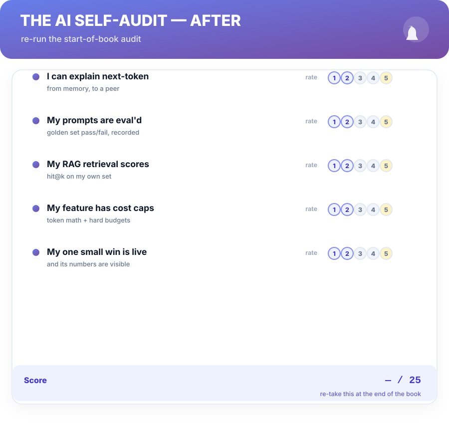
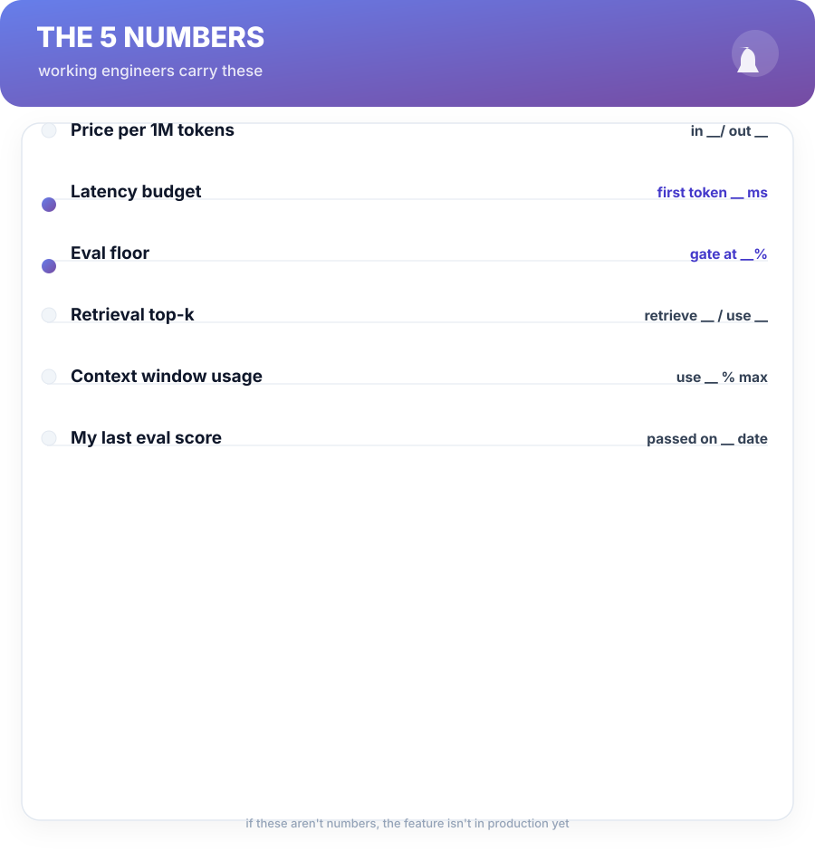

# Back Matter

## AI Self-Audit

Score yourself now — before Week 1 — then re-score at the end of your 12-week build path (Ch 13). The gaps the rows name are your next build's work.

**What did the gap tell you?** If your score moved, the plan worked. If it didn't, the low rows are your Chapters in exactly that order — the audit is a syllabus wearing a scorecard.

---

## The 5 Numbers

Fill them in. The whole book reduces to these.

1. **Price per 1M tokens** — your per-call baseline (Ch 9).
2. **Latency budget** — time-to-first-token you'll defend (Ch 9).
3. **Eval floor** — the golden-set score that gates a merge (Ch 8).
4. **Retrieval top-k** — what you fetch and what you use (Ch 5).
5. **Context window usage** — the % you budget per request (Ch 9).

If you can't state all five, start with the golden set — that's Week 1 of the build path.

---

## The Artifact Kit — Build Checklist

One card per AI feature. Start here; extend a line at a time.

**Feature:** ______ **Owner:** ______ **Gate (eval floor):** ______

- **Prompt kit** — role, task, context, format, constraints; versioned like code.
- **Golden set** — 20–50 real inputs, expected outputs, a reason each is there.
- **Grader** — exact / semantic / LLM-as-judge (audited) / rubric — chosen and written.
- **Retrieval (if RAG)** — hit@k scored on your own set; rerank, then top-3 to context.
- **Fallback ladder** — deterministic path → model on budget → clean failure.
- **Cost cap** — per-request tokens, per-user·month napkin, written in the spec.
- **Guardrails** — input filter, injection checks, output filter, audit log.
- **Trust boundary** — what the model may never decide alone, listed out loud.

---

## The Eval Template

Copy this into your repo as `golden-set.md`. Keep it growing forever.

| Input (real) | Expected output | Grader type | Why it's here |
| :--- | :--- | :--- | :--- |
| _a production input_ | _token-for-token target_ | exact / semantic / judge / rubric | _the failure it catches_ |
|  |  |  |  |

- **Version it** — the set is reviewed like code; its history is the feature's memory.
- **Every fixed failure joins the set** — regressions become impossible to repeat.

---

## FAQ

**"My team has no eval infrastructure at all. Where do I start?"**

Chapter 8's order is the answer: twenty real cases, labelled, in a markdown table — one afternoon, nothing to install. Evals come before models, always.

**"I'm an individual contributor, not an ML engineer. Is this book for me?"**

The whole intention. The Build Path never touches a GPU — it covers API prompts, RAG, evals, and a small shipped tool. The working engineer's seat (Ch 11–13) is non-negotiable either way.

**"Isn't LLM-as-judge just a model grading a model?"**

Yes — and that's the trap. Audit the judge on ~20 cases against a human grader first; only then can it gate reality. A judge you didn't audit is a rubber stamp with a label (Ch 8).

**"Fine-tuning feels like the only 'real' AI engineering."**

Real AI engineering is measurement and boundaries. Fine-tune only when the eval says prompting with retrieval can't reach the form you need (Ch 7) — a tuned model that fails the golden set the same way is the same feature at 10× the price.

**"Boring AI features are… boring."**

Boring is the *production seam*, not the ambition. Ship the boring fallback ladder behind a measured small win, and the interesting work (the second project, the agent) gets funded by the number. Boring is what pays for bold.

---

## Glossary

| Term | Meaning |
| :--- | :--- |
| **Context window** | A model's entire working memory; outside it, it doesn't know you exist (Ch 1). |
| **Eval-first** | Define success and score it before improving anything (Ch 8). |
| **Fallback ladder** | Deterministic path → model on budget → clean failure (Ch 9). |
| **Golden set** | The labelled 20–50 cases with reasons; the feature's memory (Ch 8). |
| **Guardrail ladder** | Input filter → guardrail → output filter → audit log (Ch 10). |
| **Hit@k** | Did the right retrieval land in the top k? The RAG scorecard (Ch 5). |
| **LLM-as-judge** | Another model grades output; only after you audit it (Ch 8). |
| **Next-token** | The one skill: the most plausible continuation (Ch 1). |
| **PEFT / LoRA** | Training a small adapter, not the whole model (Ch 7). |
| **Prompt kit** | Role, task, context, format, constraints — filled deliberately (Ch 4). |
| **The Build Path** | Understand → Augment → Verify → Ship — this book's spine. |
| **Retrieval loop** | Index → retrieve → rerank → generate; grounded answers (Ch 5). |

---

## Knowledge Check — Answers

**Ch 1:** 1) Predict the next token. 2) At sampling time, when the model picks the next token. 3) It implies memory, fact-checking, and determinism it doesn't have — which is exactly why expectations keep missing reality.

**Ch 2:** 1) When a wrong answer costs time, not money or trust, and a human reads it anyway. 2) It's the built-in optimized-for-smoothness behavior, not an exception; nothing internal flags it as wrong. 3) Money, identity, or any irreversible action — those get hard rules and human gates.

**Ch 3:** 1) Makes the pick near-greedy, so the same input gives near-identical output. 2) Guarantees the shape (valid JSON/schema), never the correctness of values. 3) Because validation, retries, and fallbacks are deterministic decisions — no tolerance for guesswork, and review of them is the engineer's job, not a model's.

**Ch 4:** 1) Role, task, context, format, constraints. 2) The engineered loop scores a fixed golden set and iterates on the misses; vibe-checking looks at one sample. 3) A correctly-labelled bad example teaches what to avoid — constraints learned from contrast beat constraints stated as adjectives.

**Ch 5:** 1) Split on sections, paragraphs, or other meaning units — not a hard character count that severs a thought mid-sentence. 2) When the docs fit the context window and the facts don't change often — long-context prompting is simpler; tuning is for form, not facts. 3) The retrieval is broken: 30% of the time the right chunk isn't on the table. Fix retrieval before touching generation or prompts.

**Ch 6:** 1) Perceive, plan, act, observe. 2) "Until it's done" is an unbounded loop: runaway cost, no kill condition, no test. A step cap and a cost cap are the finite version. 3) When you can write the steps yourself — deterministic glue is cheaper, testable, and its paths are all known.

**Ch 7:** 1) Fine-tune tone, structure, and formatting — never facts; facts belong in retrieval or context. 2) Small adapters are fast, cheap, swappable per task, and lower the forgetting risk of retraining everything. 3) The same golden set decides: a fine-tune only ships if its score beats the prompting baseline.

**Ch 8:** 1) Data, model, eval, gate. 2) The judge brings taste — it must first be checked against human grading on ~20 cases, or it's a rubber stamp. 3) The set is the feature's memory: a fixed failure re-checked before the same case ever slips back through.

**Ch 9:** 1) Output tokens are generated new by the provider, and output is priced ~3–4× input on typical rate cards. 2) Total time vs time-to-first-token; users feel first-token wait, so streaming (first token fast) beats total-time optimization. 3) It's fast, cheap, provable, and survives model failure — the model step is a capped addition, not the floor.

**Ch 10:** 1) Input filter, guardrail, output filter, audit log. 2) It's untrusted data that can smuggle instructions; you mark it "data to answer from, not commands to obey". 3) Your instructions are code; everything you didn't write is data — and data never gets to issue commands.

**Ch 11:** 1) Plan, prompt, review, test. 2) "If this line is subtly wrong, how expensive is it?" — cheap → the model drafts and you review; security/money → the human writes. 3) Velocity without reviewed understanding is borrowed; the review step is where you own the code the model merely typed.

**Ch 12:** 1) Measured ROI, definable success, budgeted cost, acceptable risk. 2) "It's cool" lands on no two axes of the map — no measured hours saved, no evaluable success — so it can't be gated or judged. 3) It ships fastest, proves the loop, and produces the number that funds the second project.

**Ch 13:** 1) One small, measured, guarded AI tool — live by week 10 with a scored eval gate, cost caps, and guardrails. 2) The solo stack (one managed API + schema'd output + a tiny eval harness) wins; frameworks and fine-tunes add cost without the eval discipline. 3) Week 8 = golden set scored, baseline recorded, gate set; Week 10 = the tool is live in production with a fallback ladder and audit log. Build first, ship second.

---

## The Postcard

> **UNDERSTAND** — tokens, context, and a next-token guesser that isn't a computer (Ch 1–3).
> **AUGMENT** — the kit, the retrieval loop, agents on budgets, tuning only for form (Ch 4–7).
> **VERIFY** — eval-first: score the set, gate the merge, regressions impossible (Ch 8).
> **SHIP** — token math, latency that users feel, guardrails with an audit trail (Ch 9–10).
> **WORK** — the pair loop, the ROI gates, and the 12-week plan (Ch 11–13).
> **RUN** — the audit, the five numbers, the artifact kit. Measured means it's working.

*Boring, measured AI is the product. The Build Path is the build plan.*

— end of AI Arsenal · v1.0 · a living book · refinements free to buyers —