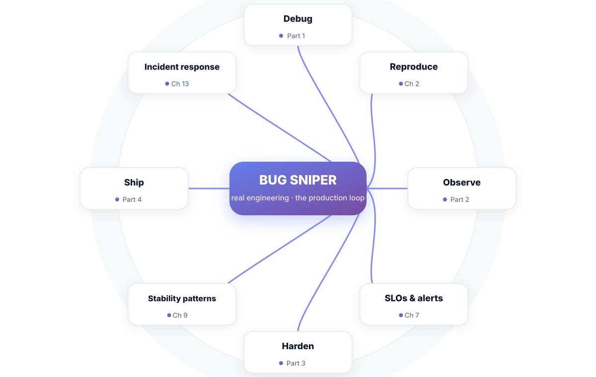
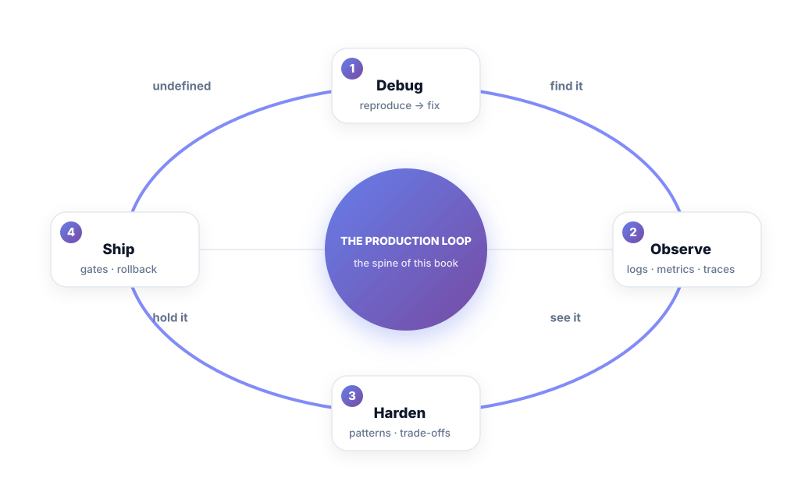
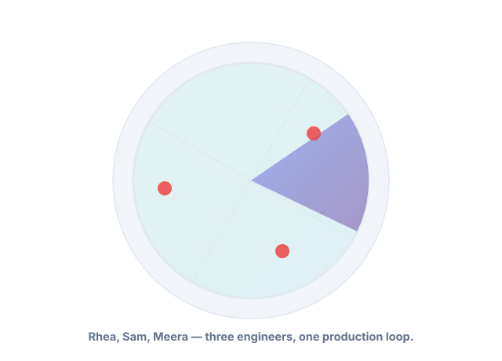
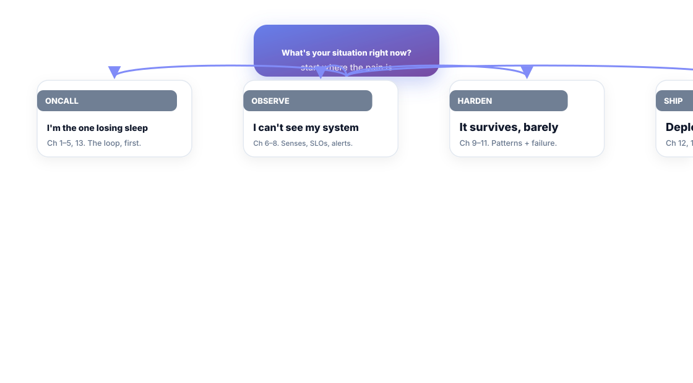

# Bug Sniper

**Real Engineering — Beyond the Tutorial**

*Production systems, debugging, architecture, CI/CD, and the trade-offs that actually matter after the tutorial ends.*

---

## Preface

The tutorial ends, production begins, and nobody sends a memo.

Somewhere in your first real system, a page fires at 3 a.m., the graph spikes, and you realize the documentation that got you hired doesn't cover this. The incident is a fact, not an emergency. What you need isn't more theory — it's a *procedure*: the same loop the engineers who sleep well run, on every system, in the same order.

This book is that loop. It exists because debugging-by-instinct is a lottery, and because most engineering books either hand you frameworks without a method or method without a production picture. Known failure modes, drills, and the boring patterns that are boring precisely because they work.

You are Rhea, Sam, or Meera in every chapter. Rhea owns on-call and leads incidents. Sam is a strong feature engineer facing the first troubles that can't be debugged from a laptop. Meera owns the platform that everyone else's code runs on. They're not characters — they're your three seats, and the Production Loop runs in all three.

One promise before we start: the loop costs you one disciplined hour and a few scripts, and it converts production fear into production calm. The calm is the product. This book is the training run.

Welcome to the production loop.

---

## Introduction — How to Use This Book

*The whole book, on one page. The loop is the book.*

One idea carries the whole thing:

> **The Production Loop — Debug → Observe → Harden → Ship.** Every production skill is one stage of this loop, and the book runs the loop in order.

- **Part 1 — The Debug Loop.** Chapters 1–5. Reproduce, diagnose, fix, reflect. The method.
- **Part 2 — See Your System.** Chapters 6–8. Senses, SLOs, alerts, and the realities of running software.
- **Part 3 — Harden.** Chapters 9–11. The stability patterns, the trade-offs that matter, and failure practiced on purpose.
- **Part 4 — Ship & Stay Out.** Chapters 12–13. Pipelines that defend production, incidents run calmly, and the 12-week readiness runbook.

### The pattern in every chapter

Same skeleton as the whole book family: **Scenario → the idea → figures → Short version → Do this → Knowledge check.** Plus real commands where they belong — this book's advice is implementable by a working engineer, this afternoon.

### Three engineers, three seats

- **Rhea** — on-call, incident commander. Follows everything, leads the exercises.
- **Sam** — feature dev, first production incident. Follows Part 1 first, then Part 4.
- **Meera** — platform/stability owner. Lives in Parts 2 and 3.

---

## Reader Navigator — Start Where It Hurts

| If you are… | Start with… | Then… |
| :--- | :--- | :--- |
| Losing sleep on incidents | Ch 1–5, then 13 | Ch 9 (patterns) |
| Blind — can't see the system | Ch 6–8 | Ch 7 (SLOs, alerts) |
| Painfully stable, barely | Ch 9–11 | Ch 11 (game days) |
| Deploys give you fear | Ch 12 | Ch 13 (incident response) |

If you only ever read one chapter, it's **Chapter 2 — Reproduce It.** Everything else in debugging follows from a reliable reproduction.

---

## A Living Book

Production tools and failure modes drift, so this book is versioned like software, and refined editions are part of what you bought.

| Version | What changed |
| :--- | :--- |
| 1.0 | First edition. The loop, 13 chapters, runbook + artifact kits. |
| 1.x | New patterns, road-tested commands, reader feedback. **Free for buyers.** |

Now open Chapter 1 — and remember: production is not where bugs fear you. Yet.

---

## The Production Loop — Postcard

> **DEBUG** — reproduce it, shrink it, then fix the cause, not the trigger (Ch 1–5).
> **OBSERVE** — senses, SLOs, and alerts that aren't noise (Ch 6–8).
> **HARDEN** — patterns, trade-offs, drills; the boring stack (Ch 9–11).
> **SHIP** — gates, canary, rollback; incidents run calmly (Ch 12–13).
> **RUN** — the readiness audit and the five numbers (back matter).