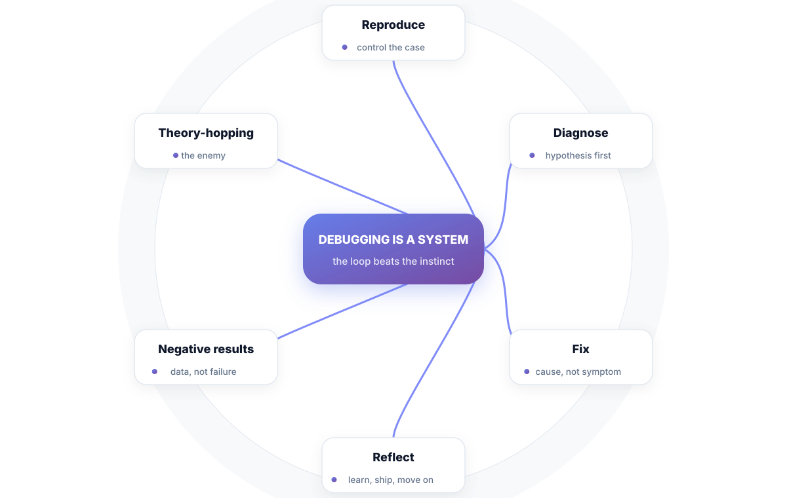
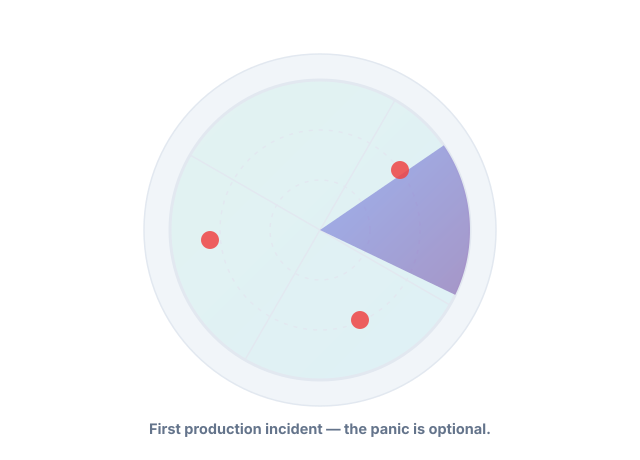
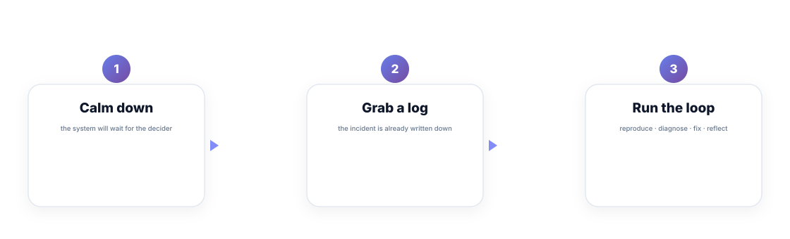

# Chapter 1. Debugging Is a System, Not a Talent

## Scenario

Sam ships a change at 4 p.m. on a Friday. At 9 p.m., the error rate graph climbs for the first time in months. Rhea — on call — pages Sam with a screenshot and a timestamp. Sam's first instinct is to *try something*: restart the pod, and then the other pod, and hope.

That instinct is the bug. This chapter replaces it with a loop.

## The loop, and why it beats the instinct

Here's the loop the calm engineers run. Four stages, always this order:

1. **Reproduce** — a reliable case you control.
2. **Diagnose** — a hypothesis, tested, not guessed.
3. **Fix** — the cause, not the symptom.
4. **Reflect** — learn, ship a guard, move on.

The instinct it replaces is **theory-hopping**: restart, refresh, tweak, hope. Theory-hopping looks like action and feels like debugging, but it never yields *information*. A restart that works is a mystery you've swept under the rug — and the mystery will be back on your next deployment.

The loop's power is not that it's clever. It's that every stage produces *evidence*, and evidence is what turns a mystery into a known failure mode.

## Negative results are data, not failure

The most respected debugging tool in the loop is the result that isn't the bug. "It's not the deploy" — proven, with data — deletes a whole branch of the change space. Deleting wrong hypotheses is how you find the right one fastest. Engineers who hide negative results are hiding the fastest path.

Not-a-bug findings deserve the same record as findings. In a postmortem, the list of disproven hypotheses is the shortest route to trust.

## How the loop runs in this book

- **Part 1** Chapter 2–5 is the loop in full, with real commands.
- **Part 2** gives you the senses the loop reads from.
- **Part 3** stops the fires before they start.
- **Part 4** makes the loop and the pipeline neighbors.

Every chapter ends with the same three boxes: **Short version**, **Do this**, **Knowledge check**. If you take nothing from a chapter, take the Do this. The book is a training run; the boxes are the reps.

**Watch out —** the restart that fixes things without explanation is a debt. It's fine to restart to stop the bleeding — *mitigation is not diagnosis*. Never let a working mitigation retire the investigation. (Chapter 4 makes the line sharp.)

## Nightmare card

**The six-hour session.** Sam restarts pods, flips config, refreshes the dashboard, and rewrites the query — six hours later the system is healthy and nobody knows why. The incident is closed by exhaustion, not by understanding. Every action Sam took was a guess with no hypothesis recorded, so none of them returned information. The fix: name the loop, run it in order, and treat "can't reproduce" as the starting fact — the most important one on the board (Chapter 2).

## Short version

- Debugging is a four-stage loop: reproduce → diagnose → fix → reflect.
- Theory-hopping looks like action but produces no information.
- Negative results are data — disproving branches is the fastest route to the truth.
- Mitigation is not diagnosis; a working restart still owes you an explanation.

## Do this

Print the four stages on a sticky note and put it beside your monitor: **Reproduce → Diagnose → Fix → Reflect**. Before your next debugging session, promise yourself one sentence out loud: *"We find it with evidence, not guesses."* The session after that, you'll write the hypothesis down — and that's Chapter 3's whole trick.

## Knowledge check

1. Name the four stages of the debug loop, in order.
2. What makes theory-hopping different from the loop?
3. Why is a negative result valuable instead of embarrassing?