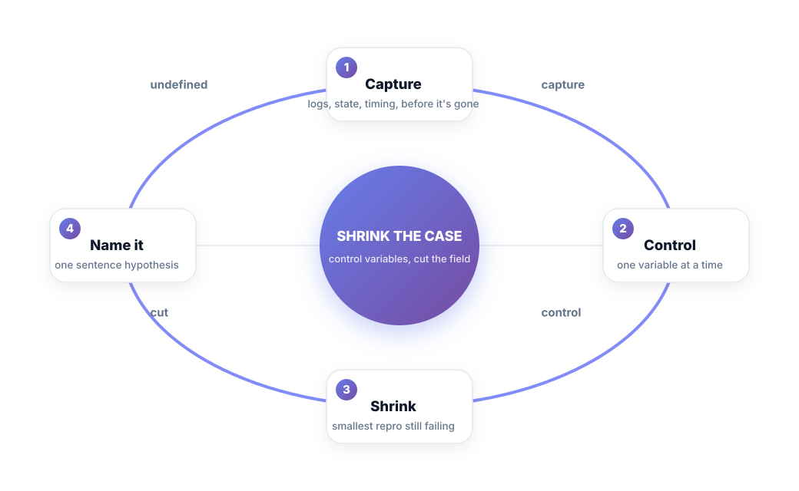
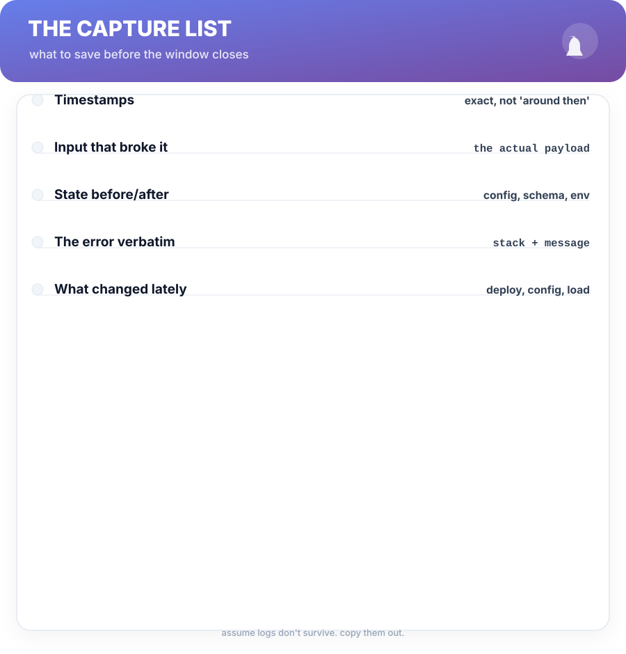
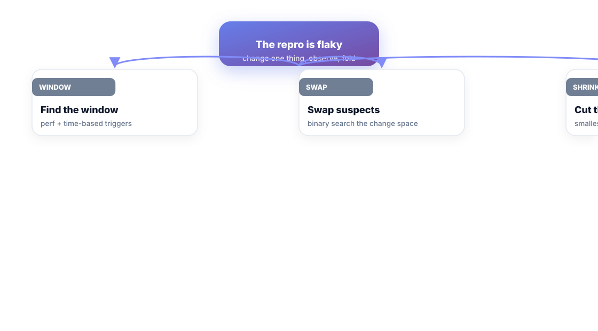

# Chapter 2. Reproduce It

## Scenario


The dashboard shows a 10-minute error spike at 09:14 that Sam never saw and can't repeat. Rhea's first move is the field's oldest trap: "Do it again." It doesn't reproduce. The bug is still real — it's just *hidden behind an uncontrolled environment*.

Sam's real job for the next hour: turn a ghost into a case. The named technique is **Shrink the Case**.

## Shrink the Case

Reproduction is a skill, and the skill is a loop of its own:



1. **Capture everything.** Before it's gone. Timestamps, input, state, the error verbatim. Sprint over to the evidence.
2. **Control variables.** Change one thing at a time; the un-controlled variable is where reproductions die.
3. **Shrink.** Keep cutting until the smallest failing case remains — input, users, workers, features.
4. **Name it.** A one-sentence repro: *"When X does Y with Z, it fails."*

A bug you can type as *that sentence* is a bug you can fix. A bug you can only gesture at is a ghost.

## Capture before it's gone



You can't reproduce what you didn't keep. Ten seconds of forensics beats an hour of archaeology:

```bash
# grab the last hour of the service logs, with context
journalctl -u my-service --since "1 hour ago" > incident.log
# snapshot state + config so "after" is comparable
kubectl get pods,configmap,deploy -n prod -o yaml > snapshot.yaml
```

Treat every incident as if the evidence window closes the moment you look away — because it does.

## Flaky? Then bisect the case, not the code



When a repro won't reproduce, you don't wait for it — you *advance on it*:

- **Find the window.** Without a time, it's not a bug. Time-based repros are searched with timestamps first: "between 09:14 and 09:24" tells you load, cron, or a deploy nearby.
- **Swap suspects.** Change one knob: payload size, worker count, concurrency, a config value. Binary-search the change space — this is `git bisect` discipline applied to runtime behavior.
- **Shrink the input.** Feed the service less and less until the minimum failing case is in your terminal. The most stubborn ghosts shrink to a curl command.

You are not guessing. You are running a controlled experiment each iteration, recording the verdict.

## The repro is the contract

Once shrunk, write the repro as a command or a tiny harness and commit it. The committed repro is a contract between stages: Chapter 3 diagnoses against it, Chapter 4 proves fixes against it, and future you replays it in five minutes. An uncommitted repro is a rumor.


**Tip —** put the repro file next to the fix in the same PR. Reviewers who can *run* your bug report review better.

## Short version


- Reproduction is a controlled skill: capture → control → shrink → name it.
- "Can't reproduce" is a fact to work from, not a dismissal of the bug.
- Capture evidence before it's gone — assume the window closes.
- A shrunk, committed repro is the contract the whole loop runs on.

## Do this


Next time you can't reproduce, write the ghost sentence out loud: *"it happened when [window] with [input] and [state]."* Circle the one variable you can control. Change it, observe, and write the verdict. Ten minutes of that beats an hour of restarting.

## Knowledge check


1. Name the four moves of Shrink the Case.
2. Why must the evidence be captured *before* investigation starts?
3. What makes an uncommitted repro a rumor?