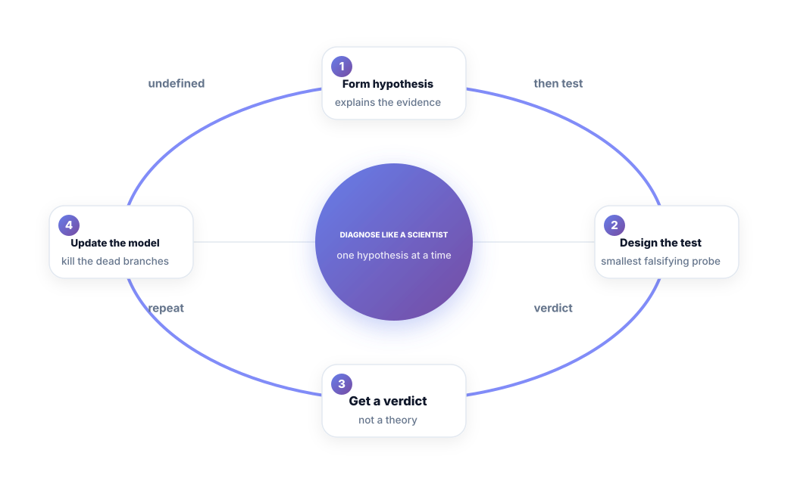
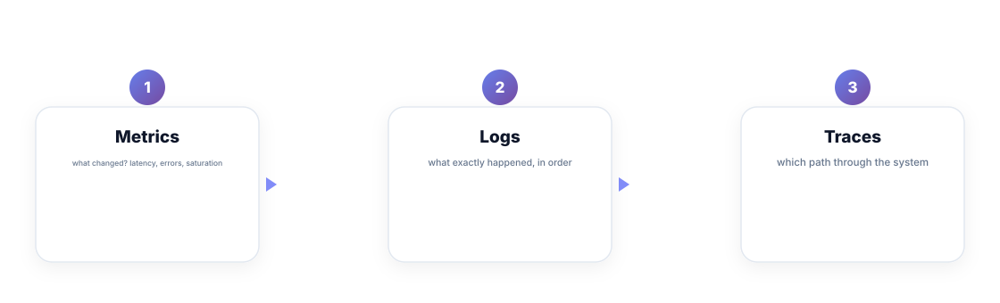
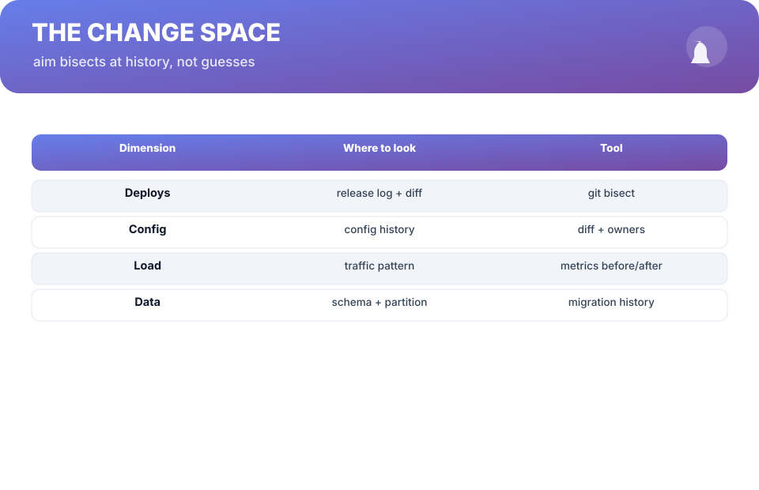

# Chapter 3. Diagnose Like a Scientist

## Scenario

Sam's repro is shrunk to a single curl command. Time to explain it. The room offers the usual energy: "maybe it's the cache," "probably a race," "could be the database." Rhea kills the meeting: *"One hypothesis. How do we falsify it?"*

That question is the whole chapter.

## One hypothesis at a time

Diagnosis is a loop: form → test → verdict → update.

1. **Form a hypothesis** that explains *all* the evidence — not just the bit you like.
2. **Design the smallest falsifying test.** The Co-alumnus trap is testing your favorite theory; the science is designing the test that could *break* it.
3. **Get a verdict.** The test either supports or kills the hypothesis. No verdict, no progress.
4. **Update the model.** Kill dead branches, keep the living, repeat.

The discipline is the same one from Chapter 2: one change, one observation, recorded. A hypothesis you can't write in one sentence is a vibe.

## The senses a hypothesis is read from

Your hypothesis is tested through three senses, and the trick is matching the sense to the question:

- **Metrics** answer *what changed*: latency, error rate, saturation at the incident timestamp. Always the first glance — they are already time-shaped.
- **Logs** answer *what exactly happened*: the sequence, the stack, the decisions. Correlate by request id.
- **Traces** answer *which path*: the call graph end to end, branch by branch.

The habit that separates calm from frantic: every claim stated in the incident thread carries one of these three senses. "Latency to the DB spiked at 09:14" beats "the DB got weird."

## Bisect the change space

Most hypotheses are candidates in the *change space*: deploys, config, load, data. Aim your bisect at history instead of brilliance:

| Dimension | Where to look | Tool |
| :--- | :--- | :--- |
| Deploys | release log + the diff | `git bisect` over releases |
| Config | config history + owners | diff + change log |
| Load | traffic before/after | metrics at the timestamp |
| Data | schema + partitions + migrations | migration history |

A 09:14 spike is a 09:14 *deploy*, a 09:14 *config flip*, or a 09:14 *traffic change* — in that order of suspicion, until the data reorders them.

## Explain it first

The cheapest diagnostic of all: *write the explanation before the test.* One paragraph — what you believe, and what would disprove it. Writing kills vague theories with zero spending, and it gives the next person (or the next on-call) the trail. The paragraph that survives a dead wrong theory is the fastest thing a postmortem can inherit.

**Watch out —** your first hypothesis is a narrative your brain likes, not a fact. The test must be designed to make your favorite idea lose. If you can't imagine the test failing, you haven't designed a test — you've designed a celebration.

## Short version

- Diagnosis is a loop: form → test → verdict → update. One hypothesis at a time.
- Match the sense to the question: metrics *changed*, logs *what*, traces *which path*.
- Bisect the change space — deploys, config, load, data — not your imagination.
- Write the explanation first; the unfalsifiable hypothesis is a vibe.

## Do this

Before your next diagnosis, write the one-line hypothesis and its killer test on the incident thread — *before* touching anything. Then run the test you designed to lose. When it does, you've spent a sentence to delete a branch. That's the fastest debugging move in the book.

## Knowledge check

1. What are the four moves of the diagnosis loop?
2. Which sense answers "which path through the system"?
3. What's the difference between a hypothesis and a vibe, in practice?