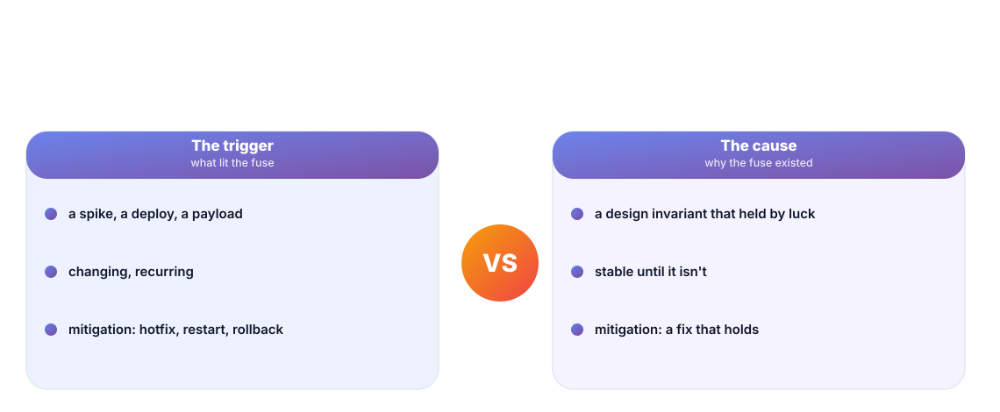
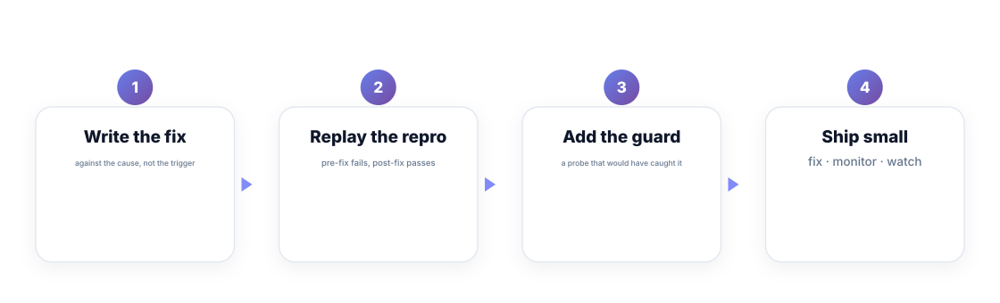
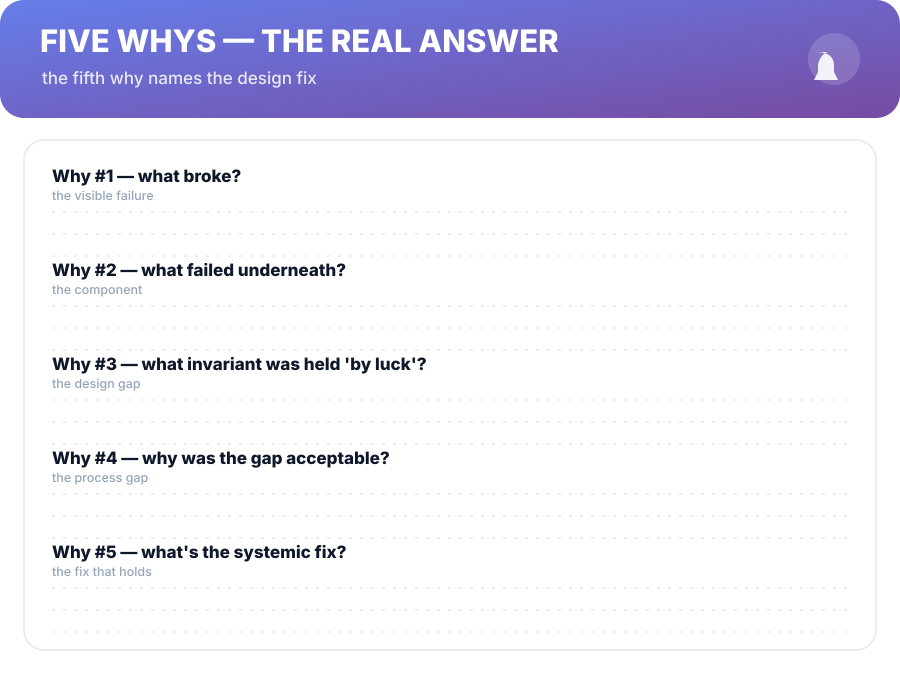

# Chapter 4. Fix the Cause, Not the Symptom

## Scenario

Sam's hypothesis holds: a config flip at 09:14 changed retry behavior, and a dependency started timing out. Sam reverts the config, the graphs flatten, and the meeting starts wrapping up. Rhea stops it: *"The revert stopped the bleeding. What was the *cause*?"*

Sam pinned the trigger, not the cause. This chapter draws the line — because the line is where fixes that hold are built.

## Trigger vs cause

- The **trigger** is what lit the fuse: a deploy, a spike, a payload. Reverting it stops the bleeding.
- The **cause** is why the fuse existed at all: a design invariant that had been holding *by luck*.

The classic example: a service that rebuilt its connection pool on every retry failure. The config flip was the trigger; the design gap — retries that multiplied connections instead of waiting — was the cause. Fix the trigger and you fix this month. Fix the cause and you fix the *class*.

## The fit-for-good fix

A fix that holds is written in four moves:

1. **Write against the cause.** Not "restore the config" — "make retries back off without multiplying connections."
2. **Replay the repro.** Pre-fix it fails; post-fix it passes. Same command, same harness — the contract from Chapter 2 gets its payday.
3. **Add the guard.** A probe that would have caught the failure *before* customers did — the alert the teardown (Chapter 7) would approve.
4. **Ship small.** Fix, monitor, watch one full cycle — not fix-and-forget at full blast.

Move 3 is the difference between fixing a bug and paying down a *class* of bugs.

## Five whys until the design gap shows

Five whys is a staircase, not a ritual:

- Why #1 names the visible failure.
- Why #2 names the component that failed.
- Why #3 names the invariant that was held *by luck* — this is the design gap.
- Why #4 names the process gap that let the invariant exist unowned.
- Why #5 names the systemic fix: the probe, the pattern, the review rule.

Stop when the fix isn't painting the symptom anymore. If the answer to "why" at any step is "a person forgot to be careful," you're not at the cause yet — processes don't hold against careful-people-remembering.

## Proving the fix

The repro that failed before must pass after. That single sentence is the acceptance test of every fix in this book. If you can't replay the original failure, your fix is an act of faith — which is Chapter 1's word for deploying a mystery.

**Nightmare card — the fix that was a coincidence.** The graph flattens the day the fix ships, but the tray closed in on the same day the *trigger* resolved itself. Weeks later the same incident returns, because nobody replayed the original repro. The retire-the-card test: your fix, against the original failing input, on your branch, before the PR closes.

## Short version

- The trigger lights the fuse; the cause is why the fuse existed.
- A fix that holds: against the cause, proven by replaying the repro, guarded by a probe, shipped small.
- Five whys until the design gap — a "person forgot" answer means you haven't arrived.
- If you can't replay the original failure, your fix is faith, not engineering.

## Do this

Take your last real fix. Write the five-why chain for it, honestly, down to the design gap. Then add the guard that would have caught it — even if you already fixed the bug. That guard alert is worth more than the fix that shipped without it.

## Knowledge check

1. What's the difference between a trigger and a cause?
2. Name the four moves of the fit-for-good fix.
3. Why must five whys stop at the design gap, not "someone forgot"?