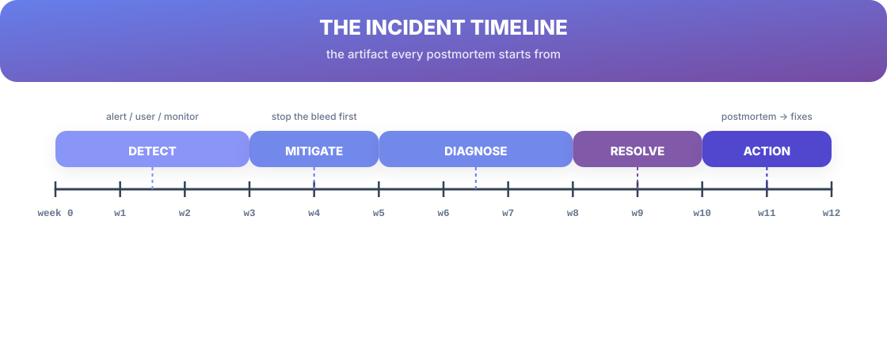
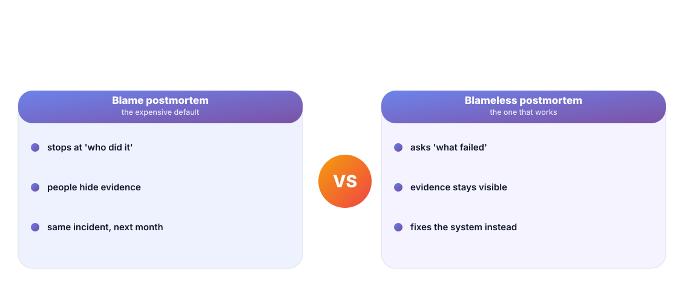
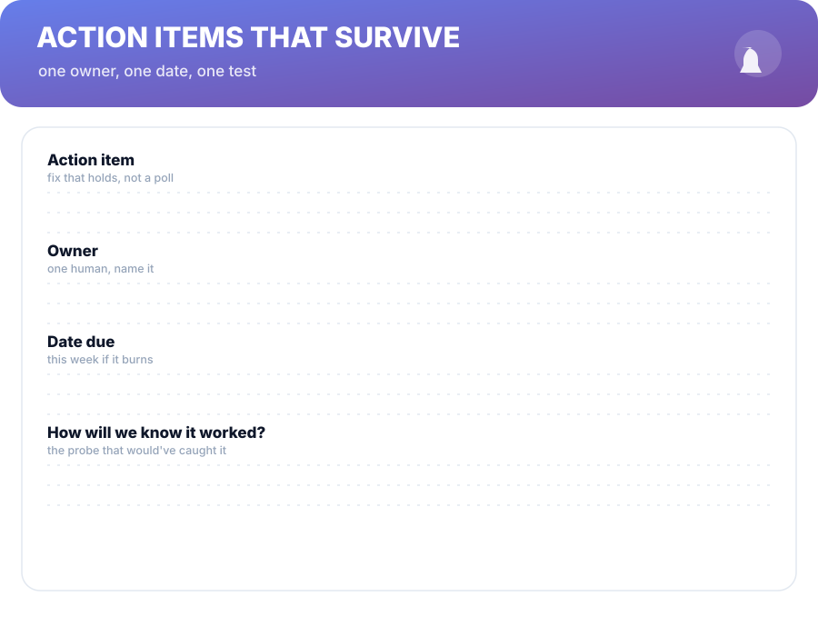

# Chapter 5. Reflect

## Scenario

The incident is over. Services are green, Sam's fix is in, and the calendar punctually suggests something called a *postmortem*. Sam's instinct: it's a review with a side of blame, a meeting where someone finds who to quietly reschedule.

It's not. The postmortem is the fourth stage of the loop, and done right it's the stage that makes incidents cheaper forever. This chapter runs it properly.

## The timeline is the artifact

Every good postmortem starts from a single artifact: the timeline. September 14, 09:14 — error rate climbs; 09:15 — pager; 09:22 — revert applied; 09:24 — graphs flatten; 10:05 — investigation continues.

Detect → Mitigate → Diagnose → Resolve → Action. Write it as you live it (or re-derive it from alerts, logs, and the incident thread), because memory is not a timeline. The timeline is also where the most expensive lesson lives: every jump without an explanation — the gap between detection and response, the hour nobody took an action — is a process bug waiting to be named.

## Blame is the enemy of evidence

A blame postmortem stops at "who did it," teaches people to hide evidence, and ships the same incident twice. A blameless postmortem asks *what failed in the system that let a reasonable human action become an incident* — and keeps the evidence flowing.

Blameless doesn't mean consequences don't exist. It means the failure analysis is about the *system*, so the fix lands on the system — not on the memory of a person who, by definition, was doing the best they could with the runbook they had. (If they weren't, that's a process gap named at Why #4 in Chapter 4, not a personality.)

## Action items that survive

A postmortem's score is not its word count. It's the count of items that still have an owner and a date a month later. Each action item carries four fields — every postmortem writer's checklist:

1. **The fix** — a fix that holds, not a poll or a policy.
2. **One owner** — named human, not "the team."
3. **A due date** — this week if it burns, else it's a wish.
4. **A test** — how we'll know it worked (the Chapter 4 guard, named and reserved).

An item without a test is a hypothesis dressed as a task.

## The loop closes here

Reflect doesn't end with the meeting. The lessons fold back into Chapter 1's loop: a new guard alert, a runbook line, a pattern in a review checklist. That's the coupling that makes incidents cheaper over time — the same incident should cost less the second time, and the postmortem is the mechanism that prices it.

**Cheat sheet —** after every postmortem, one line commits to the defense in depth: *new guard*, *new runbook step*, *new review rule*. If none of the three got touched, the postmortem didn't close the loop.

## Short version

- The timeline is the postmortem's raw material — write it as it happens.
- Blameless postmortems fix the system; blame postmortems hide the evidence.
- Every action item has an owner, a date, and a test.
- Reflect closes the loop: each lesson touches a guard, a runbook, or a review rule.

## Do this

Next incident (or last week's, reconstructed): write the timeline from alerts, logs, and the thread — with every unexplained gap marked. Circle the two biggest gaps. Those two gaps are your next action items, formatted the Chapter-4 way: owner, date, test.

## Knowledge check

1. Why is the timeline the artifact every postmortem starts from?
2. What does blameless actually mean operationally?
3. What four fields does every action item need?