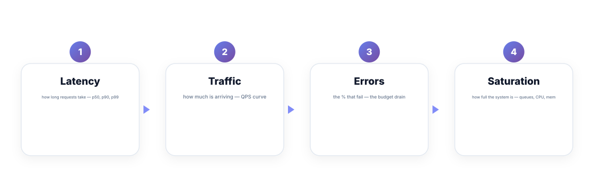
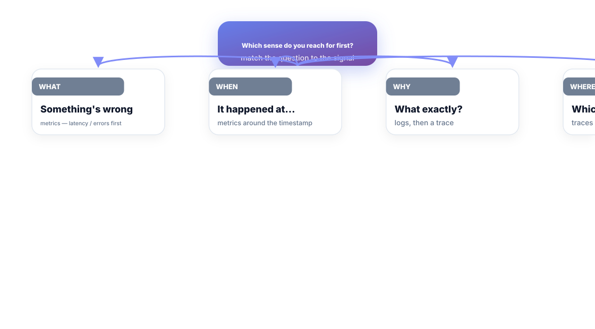
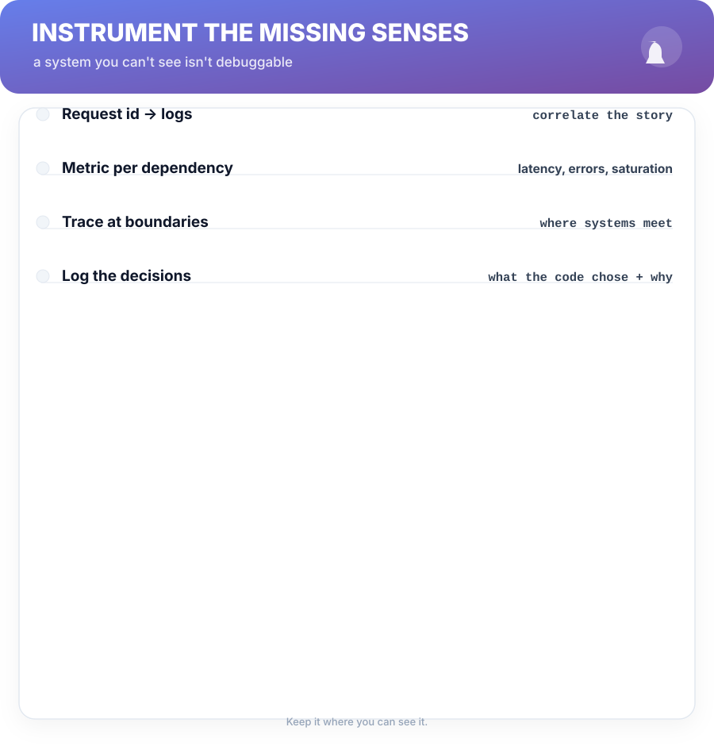

# Chapter 6. The Production Senses

## Scenario

Meera just inherited a service nobody else can "see." There's a log bucket, a dashboard nobody understands, and a tracing setup that was configured and forgotten. When it breaks, the team stares at an empty wall and guesses.

Guessing is what happens when a system is blind. This chapter gives it senses — and gives you the discipline of reaching for the right one.

## The four golden signals

When a system has only four dashboards, these are the four:

1. **Latency** — how long requests take: p50, p90, and p99. The median hides the hurting.
2. **Traffic** — how much is arriving, as a curve, not a headline. Spikes are incidents wearing masks.
3. **Errors** — the percent that fail. Express it as a *rate* — the budget drain from Chapter 7.
4. **Saturation** — how full the system is: queues, CPU, memory, connection pools. Saturation is where latency and errors come from; the signal watches the *cause*.

The golden signals are not four dashboards. They're four questions a healthy service can always answer.

## Match the question to the sense

The sense you grab depends on the question you're asking:

- **"Something's wrong"** → metrics. Always first: they're already time-shaped.
- **"It happened at…"** → metrics around that timestamp, zoomed.
- **"What exactly happened?"** → logs, correlated by request id.
- **"Which path is slow?"** → traces, branch by branch.

Correlation beats intuition: the log line with the request id *is* the metric spike, traced. The discipline is refusing to argue about a symptom you haven't correlated to its own request id.

## Instrument the missing senses

The honest state of most services: some senses are missing. Add them in order of question-value:

- **Request id everywhere** — generated at ingress, carried in every log line. One id = the whole story.
- **A metric per dependency** — latency, error rate, saturation for *each* outgoing call. "The DB" is not a sense; "the DB read path" is.
- **A trace at boundaries** — where systems meet is where surprises hide.
- **Log the decisions** — what the code chose and why, not just what it did. The best log line in an incident is the one explaining the choice.

**Watch out —** dashboards are not visibility; they're decoration until an alert reads them. A dashboard nobody has ever acted on is a wallpaper with a reload loop. The test (Chapter 7): every dashboard tile exists because someone takes an action when it moves.

## Short version

- The four golden signals: latency, traffic, errors, saturation — four questions, answerable always.
- Match the sense to the question: metrics changed, logs what, traces which path.
- Correlate by request id before you argue about a symptom.
- Instrument gaps in the right order; a dashboard nobody acts on is wallpaper.

## Do this

Pick your messiest service. Write down its four golden signals and which exist, with a label by each gap: *correlate*, *instrument*, or *unknown*. Book one afternoon to close the top gap — request-id correlation pays back every incident after it.

## Knowledge check

1. Name the four golden signals.
2. Which sense answers "which path through the system" — and how is it different from logs?
3. Why does the request id make correlation possible at all?