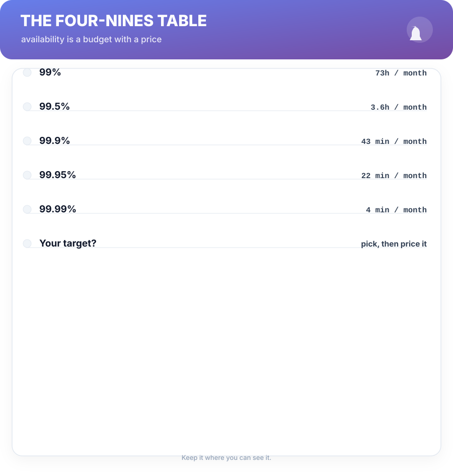
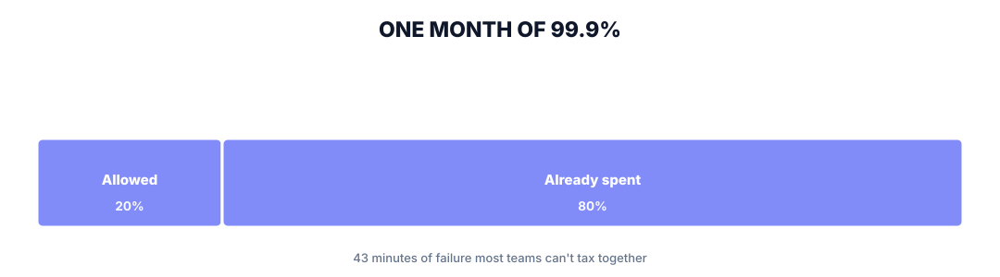
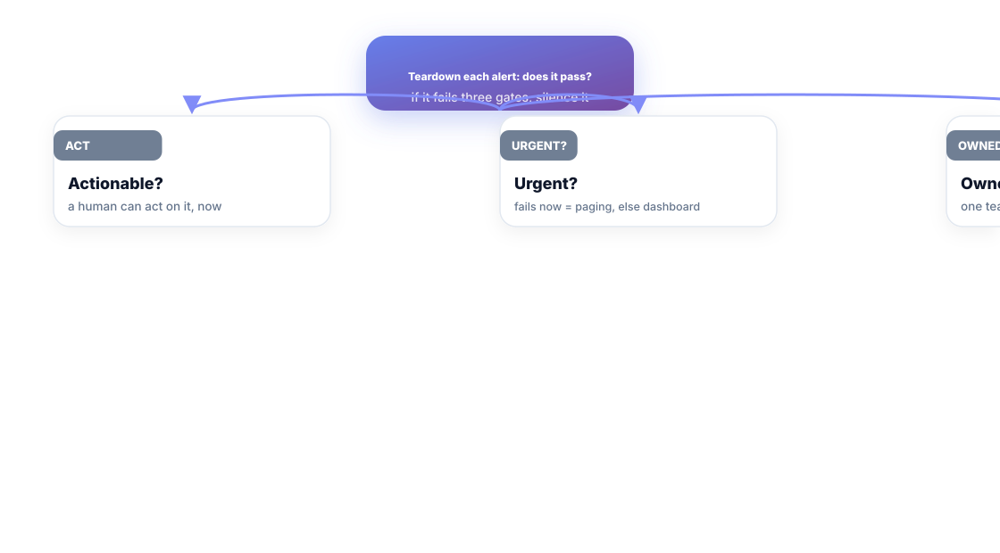

# Chapter 7. SLOs, Error Budgets, and Alerts That Aren't Noise

## Scenario

Meera opens the alerts page and scrolls past four hundred red things. All of them page someone. Two of them paged her at 3 a.m. last week — and both described the *same* thing wearing different permalinks. When everything is urgent, nothing is, and the on-call instinct is to mute the world.

The fix is the same medicine in three doses: an SLO, an error budget, and an alert teardown.

## Availability is a budget, not a slogan

"99.9% uptime" is a sentence that sounds like a bill of health. It's actually a *currency*: 43 minutes of permitted failure a month. Choose your target for the user's experience — not the marketing hero number — then price it:

An **SLO** is the target you pick (e.g., 99.9% of reads < 300 ms). An **error budget** is the accepted cost of risky improvements: the difference between 100% and your SLO is the amount of failure you're *allowed* to spend. Balance says: if the budget is unspent, you can ship riskier things; if it's empty, you stop shipping and fix accumulation first.

## The alert teardown

Every alert that pages a human must pass three gates, or it's noise dressed as vigilance:

- **Actionable?** A page that can't be answered with an action is a fact, not an alert. Put facts on a dashboard; page for *decisions*.
- **Urgent?** If it can wait until morning, it's a dashboard tile, not a page. Paging budget is human sleep, and it's finite.
- **Owned?** Every alert must name its owner team. An orphan alert gets answered by nobody at 3 a.m. — which is worse than no alert.

Run the teardown quarterly. Alerts that fail two gates get scheduled tasks, not pages. Your on-call will sleep through the ones that matter — because the ones that matter are the only ones left.

## Alert design in practice

A good alert has the three parts an incident thread can consume directly: a **condition** ("5xx rate > 2% for 10 minutes"), a **severity** (Chapter 13's ladder), and a **runbook link** (a step, not a paragraph). Two alerts that mean the same failure should be one alert with a shared runbook — duplicate pages train humans to dismiss, and dismiss is Chapter 1's word for blinder.

## Watched dashboard = owned territory

The flip side of the teardown: every tile that survives is *owned*. A golden-signal dashboard with an owner and a trend is a conversation; four hundred orphan tiles is a haunted house. Ownership is what turns dashboards into the senses from Chapter 6.

## Short version

- Availability is a budget: pick an SLO, spend its error budget deliberately.
- Every alert passes three gates: actionable, urgent, owned — or it's noise.
- Page for decisions; park facts on dashboards.
- Owned dashboards are senses; orphan alerts are hauntings.

## Do this

Run one alert teardown meeting this week. Pull the top 20 paging alerts, run each through the three gates, and silence or fix everything that fails two. Then schedule the quarterly re-run on the calendar. Your next on-call rotation will thank you in unbroken sleep.

## Knowledge check

1. What's the relationship between an SLO and an error budget?
2. Name the three gates of the alert teardown.
3. Why do duplicate alerts make human alerting worse, not better?