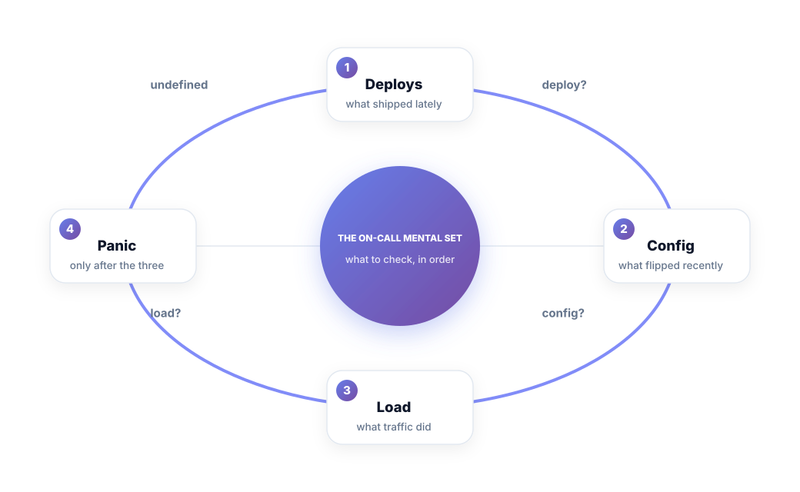
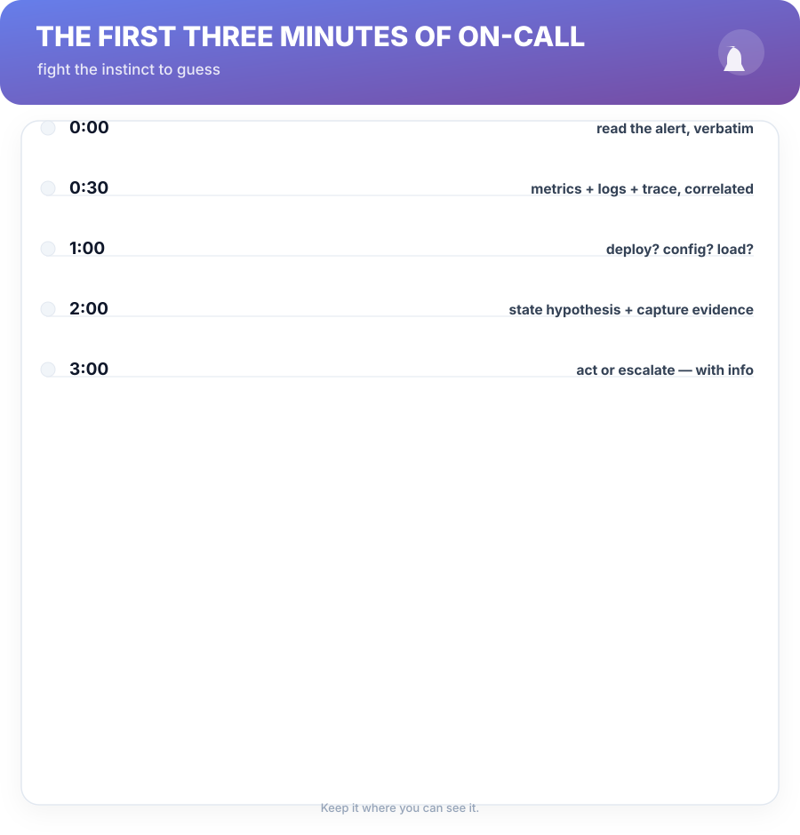
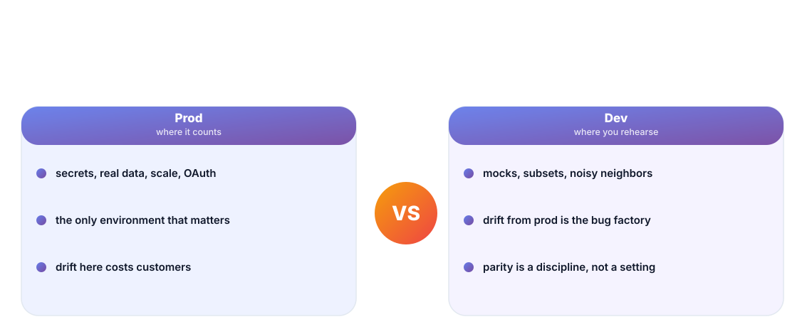

# Chapter 8. Production Realities

## Scenario

Sam's go-live is next month. The staging environment passes, the code review is clean, and Sam is quietly confident. Meera schedules a "production reality" walkthrough and asks three questions Sam hasn't thought about: *where do the secrets live, what happens when the DB restarts, and who answers the page?*

The tutorial taught Sam to build. Production is the part where it runs. This chapter is that gap.

## Deploys, config, load — the on-call mental set

When a service misbehaves, the answers to three questions solve most nights — always in this order:

1. **Deploys** — what shipped lately? The release log is the first suspect list.
2. **Config** — what flipped recently? Feature flags and config are deploys wearing different clothes.
3. **Load** — what did traffic do? Spikes come from the world, and the world doesn't file a PR.

Only after the three go the exotic theories. The on-call mental set is cheap to run and hilarious in how often it's skipped — because theory-hopping is Chapter 1's disease and the dashboards are its playground.

## The first three minutes

The incident clock starts when the pager fires, and the first three minutes set the tone for the next hour:

- Read the alert *verbatim* — not what you assumed it said.
- Correlate: metrics + logs + trace for the same request id.
- Ask deploy? config? load? — with a timestamp.
- State a hypothesis and capture evidence (Chapters 2–3).
- Act or escalate with that info attached.

Escalation with a hypothesis and a timestamp is promotion-grade behavior. Escalation with panic is a handoff of the problem plus the vibe.

## Env parity — dev is not prod

A growing fraction of "ghost bugs" are actually environment drift: the dev works, prod fails, and the difference is a config, a secret, a data shape, or a quota. Parity is a discipline, not a platform feature:

- **Names matter** — a flag named differently in prod than dev is two bugs already.
- **Data shape wins** — a dev DB of clean samples hides every null-handling bug.
- **Secrets and quotas** — the first prod-only failure is usually one of these.

The cost of parity is boring; the cost of drift is Sam's 1 a.m. call. Boring, cheap.

## On-call 101 for the soon-to-be-number

If you're new, the runbook is your job. Read it before your first rotation, then improve it after every call. Every second you spend fixing the runbook is a second future-you will spend asleep on call instead of guessing.

**Cheat sheet —** a runbook entry that couldn't be followed at 3 a.m. is decorative prose. Test every runbook step the way you'd test the repro from Chapter 2: run it, cold, on call.

## Short version

- Most nights are solved by three checks, in order: deploys, config, load.
- The first three minutes set the incident: read, correlate, list the three, then act.
- Dev is a rehearsal; prod is where drift turns into bugs.
- The runbook is your job — read it, improve it, test it cold.

## Do this

Next deploy: write the three on-call questions beside the release note (what shipped, what flipped, what traffic might do) and paste them in the channel when it ships. That three-line note is the fastest incident starter your team will ever receive.

## Knowledge check

1. What three checks run, in order, before exotic theories?
2. Why does escalation with a hypothesis beat escalation with panic?
3. Why is env drift a factory for ghost bugs — and what's the cheapest parity discipline?