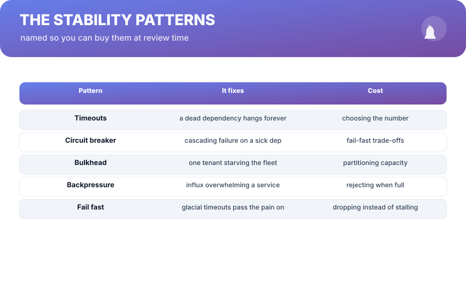
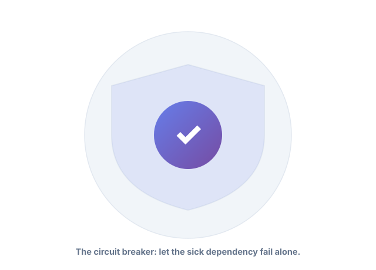
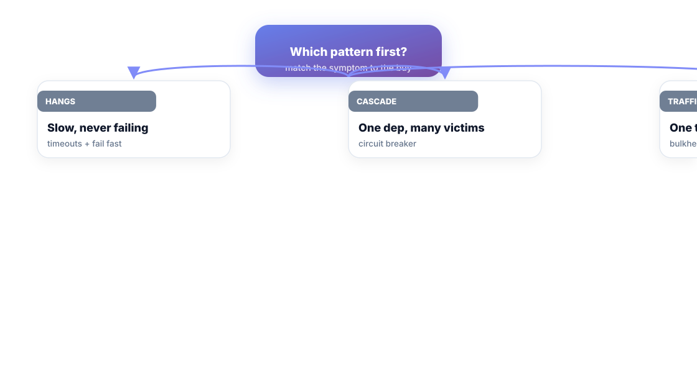

# Chapter 9. The Stability Patterns

## Scenario

Meera watches a graph tell a familiar story: one dependency slows, and the whole service crawls; one tenant spikes, and every customer suffers; one timeout and everything below it waits. The failures aren't new — they're *named*. They just weren't named at Meera's last architecture review.

Names are what this book sells. This chapter names five stability patterns so you can buy them at review time.

## The five patterns

| Pattern | It fixes | Cost |
| :--- | :--- | :--- |
| **Timeouts** | a dead dependency hangs forever | choosing the number |
| **Circuit breaker** | one sick dependency cascades | fail-fast trade-offs |
| **Bulkhead** | one tenant starves the fleet | partitioning capacity |
| **Backpressure** | influx overwhelms a service | rejecting when full |
| **Fail fast** | glacial timeouts pass pain on | dropping, not stalling |

Every production incident in your last six months maps to at least one of these lines. If it doesn't, you found a new pattern — write it down, that's the chapter's homework.

## Timeouts and fail fast

The cheapest stability buy is a timeout that actually fires, on every outbound call. The pattern companion is **fail fast**: when a call can't succeed, return a fast error rather than a slow crawl. Glacial failure is strictly worse than fast failure — it burns threads, queues, and everyone downstream for minutes while the error could have been rejected in milliseconds.

> The number matters more than the framework. A timeout measured in "the page loads" is a research project; a timeout in service-time budget is an engineering decision. Pick it per dependency, document it, and review it when a bottleneck appears.

## Circuit breakers

A slow dependency is a magnet: every request piles onto it, waits, then fails — and the systems *downstream of the wait* degrade too. A circuit breaker watches failure rates and, past a threshold, returns a fast failure *without calling the sick dependency at all*: the dependency gets time to heal, and the fleet gets its threads back. It's the difference between one cow suffering and the whole herd catching the disease.

## Bulkheads and backpressure

- **Bulkhead**: partition capacity so one tenant's surge cannot starve everyone else. Dedicated pools per tenant/class — expensive to build, essential when a single noisy neighbor is a recurring incident shape.
- **Backpressure**: when the service can't keep up, it must say so — reject clearly with a busy signal and an exit path rather than queue forever and die of queue-depth. "Full, try later" beats "stuck, forever."

Choose by symptom:

## The review-time test

Architecture reviews rarely fail for lack of talent; they fail for lack of *names*. Add one agenda item to every review: *which of the five patterns is the dependency graph asking for?* If the room can't name one, that's a finding, not a silence. Buy the cheapest pattern that removes a whole incident class — usually timeouts — and graduate up only when the data demands it.

## Short version

- Five named patterns: timeouts, circuit breaker, bulkhead, backpressure, fail fast.
- Fast failure beats glacial failure — reject rather than crawl.
- Match the pattern to the symptom: hangs → timeouts, cascade → breaker, flood → bulkhead/backpressure.
- Reviews need names; "which pattern does this graph need?" is a mandatory agenda item.

## Do this

Take your last three incidents. Map each to one of the five patterns, or write the new one down with a name. Then buy exactly one: the cheapest pattern that would have removed the biggest class. Ship it, measure, and the chapter's cost table becomes your roadmap.

## Knowledge check

1. Name all five stability patterns and the failure each fixes.
2. Why is fast failure strictly better than glacial failure?
3. What agenda item should every architecture review carry?