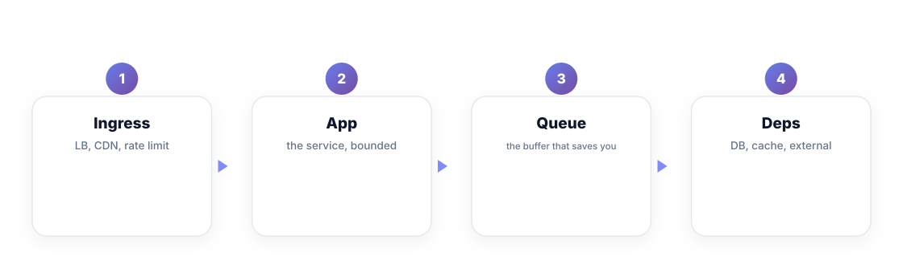
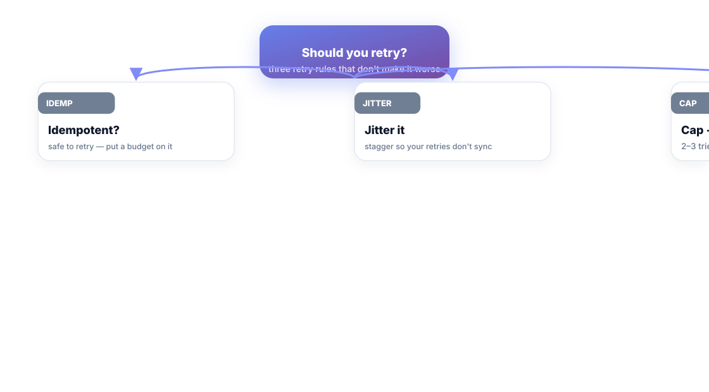
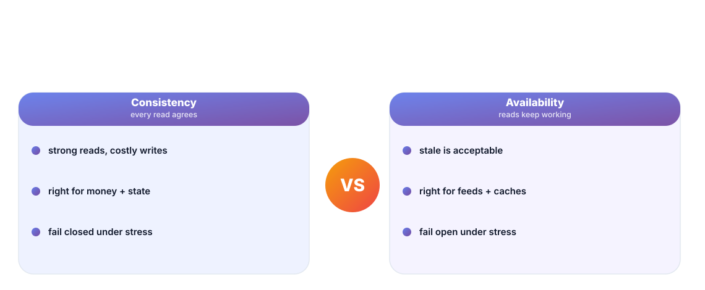

# Chapter 10. The Trade-offs That Matter

## Scenario

Sam designs the new checkout flow. Meera asks three questions Sam treats as administrative: *What happens if the queue fills? Can the retry storm the DB? Which reads can be stale?*

These aren't details. They're the trade-offs the architecture actually is. This chapter names the four that matter most — the ones that decide between a boring night and the carpet of red.

## The load path

Before any resilience pattern, you must be able to draw the load path: Ingress → App → Queue → Deps. The path is where every failure will happen — and where every pattern from Chapter 9 gets mounted. Three questions per hop:

- Does the hop time out, or wait forever?
- If it fails, does the caller retry — safely (Chapter 10's retry rules) or like a storm?
- If the queue behind it fills, is the answer a rejection with a busy signal (backpressure) or a slow death?

The team that can't draw the load path can't design for it — and the team that can, finds the tape measure is 70% of the battle.

## Retries: three rules that don't make it worse

Retries are the highest-leverage footgun in distributed systems. The correct stance in three rules:

1. **Retry only idempotent calls.** If a retry can double-apply, you've traded a timeout for a data bug.
2. **Jitter them.** Synchronized retry storms are how a sick dependency becomes a dead fleet. Stagger your retries.
3. **Cap and back off.** Two to three tries, exponential backoff, then fail fast (Chapter 9). An infinite retry loop is a distributed deadlock.

The worst retry policy is the implicit one: "the framework retries, nobody set the budget, every customer retries together." That's not a policy — that's a cascade halfway to happening.

## Queues and batching

A queue is a buffer you've drawn on purpose. Its two design decisions: *capacity* (what happens when full — rejection with a busy signal beats unlimited, dying separately) and *batching* (fewer, bigger writes trade latency for throughput). Batch like the data allows, not like the code page allows. Every queue is a place where a backlog is a decision wearing a metric.

## Consistency vs availability

The oldest honest trade-off decided per feature, not per system:

- **Consistency**: every read agrees. Right for money, state, and anything you'd bend over backwards not to double-apply. Costs writes and latency.
- **Availability**: reads keep working, freshness may lag. Right for feeds, caches, and recommendation surfaces. Fails open instead of closed.

The failure posture matters more than the ideal: under stress, does the feature *fail closed* (safe, correct, hard) or *fail open* (serves stale, keeps working)? Decide it out loud per endpoint before the incident decides it for you.

## Short version

- Draw the load path; every failure and every pattern lives on it.
- Retry only idempotent calls, jitter them, cap and back off.
- Queues need a capacity decision; batching trades latency for throughput.
- Choose consistency vs availability per feature — and decide fail-closed vs fail-open out loud.

## Do this

Draw your service's load path on a whiteboard or doc, one line per hop, and mark each with its worst failure: timeout, retry-storm risk, queue-full behavior, and whether it fails closed or open. Present it at the next review. The drawing is the review.

## Knowledge check

1. What three questions does every hop of the load path have to answer?
2. State the three retry rules.
3. When does a feature prefer consistency, and when availability — and what must you decide per endpoint?