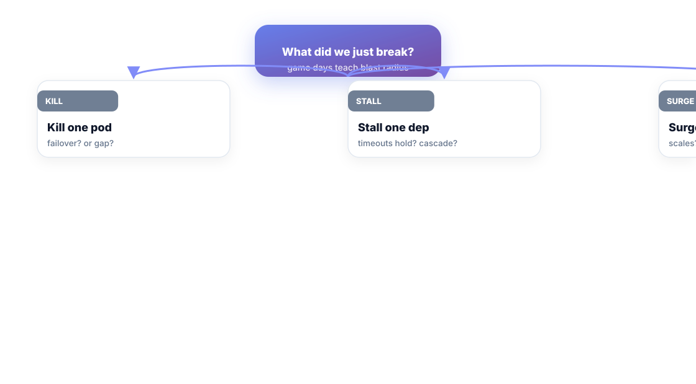
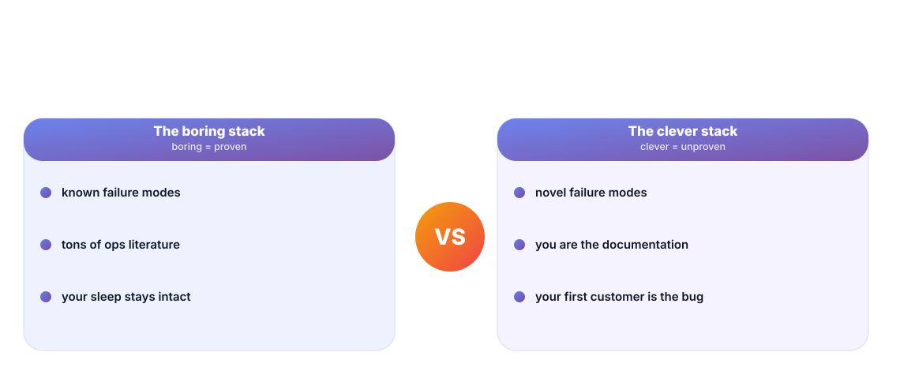
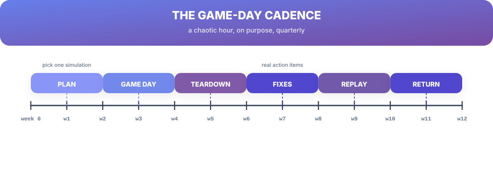

# Chapter 11. Failure in Practice

## Scenario

Meera has read everything. Patterns, trade-offs, SLOs — all sanctioned, none actually exercised. Then the dependency quietly degrades in production and it takes the team 90 minutes to notice that the "healthy" dashboards were showing a metric nobody had ever watched.

Theory is cheap; drill is expensive and worth every minute. This chapter makes failure an appointment.

## Failure injection: break it on purpose

The cheapest form of practice is a *game day*: an hour, a goal, one controlled break:

- **Kill one pod.** Does traffic fail over — or does the fleet hold a breath?
- **Stall one dependency.** Do the timeouts from Chapter 9 fire, or do requests pile up in a queue that grows forever?
- **Surge traffic.** Does the service scale, or throttle gracefully with a busy signal?

The point is the *inventory of what you just broke* — blast radius discovered on purpose, at 2 p.m., with a runbook open, instead of at 2 a.m. with a pager.

## Blast radius is the metric

Every game-day question reduces to one number: how far did the failure travel? One pod gone and nothing notices — small radius, good. One dependency stalled and the whole fleet crawls — radius is the whole fleet, which is your Chapter 10 load path's biggest open question, now with evidence.

The blameless part is automatic here: you broke it on purpose. The insight price is low, the honesty price is zero, and the findings feed straight into Chapter 5's postmortem format.

## The boring stack wins

Over time, the mature team's stack looks *boring*: proven components, known failure modes, documented runbooks. That is not a failure of ambition. The boring stack has the literature, the tooling, and the reused incidents. The clever stack's failure modes are novel — which means you are the documentation, and your first customer may be the bug.

Boring in production, clever where it's cheap to be wrong. The adventurous code goes behind a feature flag and a graded rollout (Chapter 12) — never at the load-bearing seam.

## A game-day cadence

Quarterly is enough to matter and few enough to survive: Plan → Game day → Teardown → Fixes → Replay (the fix against the same injection) → Return. The replay step matters — the whole loop from Chapter 1 applied to your own drills: the fix should make the same injection boring on the second run.

## Short version

- Game days price failure at 2 p.m. instead of 2 a.m.: kill, stall, or surge on purpose.
- Blast radius is the metric — how far did the break travel?
- The boring stack wins because its failure modes are known; be clever where being wrong is cheap.
- Run the cadence: plan → day → teardown → fix → replay.

## Do this

Book the next game day on the calendar this week: an hour, one injection (kill a pod on the service that least breaks the world), and a named goal. Write the teardown as a postmortem, with owners. That's the entire practice loop, started.

## Knowledge check

1. Name the three standard game-day injections.
2. Why is blast radius the metric that matters?
3. What does the "boring stack" actually mean, and why does it win?