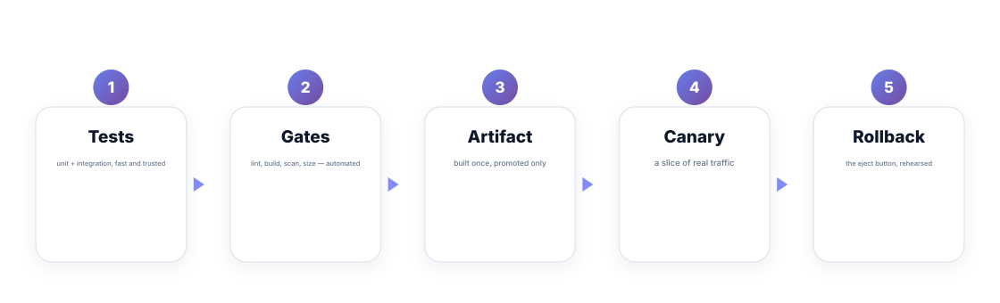
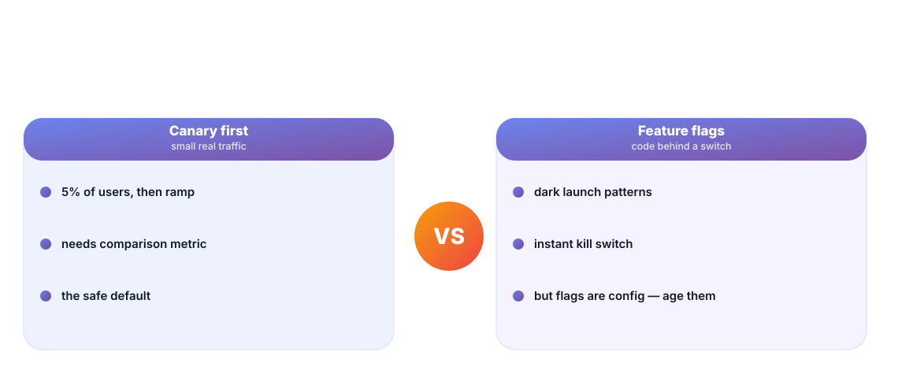
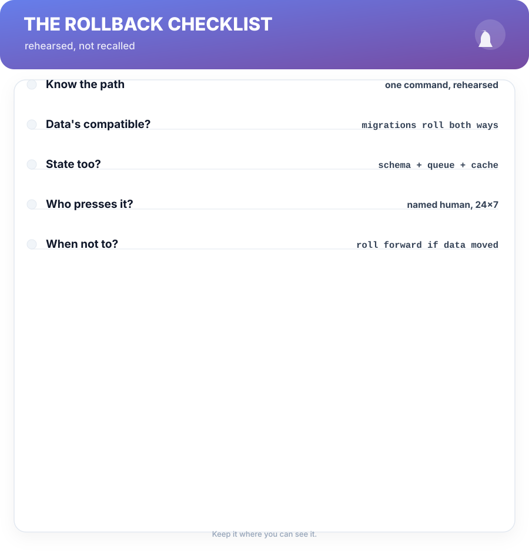

# Chapter 12. CI/CD That Defends Production

## Scenario

Sam's team ships every Friday, "because it's the safest time." The deploy is a two-hour ritual nobody can do alone: three clicks nobody can explain, one shared secret, and a rollback that lives in someone's memory. Every release is an incident with extra steps.

The pipeline should be the *boringest* part of production — a conveyor belt between soiled code and a canary. This chapter builds that belt.

## The pipeline as defense

A release pipeline is defense in depth. Its stages are backstops, and each has a job:

- **Tests** — unit and integration, fast enough to run every commit and trusted enough to gate on.
- **Gates** — lint, build, scan, size checks: mechanical, automated, and *noisy-free*.
- **Artifact** — build once, promote only. The code that reaches staging is byte-identical to what reaches prod.
- **Canary** — a slice of real traffic, compared against the baseline (Chapter 6 senses do the comparing).
- **Rollback** — the eject button, rehearsed, not recalled.

The pipeline's enemy is the manual step that lives in someone's memory. Every "I always run this little command" is a bug waiting for the day the person is on leave.

## Deploy strategies: canary first

- **Canary**: 5% of real users, watch the golden signals, ramp if clean, roll back if not. The safe default, because it keeps a comparison metric alive.
- **Feature flags**: code shipped dark, behind a switch. Enables safe trunk deploys and instant kill — but a flag is config, ages like config, and un-deleted flags are a tech-debt species of their own.

The working pair: canary for the release's *shape*, flags for the release's *scope*. Use flags to turn parts of a big deploy into many small reversible steps.

## The rollback that works

A rollback is a feature, and it deserves a checklist, rehearsed:

- **Know the path** — one command, rehearsed before it's needed, tested in a drill (Chapter 11).
- **Data walks both ways** — migrations must reverse; the schema the code expects must exist on the old version. Roll forward if data moved, roll *code* back if not.
- **State too** — schema, queue shapes, cache formats, feature-flag defaults. Code isn't the only thing that rolls.
- **Name who presses it** — a named human, 24×7, with authority. A rollback nobody owns is a ceremony.

## Deploy discipline

Shippers adopt three habits that cut incident rates more than any tool:

1. **Small, frequent, reversible** — Friday-mega-releases become Tuesday-minutes.
2. **Deploy ≠ done** — the release closes when the canary window passes and the dashboard is bored.
3. **The diff is the story** — a release note with one line per change (Chapter 8's favorite) is what makes "what shipped lately?" answerable in ten seconds.

## Short version

- The pipeline is a conveyor belt of backstops: tests, gates, artifact, canary, rollback.
- Manual steps in memory are bugs waiting for leave day.
- Canary shapes the release; flags scope it; both shrink to reversible steps.
- Rollback is a rehearsed feature — data walks both ways, and someone named owns the button.

## Do this

Run one rollback drill this week: pick a service, write the one-command rollback, and rehearse it on staging with a real flag flip or a real reverted artifact. Time it. If it took more than five minutes, the checklist's first line is now "fix the rollback times."

## Knowledge check

1. Name the five backstops of a defending pipeline.
2. What's the difference in job between a canary and a feature flag?
3. Why must migrations be reversible, and when do you roll forward instead?