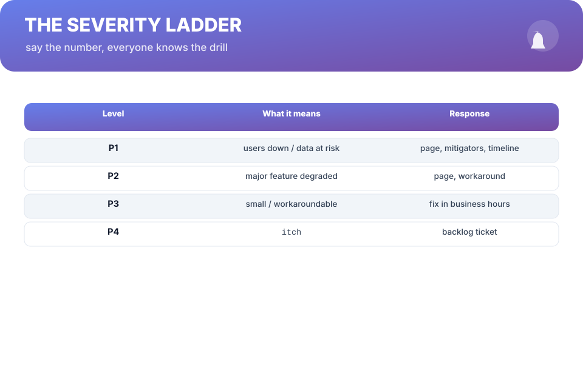
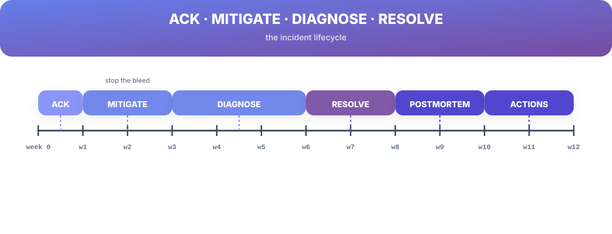
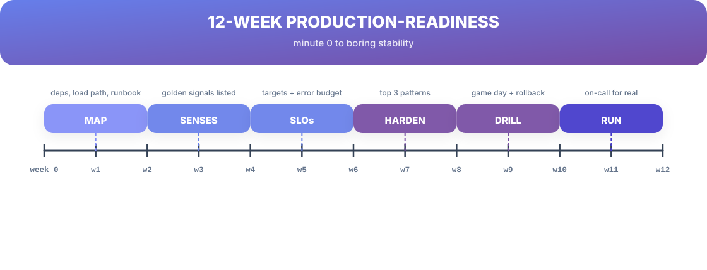

# Chapter 13. Incident Response & the 12-Week Production-Readiness Runbook

## Scenario

Rhea's pager fires: P1, checkout is down. She's the incident commander until she's not. The room fills with three people who all speak at once, one person quietly pushing code, and a growing silence about whether anyone has updated the timeline.

The incident's outcome isn't decided by expertise. It's decided by *procedure* — the same procedure every time, so nobody has to think about what to do. This chapter is that procedure, plus the twelve weeks that make it routine.

## The severity ladder

Everything starts with a shared vocabulary:

| Level | What it means | Response |
| :--- | :--- | :--- |
| **P1** | Users down / data at risk | page, mitigators, timeline |
| **P2** | Major feature degraded | page, workaround |
| **P3** | Small / workaroundable | fix in business hours |
| **P4** | Itch | backlog ticket |

The level is set in the first minute and can move down later — but only deliberately. "Is it P1?" answered fast beats "what exactly is happening?" answered slowly.

## The incident lifecycle

Every incident is the four stages in order:

1. **Ack** — the pager is answered and the level is named. Silence is the enemy; even "on it" is progress.
2. **Mitigate** — stop the bleed before cold diagnosis: rollback, feature-flag off, traffic shift. Mitigation is not diagnosis (Chapter 1) — the investigation continues after the graphs flatten.
3. **Diagnose** — with the system stabilized, run the loop from Part 1 calmly.
4. **Resolve → postmortem → actions** — the fix, then Chapter 5 turns the timeline into owners and dates.

Roles stay explicit: one **commander** (the decider), one **scribe** (the timeline), one **comms** voice (the world gets updates from one person; the engineers get silence for work). Nobody works harder than they communicate by accident.

## The runbook, the 12 weeks

The discipline is not a course; it's a runbook on a calendar. Twelve weeks from "I don't know my system" to "boring on-call":

- **Weeks 1–2 — Map.** Load path (Ch 10), dependencies, contacts, the runbook skeleton.
- **Weeks 3–4 — Senses.** Golden signals exist, request ids correlate (Ch 6).
- **Weeks 5–6 — SLOs.** Targets picked, error budgets priced, alerts teardown-run (Ch 7).
- **Weeks 7–8 — Harden.** Top three patterns bought (Ch 9), load-path questions answered.
- **Weeks 9–10 — Drill.** One game day, one rollback rehearsal (Ch 11, 12).
- **Weeks 11–12 — Run.** On-call for real, with the read-back audit scored.

## Nightmare card

**The incident nobody owns.** It's P1, no commander is named, comms improvise, and the timeline is reconstructed from memory next week — then the postmortem finds its action items were "communicate better" and "be more careful." The fix is boring and specific: name the commander, name the scribe, name the comms voice in the first minute of every P1. Roles are not titles; they're the first three lines of this chapter.

## Short version

- The severity ladder is the shared vocabulary; name the level in the first minute.
- Acknowledge → mitigate → diagnose → resolve; mitigation is not diagnosis.
- One commander, one scribe, one comms voice — every P1, every time.
- The 12-week runbook turns a team from "I don't know my system" to boring on-call.

## Do this

Write the "first three lines of a P1" for your team today: who is the commander by default, who scribes, who owns comms — and post them where the incident channel starts. Then open the readiness audit in the back and score yourself. That score is week zero of the runbook.

## Knowledge check

1. What does each severity level trigger as a response?
2. Name the four incident stages and the order they run.
3. What three roles are named in the first minute of every P1 — and why?