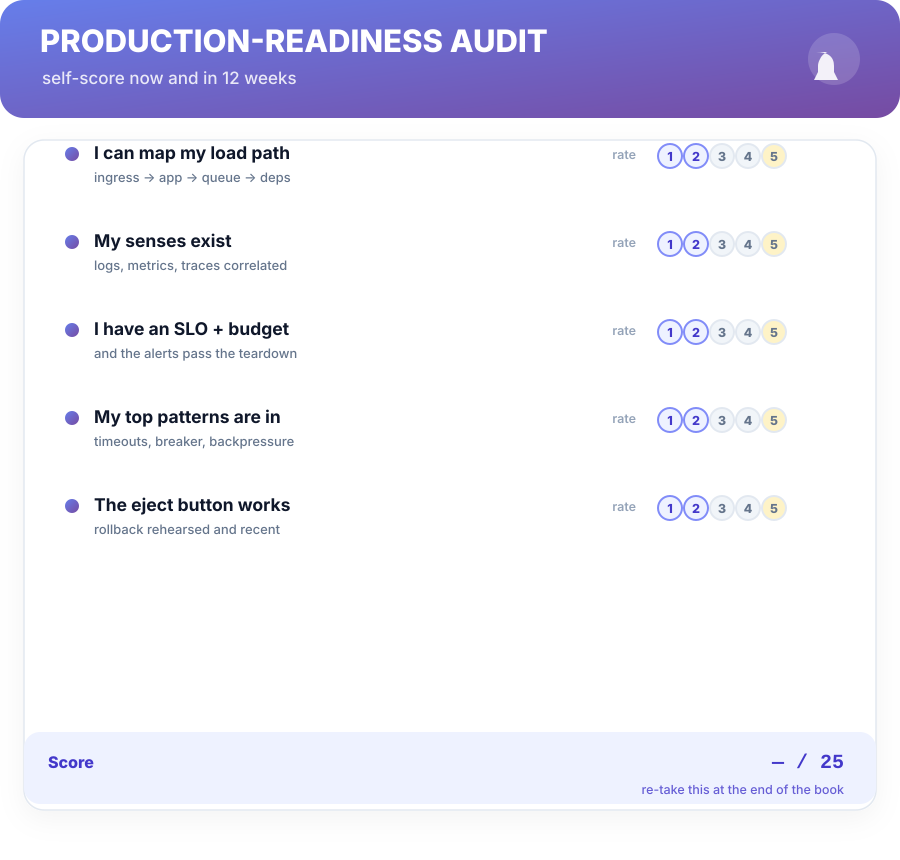
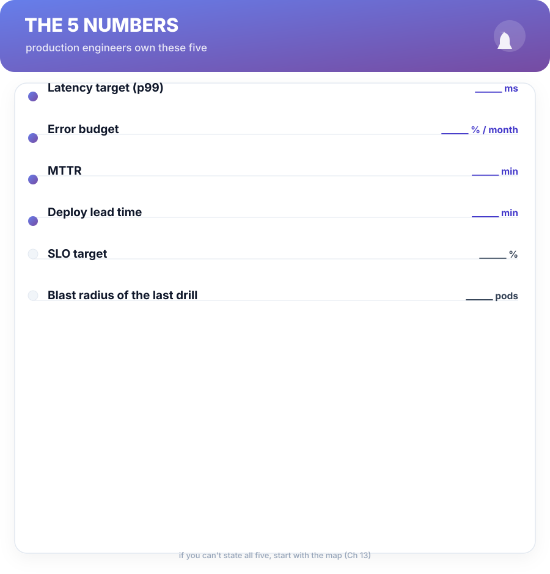

# Back Matter

## Production-Readiness Audit

Score yourself now, then re-run the audit at the end of the 12-week runbook. The gaps the rows name are your next month's work.

**What did the gap tell you?** If your score moved, the runbook worked. If it didn't, the low rows are your Chapters in that exact order — the audit is a syllabus wearing a scorecard.

---

## The 5 Numbers

Fill them in. The whole book reduces to these.

1. **Latency target (p99)** — the number you defend (Ch 6).
2. **Error budget** — the failure your SLO affords you per month (Ch 7).
3. **MTTR** — how fast you can return to green (Ch 13).
4. **Deploy lead time** — commit to canary, wall clock (Ch 12).
5. **SLO target** — the availability you actually promised (Ch 7).

If you can't state all five, start with the map — that's Week 1 of the runbook.

---

## The Runbook Template

One page per service. Start here; extend a line at a time.

**Service:** ______ **Owner:** ______ **Runbook owner:** ______

- **Load path:** ingress → API → queue → DB → deps (links to dashboards).
- **SLO:** target %, error budget, and the one dashboard that proves it.
- **Top three failure modes:** 1) ____ → runbook link; 2) ____ ; 3) ____.
- **Rollback:** one command, rehearsed (last rehearsal date: ______).
- **On-call:** who, what "healthy" looks like, and who gets escalated.
- **Postmortems:** link to the last one; its action items and owners.

---

## The Incident Checklist

Paste into the incident channel; fill as you go.

- [ ] **Ack** — "on it." Name the level: **P1 / P2 / P3**.
- [ ] **Roles** — commander: ____; scribe: ____; comms: ____.
- [ ] **Timeline started** — full timestamp log (not memory).
- [ ] **Mitigation** — rollback / flag / shift traffic. *Mitigation ≠ diagnosis.*
- [ ] **Senses** — metrics + logs + trace, correlated by request id.
- [ ] **Deploy? config? load?** — the three questions, answered.
- [ ] **Hypothesis + test** — written; verdict recorded.
- [ ] **Resolve** — fix to the cause (Ch 4); repro replayed.
- [ ] **Postmortem scheduled** — owner + date within the week.

---

## FAQ

**"My team has no dashboards or tracing. Where do I start?"**

Chapter 6's order is the answer: request ids and structured logs first — one afternoon of work — then a metric per dependency. Senses come before SLOs, always.

**"I'm not on-call yet. Is this book for me?"**

Parts 1 and 4 yes — the debug loop and the deploy pipeline cost you nothing to practice. By the time you're paged, the procedure should already be reflex.

**"Aren't game days just chaos experiments?"**

Related but different: game days are *scheduled, bounded, teardown-driven* practice with named owners (Ch 11). If there's no teardown or no owner, it's not a game day — it's Monday.

**"Boring stack feels like career stagnation."**

Boring is a property of the *production seam*, not your ambition. Be as clever as you like behind a flag and a canary (Ch 12); keep the load-bearing path proven. The calm is the career.

**"Do we really need a postmortem for a P3?"**

P3s get a short entry in the timeline and one action item, not a full chapter-5 ceremony. The discipline is: everything has a timeline and an owner. Size the ceremony to the blast radius.

---

## Glossary

| Term | Meaning |
| :--- | :--- |
| **Blast radius** | How far a failure travels — the metric every game day prices (Ch 11). |
| **Bulkhead** | Partitioning capacity so one tenant can't starve the fleet (Ch 9). |
| **Circuit breaker** | Fast-failing past a threshold to let a sick dependency heal alone (Ch 9). |
| **Error budget** | The failure your SLO affords; spend it deliberately (Ch 7). |
| **Golden signals** | Latency, traffic, errors, saturation (Ch 6). |
| **Load path** | The route a request takes, where every failure lives (Ch 10). |
| **Mitigation ≠ diagnosis** | Stopping the bleed is not explaining it (Ch 1). |
| **Production Loop** | Debug → Observe → Harden → Ship — this book's spine. |
| **Shrink the Case** | Capture, control, shrink, name — the repro skill (Ch 2). |
| **Theory-hopping** | Guessing without hypotheses; the loop's opposite (Ch 1). |

---

## Knowledge Check — Answers

**Ch 1:** 1) Reproduce → Diagnose → Fix → Reflect. 2) Theory-hopping produces actions but no information; the loop produces evidence at every stage. 3) Negative results delete branches of the change space — the fastest route to the truth, and a source of trust in postmortems.

**Ch 2:** 1) Capture, control, shrink, name. 2) Evidence windows close the moment you look away; capture is the only reproducibile part. 3) A repro only benefits later stages if it's committed; in memory it decays into a rumor.

**Ch 3:** 1) Form → test → verdict → update. 2) Traces. 3) A hypothesis is falsifiable and written; a vibe is a narrative without a killer test (Ch 3's explain-it-first rule).

**Ch 4:** 1) The trigger lights the fuse; the cause is why the fuse existed. 2) Against the cause, replay the repro, add the guard, ship small. 3) "Someone forgot" treats a process gap as a personality; the fix has to land on the system (Why #4–5).

**Ch 5:** 1) The timeline is the evidence artifact; memory is not. 2) Blameless asks what failed in the system, keeps evidence visible, ships fixes to the system. 3) The fix, one owner, a due date, a test.

**Ch 6:** 1) Latency, traffic, errors, saturation. 2) Traces; logs are per-event, traces are per-request-path. 3) The id is the join key that makes metrics, logs, and traces the same story.

**Ch 7:** 1) The error budget is the failure your SLO affords; spend it or stop shipping. 2) Actionable, urgent, owned. 3) Duplicates train humans to dismiss pages — dismiss is a blinder.

**Ch 8:** 1) Deploys, config, load — in that order. 2) Escalation with evidence hands over a thread, not a vibe; the next engineer continues the loop. 3) Dev is a rehearsal with clean data; parity of names, data shape, and secrets removes the production-only variation.

**Ch 9:** 1) Timeouts (hangs), circuit breaker (cascade), bulkhead (tenant starvation), backpressure (influx), fail fast (crawl). 2) Fast failure frees threads and queues; glacial failure burns everything downstream. 3) "Which pattern does this dependency graph need?" — names buy decisions.

**Ch 10:** 1) Timeout? Safe retry? What happens when the queue fills? 2) Idempotent only; jitter; cap + backoff. 3) Consistency for money/state, availability for feeds/caches — and fail-closed vs fail-open decided per endpoint.

**Ch 11:** 1) Kill a pod, stall a dependency, surge traffic. 2) It prices the load-path question with evidence instead of theory. 3) Proven components with known failure modes and literature; clever is for where being wrong is cheap.

**Ch 12:** 1) Tests, gates, artifact built once, canary, rollback. 2) Canary shapes release (traffic comparison); flags scope it (dark launch + kill switch). 3) Schema must be compatible in both directions; roll forward when data has moved, roll code back when it hasn't.

**Ch 13:** 1) P1 page+mitigators+timeline, P2 page+workaround, P3 business hours, P4 backlog. 2) Ack → mitigate → diagnose → resolve (→ postmortem → actions). 3) Commander decides, scribe owns the timeline, comms owns the world; roles guarantee procedure when panic competes for attention.

---

## The Postcard

> **DEBUG** — reproduce it, shrink it, then fix the cause, not the trigger.
> **OBSERVE** — golden signals; SLOs and budgets; alerts that pass three gates.
> **HARDEN** — timeouts, breakers, bulkheads, backpressure; drills on the calendar.
> **SHIP** — gates, canary, a rehearsed rollback, and flags that age.
> **RUN** — the audit, the five numbers, the runbook. Boring means it's working.

*Boring production is the product. The loop is the training run.*

— end of Bug Sniper · v1.0 · a living book · refinements free to buyers —