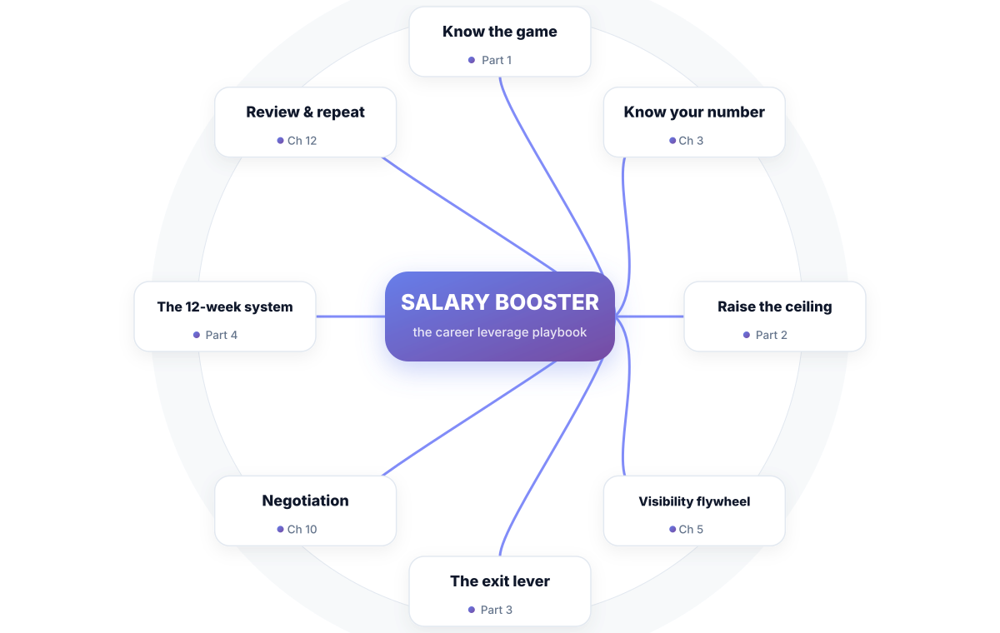
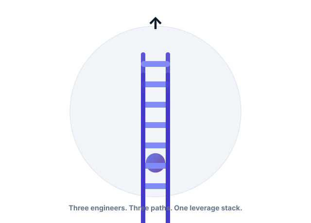
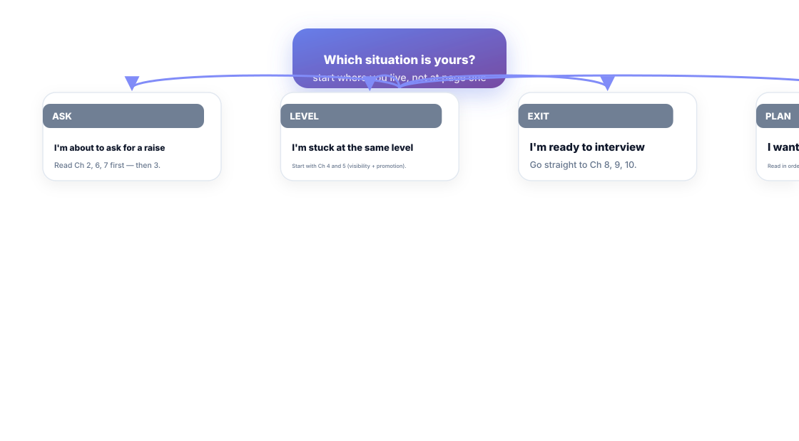

# Salary Booster

**The Career Leverage Playbook for Engineers**

*Promotions, salary negotiation, building influence, and interviews — the playbook for engineers who refuse to stay overlooked.*

---

## Preface

This is a book about money, and it refuses to be embarrassing about it. You are a working engineer. You ship things. Somewhere between your keyboard and your bank account, a system decides what your work is worth — and that system mostly runs on what other people can see and repeat, not on how hard you tried.

The good news: everything in that system is learnable.

The book you're holding is built for engineers who are technically strong and institutionally naive. It does not assume you're bad at your job. It assumes you've never been taught how the compensation system works, and that nobody at your company has an incentive to teach you. Both are safe assumptions.

Here is what this book will *not* do. It will not promise that saying the right sentence in the right meeting doubles your salary overnight. It will not ask you to fake enthusiasm, cold-call recruiters at midnight, or treat your job as a full-time negotiation. Most resources in this space are selling anxiety. Fixed anxiety, I suspect. You don't need more of it.

Here is what it *will* do: give you a system. The **Leverage Stack** — *Value → Visibility → Leverage* — the three layers every promotion, raise, and job switch actually run on. It will show you, chapter by chapter, how to raise each layer, in an order that compounds.

Three engineers read this book with you. Priya is a mid-level engineer who wants a raise without quitting. Dev wants the promotion they've been invisible for. Anjali is building an exit lever. Their names come back every chapter, because the system only starts working when it's yours, on your calendar, in your numbers.

One promise before we start: the tools in this book cost you nothing but attention and one honest hour per quarter. Companies don't pay your loyalty. They pay your leverage.

Welcome to the leverage stack.

---

## Introduction — How to Use This Book

*The whole book, on one page. Pin it where you can see it.*

This book is a system, not a collection of tips. Every chapter plugs into the same spine, and the spine is one idea:

> **Your pay is set by what decision-makers *believe* you produce — Value, made Visible, becomes Leverage.**

Each part of the book raises one layer of the stack:

- **Part 1 — Know the Game.** Chapters 1–3. The current you, priced honestly. How compensation actually works, and what your number *is*.
- **Part 2 — Raise the Ceiling Where You Sit.** Chapters 4–7. Promotions, visibility, the ask, and the counter-offer — the leverage you can build without leaving.
- **Part 3 — The Exit Leverage.** Chapters 8–11. Your resume as a sales page, interview prep that respects your effort, negotiation with known moves, and the 12/24/36 decision model.
- **Part 4 — The System.** Chapters 12–13. The 12-week plan that compiles everything, and the scripts to run it.

You are allowed to read this book out of order. That's what the navigator on the next page is for.

### The pattern in every chapter

Every chapter follows the same skeleton, so you can scan fast and use fast:

- **Scenario** — a concrete situation you've probably lived this quarter.
- **The idea** — what's actually going on, named so you can talk about it.
- **Figures** — diagrams, because this system is easier to see than to read.
- **Short version** — the chapter in four lines.
- **Do this** — exactly one action, this week.
- **Knowledge check** — three questions. Answers in the back, and yes, you should actually do them.

### Three engineers, three paths

Throughout the book, Priya, Dev, and Anjali run the same system on different problems:

- **Priya** (ask track) — underpaid relative to market, likes her team, wants a raise without leaving. Follow chapters 2, 3, 6, 7.
- **Dev** (promotion track) — paid fine, but invisible. Wants the title. Follow chapters 4, 5, 6.
- **Anjali** (exit track) — grown past what this company can offer. Building the clean exit. Follow chapters 8, 9, 10.

They aren't characters. They're your three possible selves, running the same Leverage Stack at different stages. Wherever you are on that arc, one of them is you.

---

## Reader Navigator — Start Where You Live

*Four situations. Four entry points. You don't have to start at page one.*

| If you are… | Start with… | Then… |
| :--- | :--- | :--- |
| About to ask for a raise | Ch 2, 6, 7 | Ch 3 (know your number) |
| Stuck at the same level | Ch 4, 5 | Ch 6 (the ask) |
| Ready to interview | Ch 8, 9 | Ch 10 (negotiation) |
| Building the full system | Read in order | Ch 12 (the 12-week plan) |

If you only ever read one chapter, it's **Chapter 3 — Know Your Number**. Everything else is leverage; that chapter is the price of admission.

---

## A Living Book

Get-this-edition-caveats are a compliance chore. This is not that. Two facts:

1. Compensation data has a shelf life. By the time this book reaches you, some benchmark numbers have moved.
2. That means the book is versioned like the software you ship — and refined editions are part of what you bought.

**Edition & changelog**

| Version | What changed |
| :--- | :--- |
| 1.0 | First edition. Full system, 13 chapters, artifact kits. |
| 1.x | Refinements — new scripts, updated benchmarks, reader feedback. **Free for every buyer.** |

The 5 numbers in the back of this book are intentionally fill-in-the-blank. Fill them in, and the changelog falls into place on its own.

Now go to Chapter 1 — and set up your evidence list before you read it. You'll understand why by page three.

---

## The Leverage Stack — Postcard

Once you've read the book, this postcard is the whole system. Keep it on your desk:

> **VALUE** — produce real, hard evidence of value (Ch 1, 10).
> **VISIBILITY** — make it impossible to miss (Ch 4, 5, 8).
> **LEVERAGE** — convert attention into a letter, a band, or an offer (Ch 6, 7, 9, 10).
> **SYSTEM** — run the ritual: know your number, check quarterly, act on signal (Ch 3, 12).
> **EXIT** — the hammer you never have to swing (Ch 11).