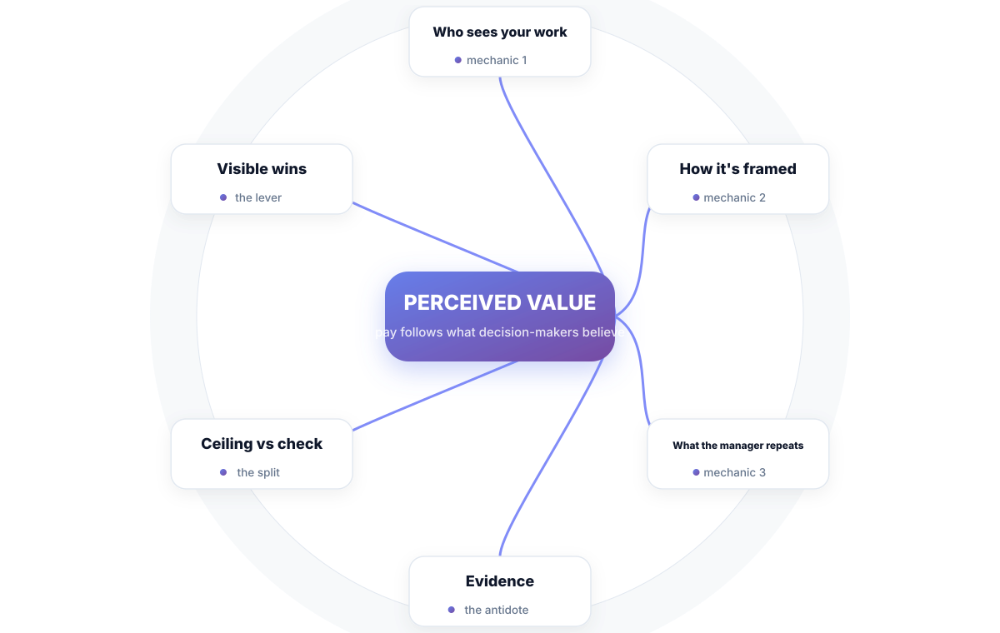
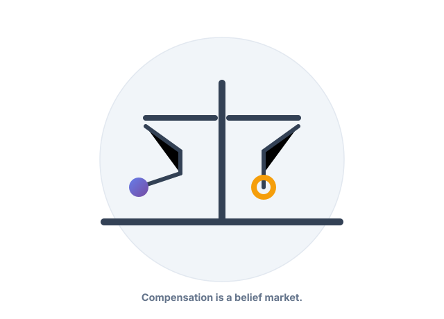

# Chapter 1. You're Not Underpaid. You're Undervalued.

## Scenario

You ship. You take the ugly tickets nobody wants. You stay late before releases, and it has been three years since a raise beyond the cost-of-living bump. Your manager says "great work" in the stand-up, and at review time you get called "a solid contributor" with an adjustment that doesn't touch your lifestyle.

That's Priya's situation, and it's probably not far from yours. None of it means you're underpaid. It means you're undervalued. This chapter explains why those are two different things — and why the distinction is where the whole game begins.

## Value vs. perceived value

Here is a fact that quietly governs your income: your salary is not a function of what you produce. It is a function of what the people who decide your salary *believe* you produce. Compensation is a belief market.

Two engineers on the same team, same years of experience, can be paid differently for doing objectively similar work. Not because one is better — because one is **seen** as better. Promotion committees don't evaluate your code from memory. They evaluate what you put in front of them, what your manager repeats back, and what your projects caused that they noticed.

Your actual output sets your *ceiling*. Perceived output sets your *check*. Most engineers spend their entire careers optimizing the ceiling (more hours, more tickets, more skill) and ignoring the check. That's the mistake this book exists to fix.

## Why "work hard and hope" fails

Hard work is table stakes. It gets noticed roughly in proportion to how much it *looks* like work — and how much visible evidence it leaves behind. If your best contributions live in your head — the bug you fixed quietly at 1 a.m., the refactor nobody saw — then as far as the compensation system is concerned, they didn't happen.

That sounds unfair. It is. It is also true, and arguing with it is a worse use of your time than learning to feed the system what it can actually see. Three mechanics decide your perceived value:

1. **Who sees your work.** Work visible to the person deciding your pay is worth more than identical work visible to nobody. This isn't vanity — it's the market at work.
2. **How your work is framed.** "Cleaned up a messy module" and "cut release-blocker rate by 40%" can be the very same fortnight of effort. They are not the same perceived value.
3. **What your manager repeats.** Review conversations are your manager's story about you. If they can't repeat your wins without prompting, you don't have wins — you have a hobby.

**Watch out —** the invisible-work trap has plausible mechanics: "my work should speak for itself" and "I don't want to look like I'm bragging." Both are survival instincts from teams that confuse visibility with vanity. On the compensation market, invisible work simply isn't a thing — it's *work that didn't happen*.

## Why the meritocracy myth still deserves respect

You'll be tempted to read the above as cynicism. It isn't — or at least, it's the useful kind. The system isn't rigged against competence; it's rigged against *invisible* competence. The best career strategy in a world of perceived value is not to play less politics. It's to make your genuine work impossible to miss — to build so much visible evidence of real value that perception and reality converge.

Notice what that means: the antidote to "being undervalued" isn't asking harder in one conversation. It's a system where your value keeps showing up in writing, in numbers, in front of the right people, month after month. That system is the rest of this book.

Perceived value is not a scandal to resent. It's a lever the hardworking engineer has been standing on without realizing it — because effort and visibility are two things you fully control.

## Short version

- Your pay tracks what decision-makers *believe* you produce, not what you produce.
- Hard work that leaves no visible evidence doesn't move your compensation.
- Three mechanics decide perceived value: who sees your work, how it's framed, and what your manager can repeat.
- The fix is not bitterness, and not raw self-promotion. It's visible evidence that makes perception catch up to reality.

## Do this

Make a running list called **Evidence** in exactly one place — a note, a doc. Starting this week, record every piece of work you can point at: the bug you crushed, the thing you shipped, the number that got better because of you. Sentence each one as a *result*, not an activity ("cut pipeline failure rate 30%", not "worked on pipelines").

You'll need this list in Chapter 4. Future you will be very grateful past you started now.

## Knowledge check

1. What actually sets the size of your check — your output, or your perceived value?
2. Name the three mechanics that decide perceived value.
3. Why is "my work speaks for itself" a dangerous compensation strategy?