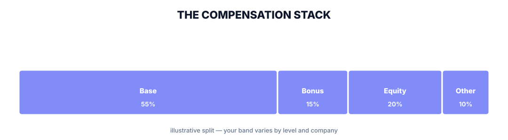
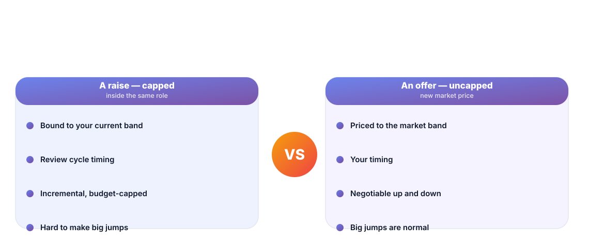
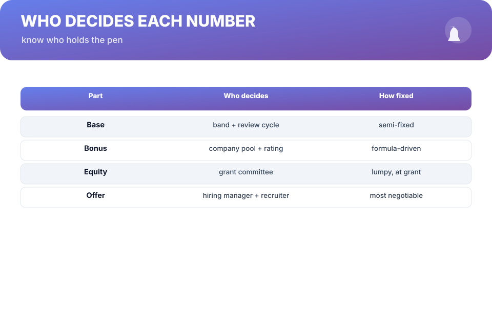
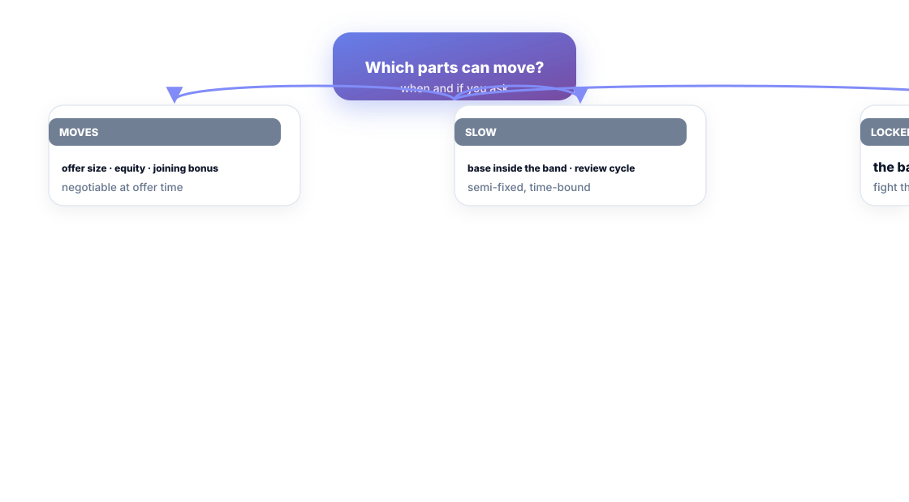

# Chapter 2. How Compensation Actually Works

## Scenario

Dev's manager just told him the raise decision: "The band only allowed 8%, that's the best we could do." Priya is eyeing the market and keeps hearing two terms she can't pin down — "band" and "equity." Anjali is fielding a recruiter who says "we pay top of market" and does not mean it.

All three are negotiating with a machine they've never seen. This chapter shows you the machine, the parts, and who holds the pen on each part.

## The compensation stack

Most engineers treat "salary" as one number. It's four parts, with four different rules:

- **Base.** Anchored to a *band* for your level. Moves inside the band by review cycle. It's the part you can quote.
- **Bonus.** Decided by a company-wide pool *times* your personal rating. It's a multiplier, not a negotiation.
- **Equity.** A grant schedule set at joining (or promotion). Lumpy, has a vesting schedule, and is priced on the day it's granted, not today.
- **Other.** Joining bonus, relocation, perks, title, start date. All real currency, especially at offer time.

The stack is the machine. The band is its frame.

**Key number —** your *band* is the real ceiling for a raise in role. The top number in it is a fantasy; the middle is what review cycles actually operate near. Know your band before you know your ask.

## A raise is capped. An offer is not.

This single asymmetry drives more career decisions than any merit discussion ever will:

- **A raise** is bounded by your current band, timed by the review cycle, and priced by a budget that was set before your conversation.
- **An offer** is priced against the *market band* for the role, timed by *your* schedule, and negotiated by a person whose job includes not losing you.

That's why Chapter 11 exists. Not because quitting is the goal — because the exit lever is the thing that makes the raise conversation honest.

## Who decides each number

Know who holds the pen:

- **The band** is set by compensation teams using market data. Your manager mostly *reports into* the band; they rarely wrote it.
- **Your bonus** comes from a pool divided by ratings. The peer who rates you matters more than the number itself.
- **Your equity** is set at grant time by a committee with a schedule. It won't move for one conversation.
- **Your offer** is set by the hiring manager and recruiter, within a budget they can bend *at the moment of the offer* — the most flexible number you'll ever see.

## What that means in practice

Three rules fall out of the machine:

1. **Don't fight the band with conversation.** If base is pinned by band, asking your manager to break the band is asking them to fight three layers of approval. Ask for the things the person in front of you can actually grant.
2. **Time your asks to cycles.** Raises happen at review; offers negotiate immediately; equity moves at grant. A great argument at the wrong moment is a wasted one.
3. **The most negotiable number is the one you haven't signed yet.** Every increase in your current company runs through the raise machine. Every new offer runs through the offer machine. Choose your machines.

## Short version

- Your comp is four parts with four rules: base (band), bonus (pool × rating), equity (grant), other (negotiable).
- The band is the real ceiling on raises in role — know it before the ask.
- A raise is capped by your band and cycle; an offer is priced to market and negotiable.
- Every number has a decider. Ask the person who holds the pen — at the right moment.

## Do this

Write out your own comp stack as four lines — base, bonus, equity, other — with real numbers. Then write one sentence next to each: *who decides it?* and *when does it move?* You'll need this page when you read Chapters 6 and 7.

## Knowledge check

1. Why is a raise capped while an offer is effectively uncapped?
2. Who actually sets your bonus — and what two inputs drive the number?
3. List the three rules for choosing *which* number to fight and *when*.