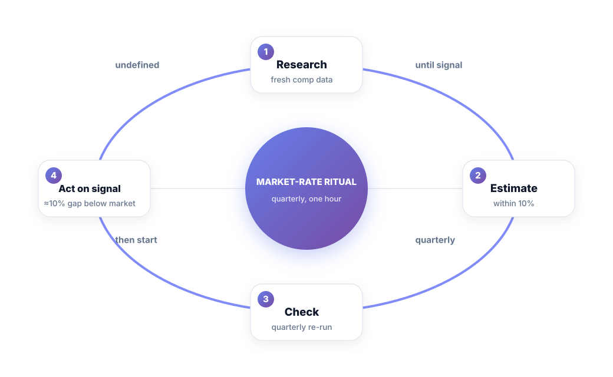
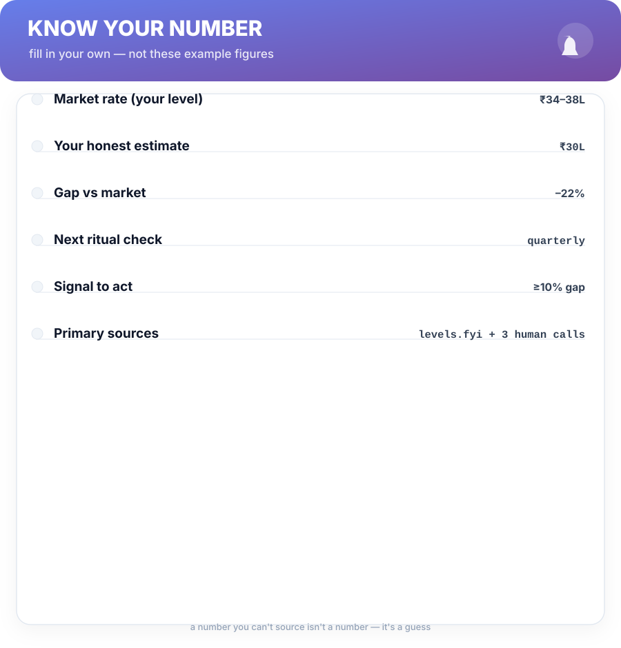

# Chapter 3. Know Your Number

## Scenario

Priya finally worked up the courage to ask for 20%. Her manager said no. When she asked what the market said, her manager shrugged: "market's soft, honestly."

Priya Googled "software engineer salary" as she left the room — and got three wildly different numbers from three ad-heavy sites. She has no idea which one is true.

That's not a negotiation problem. It's a *data* problem. And it's the fixable one.

## The market-rate ritual

You cannot negotiate on a vibe. The single most predictable difference between engineers who get larger raises and engineers who don't is this: the first group walks in with a *number*, sourced, written down, and defensible. The second group walks in with a feeling.

Your number is produced by a four-step ritual, and the ritual is the named technique of this book:

1. **Research.** Collect fresh market data for *your* level and stack — not "software engineer" in general. Primary sources: trusted salary databases, offers threads, and (best of all) three human calls: a recruiter, a former colleague who's switched, and one peer at your level elsewhere.
2. **Estimate.** Collapse what you found into a single range you can defend — and write down your honest read of *your own number* within it.
3. **Check quarterly.** Comp data moves. Re-run the ritual in one hour each quarter, same three sources, same three questions.
4. **Act on signal.** A sustained gap of roughly 10% or more between your number and your pay is a *signal*, not a suggestion. It triggers the plans in Part 2 and Part 3.

## What good data looks like

Three traps send engineers to bad numbers:

1. **Aggregator averages.** They mix cities, levels, and skills. The average of everyone is useful to nobody. Filter to your level, your stack, your geography.
2. **The top of the range.** "Top of market" is a marketing phrase, not a salary. Negotiate to the *competent midpoint*, and be pleasantly surprised when you beat it.
3. **Your own history.** What you're paid today is the worst anchor for what you should be paid — precisely because it's what you've been called "solid" for.

The test of a good number: you can say it in a meeting without apologizing, and you can show your homework when asked.

## Signal, not theory

The 10%-gap threshold does important work: it tells you *when* the conversation is worth your energy. Below it — relax, keep building evidence. Above it — you're now running one of three tracks from Chapter 12: the ask, the promotion, or the interview. You don't decide the track by mood. You decide it by the gap.

**Cheat sheet —** your number is the price of admission to every later chapter. Chapters 6, 7, 10 and 11 all assume you have one. If you skip this chapter, none of them will work.

## Short version

- You can't negotiate on a vibe — you need a sourced, written number.
- The four-step ritual: research, estimate within 10%, check quarterly, act on signal.
- Good data is filtered to *your* level and stack, and includes human conversations.
- A sustained gap of ≥10% below market is your go-signal for the plans in Parts 2 and 3.

## Do this

Run the ritual this week. Set a calendar reminder labeled **"Market-rate ritual"** every quarter with a 1-hour block. Fill in the cheat sheet from Chapter 3 — including the sources you actually used — and put it where you'll see it. That one recurring event is the cornerstone of the whole system.

## Knowledge check

1. Name the four steps of the market-rate ritual.
2. Which of the three data traps is the sneakiest, and why?
3. What gap percentage is your signal to act — and what does the gap *not* tell you?