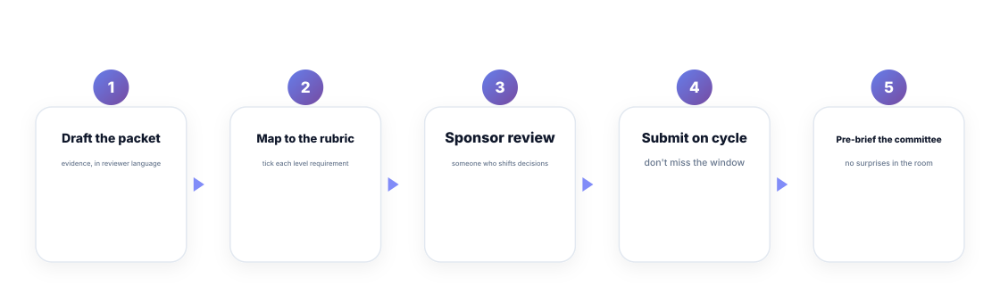
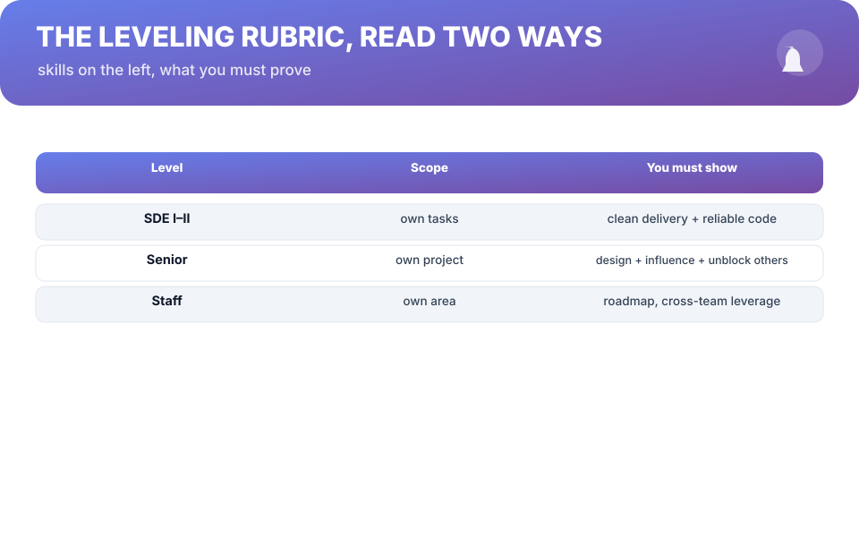

# Chapter 4. Promotions Are Written, Not Earned

## Scenario

Dev has done two years of work he's proud of. He expects the senior promotion. Review comes, and his manager says, "We want you on the path — but we need to see more impact in the next cycle."

There's nothing in that sentence about his work. There's everything about his *packet*. Dev never wrote one. Nobody read his impact in maximum clarity, because the committee reads packets — not memories, and not Dev's.

## The packet is the product

A promotion isn't a reward for effort. It's an underwriting decision made from a written case: the **promotion packet**. Your manager may author the packet, but *you* are the source material. If your material is thin, the packet is thin, and the committee says "on the path."

The discipline is to treat the packet as a deliverable you own — not as paperwork your manager does for you. Every stage below is a thing *you* draft, and your manager edits, approves, and submits.

1. **Draft the packet.** Every win from your evidence bank, written as an outcome, tied to the level above you.
2. **Map it to the rubric.** Tick the exact line items of the next level — be forensic about it.
3. **Sponsor review.** Hand it to someone with decision weight *before* the cycle, not after it. (Chapter 6 covers sponsors properly.)
4. **Submit on cycle.** Promotion windows are real. Miss them, and outstanding work waits a quarter.
5. **Pre-brief the committee.** The room should read your case with no surprises — your manager pre-sells it.

## Read the rubric the way the committee does

The rubric is a two-column document, and almost everyone reads the wrong column.

- The **left column** is *skills*: "owns a project," "influences without authority." That's the vocabulary — it describes the level.
- The **right column** is *proof*: the evidence that shows you operating at that level. The committee votes on proof, not potential.

So your packet's job is translation: for every left-column phrase at the next level, produce right-column proof from your own work, in the reviewers' language. "Owns the billing rewrite end-to-end" is proof of the right level. "Helped with billing" is proof of a different conversation entirely.

**Nightmare card —** the engineer who ships for two years and never writes a packet. Their promotion conversation is always "on the next cycle," because the next cycle's packet is always empty. The fix isn't more work. It's keeping the packet *continuously drafted* — one live document you update every shipping month, so the cycle is a submission, not a scramble.

## Evidence is the raw material

Your manager can't write a strong packet from fog. They write it from the evidence bank you started in Chapter 1. If you kept it as a result-sentence habit, Chapter 4 is cheap. If you didn't, this is where it becomes expensive — maxing a rubric from memory, under time pressure, after months have passed.

**Evidence —** every packet problem is an evidence problem wearing a timing costume. One live document, updated as you ship, is the entire fix.

## Short version

- Promotions are underwriting decisions made from a written packet, not trophies for effort.
- Own the packet: draft → map to rubric → sponsor review → submit on cycle → pre-brief the room.
- Committees vote on proof (right column), not potential (left column).
- Keep the packet continuously drafted; the evidence bank is its raw material.

## Do this

Open the rubric for the level above you. For each left-column phrase, write one line of proof from your evidence bank — honestly, and with a gap where you have none. The gaps are your next two quarters' work. That document, annotated before the next cycle, is your live packet.

## Knowledge check

1. In a committee's eyes, what is a promotion actually a decision about?
2. List the five stages of the packet lifecycle.
3. What do you do with the rubric gaps you found?