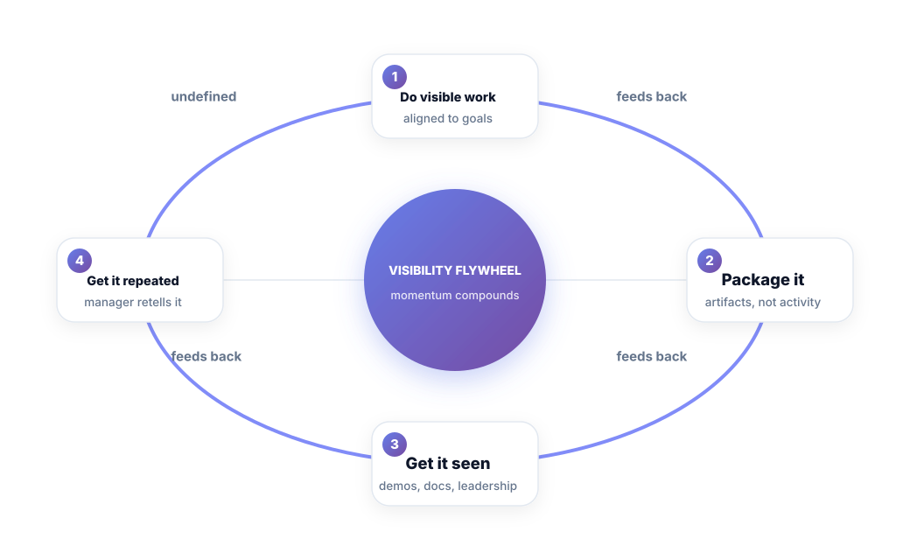
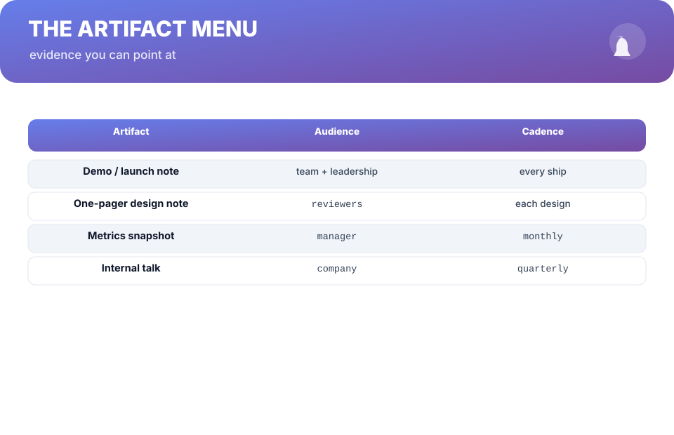

# Chapter 5. The Visibility Flywheel

## Scenario

Dev got the message last chapter: the committee needs proof. He updates his packet, then freezes.

"This is just an exercise in self-promotion, isn't it? I hate that."

Fair. And wrong. Visibility is not vanity — vanity is visibility without substance. This chapter builds the machine that turns real work into *repeatable* evidence, month after month, without turning you into a LinkedIn personality.

## The flywheel

Here's the machine. Four stages, one repeating loop:

1. **Do visible work** — work aligned with what leadership is measured on, not the most technically elegant ticket.
2. **Package it** — one artifact per result: a launch note, a demo, a one-pager, a metrics snapshot.
3. **Get it seen** — by the people whose memory becomes review. Demos, design reviews, leadership syncs, internal talks.
4. **Get it repeated** — your manager retells it, because packaging made it retellable. Retelling feeds the next round of visible work.

Each turn of the wheel makes the next turn cheaper. The first artifact is awkward; the tenth is reflex. That compounding is why it's a flywheel, not a to-do list.

## Packaging: artifacts, not activity

"More visibility" fails until it has a *shape*. Give it one: everything you produce on a ship trajectory gets packaged into one of four artifact types:

- **Demo / launch note** — every ship, one paragraph: what changed, who cares, what result.
- **One-pager design note** — the thinking behind a real decision. Also makes you a better designer.
- **Metrics snapshot** — one page, the numbers that moved because of you. Monthly.
- **Internal talk** — quarterly. Same packaging, bigger room.

Each is small enough to make with the work you're already doing. You are not adding meetings; you are adding *output files*.

**Watch out —** the flywheel pirates itself. Warning signs: artifacts with no numbers, visibility aimed at people who don't decide, and packaging for work that is genuinely invisible-worthy. If you can't put a number on the win, don't polish it — build it. The flywheel only rotates when substance is in the wheel.

## Aligning to what leadership measures

One refinement makes visibility compound faster: ship toward what the people above you are measured on this quarter. Their quarterly numbers are public, or discoverable. If leadership is measured on reliability, your reliability win matters more this quarter than your dashboard polish. That isn't cynical — it's putting scarce attention where the market is.

**Tip —** after every ship, write one sentence: *"We [changed X], and [result], which moves [leadership metric]."* Forty words. Put it in the launch note, the demo, and the monthly snapshot. It's the same sentence everywhere, and it's the sentence that gets repeated.

## Short version

- Visibility without substance is vanity; substance without packaging is work that didn't happen.
- The flywheel: do visible work → package it → get it seen → get it repeated. It compounds.
- Attach every win to an artifact and a number.
- Aim visibility at the people who decide, aligned to what they're measured on.

## Do this

Set one recurring calendar block (90 minutes, monthly) labeled **"Packaging."** In it, turn your evidence-bank wins from the last month into artifacts — one launch note or one metrics snapshot. Set a second, quarterly reminder for your internal talk. Two calendar entries and the flywheel runs itself.

## Knowledge check

1. Name the four stages of the Visibility Flywheel.
2. What's the difference between visibility and vanity, in one test?
3. Why does aligning to leadership's quarterly metrics make the wheel turn faster?