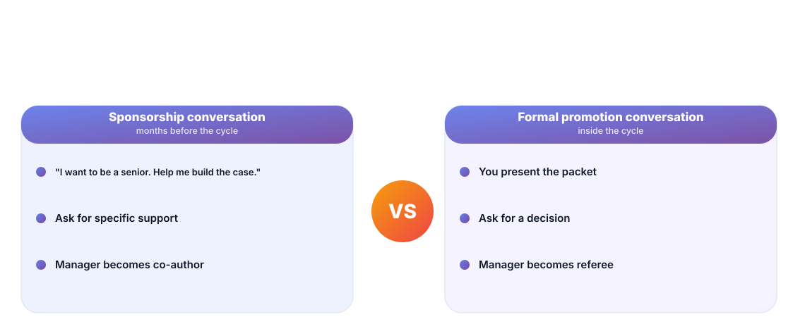
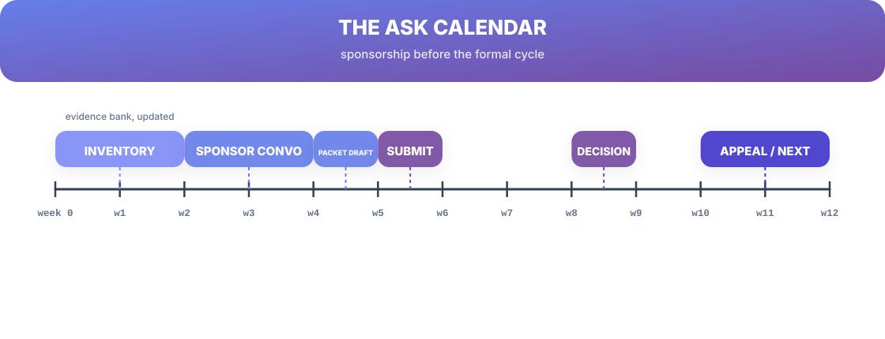

# Chapter 6. Ask for It

## Scenario

Priya is ready. She has the number from Chapter 3, the packets from Chapter 4, the flywheel from Chapter 5. She opens her manager's calendar… and realizes she has no idea how to actually *have the conversation*, or when.

The ask fails at two points: the wrong conversation (asking a referee to be a sponsor), and the wrong timing (a week before the cycle closes). This chapter fixes both.

## Sponsors, not just managers

A manager administers your role. A **sponsor** — could be your manager, but often not — puts their reputation on the line to *shift a decision* for you. You need both, and they have different jobs:

- The **sponsorship conversation** happens *months* before the cycle. It's not a demand — it's enrollment: *"I want to be a senior. Help me build the case. What would make it undeniable?"* You leave with specific support, and your sponsor leaves co-owning the outcome.
- The **formal promotion conversation** happens *inside* the cycle. You present the finished packet and ask for the decision. Your sponsor is in the room with you, having already carried the case.

Ask for the first conversation early; the second happens anyway.

## Timing is half the ask

The calendar decides more than your words do. The reliable sequence:

- **Weeks 0–2 — Inventory.** Your evidence bank, packaged into the live packet (Chapter 4).
- **Weeks 2–4 — Sponsor conversation.** Enroll your sponsor before anything is submitted.
- **Weeks 4–5 — Packet draft.** With sponsor input baked in.
- **Week 5 — Submit** on cycle.
- **Weeks 8–9 — Decision.**
- **Weeks 10–12 — Appeal or next cycle.** Either way, the live packet rolls forward.

An ask launched after the cycle closes isn't an ask — it's a promise for next quarter.

## The conversation itself

Scripts are worth ten screeds about confidence:

**The line that works:** *"Based on the market and the case I've put together, I'm targeting [title/band] this cycle. Here's the evidence. What would it take for you to support it?"* Then go silent. The silence is the ask; fill it and you'll negotiate against yourself.

Two rules: **one ask per conversation**, and **never present a number you wouldn't accept having justified out loud**. If you can't defend it in the next sentence, it's too aggressive — or too cheap. (Chapter 3's homework makes this automatic.)

## Short version

- You need a sponsor who shifts decisions — not just a manager who administers you.
- Hold the sponsorship conversation months early; the formal one happens on cycle.
- Timing beats wordcraft: inventory → sponsor → packet → submit → decision → appeal.
- One ask per conversation, and silence after it.

## Do this

Map your company's next promotion window onto a calendar today — count back 8–12 weeks and write the **sponsor conversation** on week −10. Now send one message to the person who could sponsor you, on that schedule: not an ask, just a meeting to *talk about where you're going*. Book the rest of your chips in that single sitting.

## Knowledge check

1. What's the difference between a sponsor and a manager?
2. Why must the sponsorship conversation happen *before* the cycle, not during it?
3. What's the one-line ask — and why do you go silent after it?