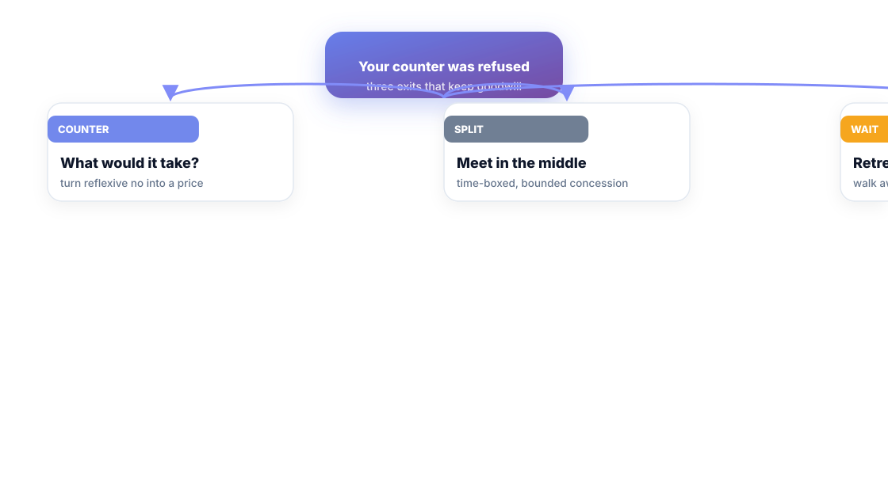
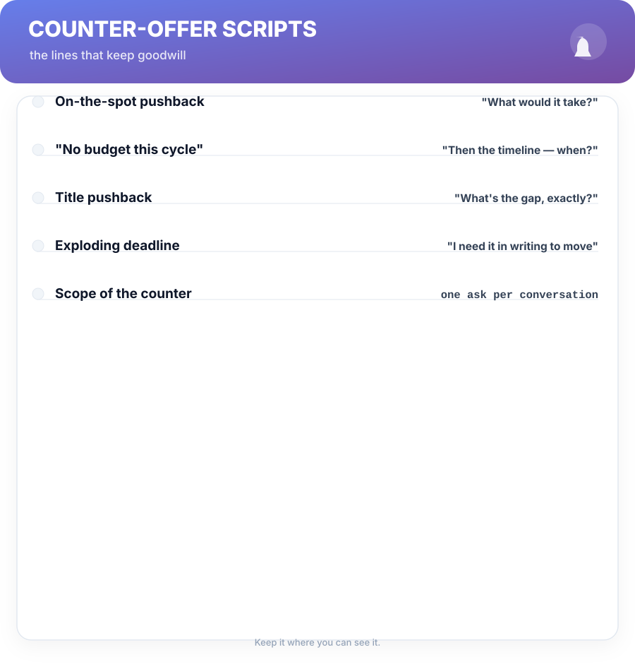

# Chapter 7. The Counter-Offer Maze

## Scenario

Priya did everything right. She asked, she has a sponsor, the packet was clean. The answer: *"The band really is tight this cycle. We gave you what we could."*

This is not the end of the case. It's the moment the case is tested — the counter-offer maze. Most engineers walk out of this meeting accepting a "no" that was actually a first position to be negotiated.

## Pushback is a position, not a verdict

A refused ask has three exits that keep goodwill in the tank:

1. **Counter — "What would it take?"** Turn a reflexive no into a price. *"I understand the band this cycle. What would the package need to look like for the level I've proposed — and what's the timeline for that?"* You've just converted a dead end into a negotiation about the next cycle's price.
2. **Split the gap.** A bounded, time-boxed concession: *"I'll take the title this cycle and the comp catch-up next cycle."* It's how goodwill survives compression.
3. **Retreat to the system.** You hold, politely, and go run Chapter 12. The exit lever — or a future offer — does the talking that words couldn't.

The refusal outcome is rarely the verdict; the *timeline and price* are what was actually negotiated.

## Never argue with a budget

The most common trap after a no: treating the budget like a moral problem. *"But I deserve it!"* — even when true, it's not actionable. Budgets are conversations about *when*, not *whether*.

**Nightmare card —** "Give me a raise or I'll look elsewhere" with no evidence and no timeline. It produces a polite yes on paper and a you-shaped target afterwards. The system version of that demand — the counter with a date and a packet — produces the same result without the damage. Results are earned by *movements*, not threats.

## The scripts

Fully written in Chapter 13. The four that close this chapter:

- **On-the-spot pushback:** *"What would it take?"* — mirror the objection into a price.
- **"No budget this cycle":** *"Then the timeline — when?"* — budget talk is time talk.
- **Title pushback:** *"What's the gap, exactly?"* — force the rubric to say what's missing (then go build it, from Chapter 4).
- **Exploding deadline:** *"I'd need it in writing to move on it."* — exploding offers are pressure, not policy.

Every script follows one rule from Chapter 6: one ask, then silence.

## Short version

- A refused ask is a first position, not a verdict.
- Three exits keep goodwill: counter with "what would it take", split the gap, or retreat to the system.
- Don't argue with budgets — negotiate timeline and price instead.
- Scripts survive the moment; temperament doesn't.

## Do this

Pick the one exit that fits your current situation (counter, split, or retreat). Write your exact scripted line on a card — the "what would it take" variant that matches your numbers. Practice it out loud twice. It feels theatrical; it works.

## Knowledge check

1. Name the three exits of the counter-offer maze.
2. Why is "I deserve it" a losing argument with a budget?
3. What's the single rule every script in this chapter follows?