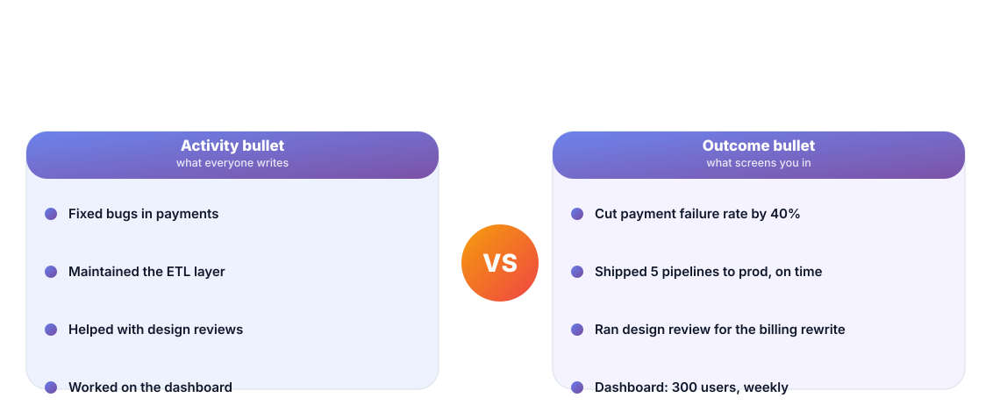
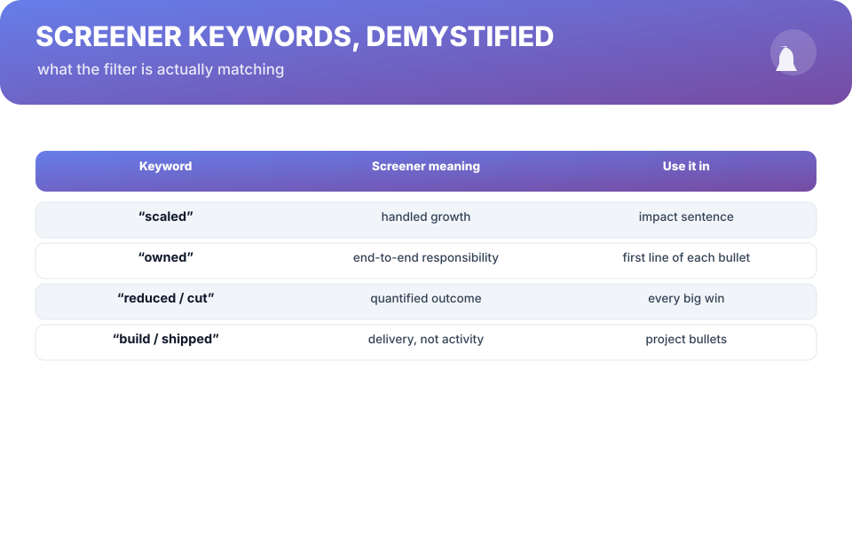

# Chapter 8. The Resume Is a Sales Page

## Scenario

Anjali is ready to run the exit track. She dusts off a resume that reads like a work diary — "maintained the ETL layer," "helped with design reviews," "worked on the dashboard." It's accurate, complete, and completely invisible to a screener.

Then she learns the job she wants got 400 applications, and a machine filtered it to 12 before a human ever looked. Her resume was written for a human who never arrived.

## Software reads it before people do

The resume is a sales page. Its customers: a keyword screener, then a recruiter with eight seconds, then a hiring manager forming a first opinion. Every layer is optimizing different signals, and all three share one preference: **outcomes, not activities**.

The rewrite is mechanical, not mystical. For every bullet:

- **Delete the verb of doing** ("helped," "worked on," "maintained") and replace it with the verb of *owning* ("built," "shipped," "cut," "designed").
- **Lead with the result.** The metric goes in the first clause, not buried mid-sentence.
- **Add the scope that makes the number credible** — users, teams, systems touched.

"Fixed bugs in payments" → "Cut payment failure rate 40% by shipping the retry redesign." Same fortnight. Different sale.

## One page, and then one more rule

One page is a rule for a reason: the screener is indexing, not reading. Two pages survive only when the second page is all ballast-free seniority. For every bullet you lose, keep the one with the biggest number in the first clause.

**Worksheet —** rewrite your own bullets on paper before the screen: same facts, outcome-first, one page. Your evidence bank (Chapter 1) is the raw material — every win is already a result-sentence.

## Screener keywords, demystified

The filter isn't magic. Four patterns do most of the matching, and each is also the structure of a strong bullet:

- **"Scaled"** — you handled growth. Proof: numbers up, latency down, users served.
- **"Owned"** — end-to-end responsibility. Put "owned" (or "led") in the first line of your biggest bullets.
- **"Reduced / cut"** — quantified outcomes. The screener's favorite verb, and your evidence bank's favorite shape.
- **"Built / shipped"** — delivery, not activity. Every ship gets a bullet.

Match the job description's vocabulary honestly. You're translating your work into the language the reader is already thinking in — not inventing résumé-poetry.

## Short version

- A resume is a sales page for three readers who all prefer outcomes to activities.
- Every bullet: lead with the result, own it, scope it.
- One page, then drop ballast — keep the bullets with the biggest honest numbers.
- The four screener patterns (scaled, owned, reduced/cut, built/shipped) are also the structure of strong bullets.

## Do this

Run the full rewrite this week: one page, outcome-first, keywords matched to two target job descriptions. Then test it the honest way — paste it past a friend who hires, and read your own bullets out loud. Every bullet you wouldn't skim is a bullet to fix.

## Knowledge check

1. Name the three readers of your resume and what each optimizes for.
2. Why must the result lead the bullet rather than trail it?
3. What's the evidence-bank connection — why is rewriting easy if Chapter 1 worked?