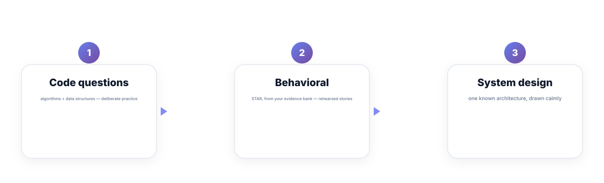
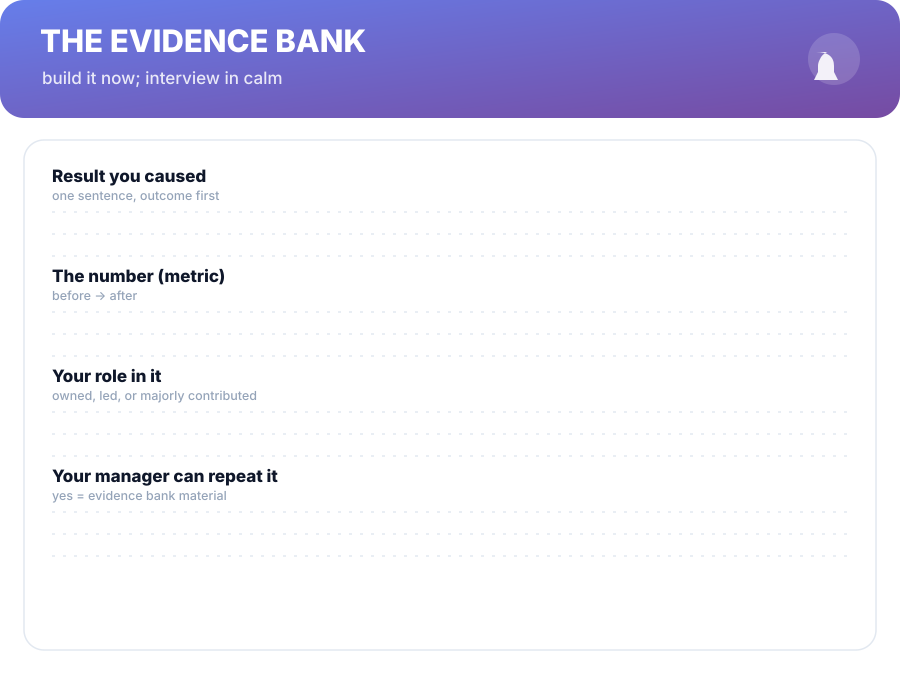

# Chapter 9. Interview Prep That Respects Your Effort

## Scenario

Anjali's resume is doing its job. Calls are coming in. Now her brain does the standard thing: a wall of panic about "the interview" — which question format? which algorithms? what if I freeze?

Here's the reframe that makes prep finite: there are only **three kinds of interview questions**, and they have different fixes. Most prep panic comes from treating three different games as one.

## The three kinds of questions

1. **Coding / technical.** Fixed, bounded, improvable with deliberate practice. *Fix:* a prep bank and repetition — no cleverness required.
2. **Behavioral.** Rehearsed stories from your own history. *Fix:* your evidence bank, pre-built into answers. This is the most under-prepared and most winnable category.
3. **System design.** A known architecture, drawn calmly. *Fix:* one hour drawing the standard stack until it's reflex, then the same answer in any dialect.

Note what isn't on the list: trick questions and personality ambushes exist, but you can't prepare for surprises — and the three prepared games cover 95% of the room.

## The evidence bank does double duty

Your Chapter 1 evidence bank isn't only for promotions. Behavioral rounds run on stories, and the best stories are your evidence bank written as **STAR** — Situation, Task, Action, Result. For each strong entry: one sentence per element, spoken like a story, not a report.

The trick is *currency*. A bank updated this quarter beats a bank excavated from memory at midnight before the interview. Chapter 1 called this out; here's the receipt: the bank you built while working is exactly the interview prep nobody can buy.

**Evidence —** the same sentences power the packet (Chapter 4), the resume bullets (Chapter 8), and your behavioral answers. One asset, three markets.

## Mocks are pressure, not magic

Mock interviews are calibration, not rehearsal for the real thing — treat them as gym, not as show. A no-feedback mock is a waste; always debrief on the three-question axes (code quality, story quality, design calmness) and fix one axis per round. Two mocks, spaced, beat eight squeezed into one weekend.

**Tip —** re-read your own bullets the morning of the interview. Reminding yourself you have evidence stops the "I'm a fraud" spiral at the cheapest possible moment — you're not visualising confidence, you're quoting your resume.

## Short version

- There are three kinds of questions: coding, behavioral, system design — three fixes, no panic.
- Behavioral rounds are won with your evidence bank pre-built into STAR stories.
- System design is one known architecture drawn until it's reflex.
- Mocks calibrate, they don't certify — debrief on three axes and fix one per round.

## Do this

Take your three strongest evidence-bank entries and write each as STAR, one sentence per element — six typed lines total. Book two spaced mocks this month and write the debrief axes on the calendar next to them. That's the entire prep system, on your calendar.

## Knowledge check

1. Name the three kinds of interview questions and their fixes.
2. What does STAR stand for, and what's its raw material here?
3. What's the correct use of a mock interview?