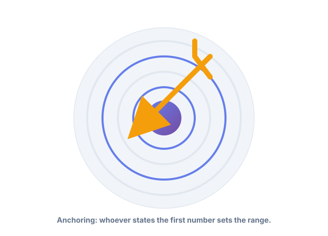
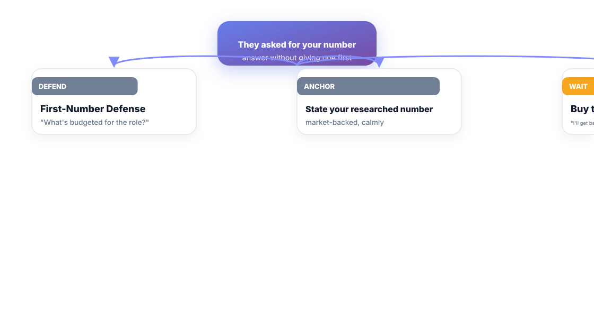
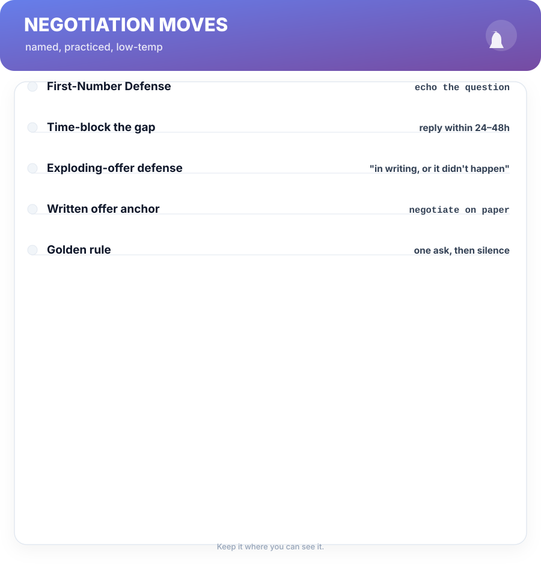

# Chapter 10. Negotiation With Known Moves

## Scenario

Anjali got the offer. The recruiter's line: *"We'd love to move fast. What's your expected range?"*

It sounds friendly. It's a loaded question. If she answers before the offer's shape is on the table, she's negotiated against herself with zero information. This chapter is the set of *known moves* that turn that moment into a calm, scripted exchange.

## The game is numbers on a page

Anchoring: whoever utters a number first sets the range everything after orbits. If you quote first, you quote low or you risk lowballing the process. If the offer is on paper first, *their* anchor is what moves.

The rule that follows: **never state your number before the offer's components are in writing.** That single rule — the First-Number Defense — is worth more than any persuasion trick in this domain.

When they fish for your number:

- **Defend:** *"I'd want to see the full offer first — what's budgeted for the role?"* The echo keeps the move without hostility.
- **Anchor (deliberately):** if you must give a number, it's your researched market number from Chapter 3 — never a hopeful guess. Defensible in the next sentence.
- **Buy time:** *"I'll get you my thoughts this afternoon."* Silence is allowed; a wrong first number isn't.

## The moves, named

Every round of the conversation maps to a named move, so you're never improvising:

- **The First-Number Defense** — see above. The load-bearing move.
- **Time-block the gap** — respond within 24–48 hours, not instantly. You're deliberating, not stalling.
- **The Exploding-Offer Defense** — *"I'd need it in writing to move on it."* Deadlines you can't verify compress into weeks of unconsidered decision.
- **The Written-Offer Anchor** — negotiate on paper, against components, not against a mood.

One move per exchange, then silence. Same rule as Chapters 6 and 7 — it's the whole discipline in a sentence.

**Watch out —** "this offer expires Friday" is the most common pressure tool in the book. It's rarely real, and it's always negotiable in timeline if you ask for it in writing. The only deadline you should respect is the one you set.

## Competing offers change the temperature

A second offer isn't a weapon — it's *information*, and it dramatically relaxes the whole exchange. You're no longer negotiating from want; you're costlessly comparing. If you have one, say so plainly: *"I've another offer — I'd like to give you the chance to be competitive."* Keep it true, keep it brief, and never invent it. Invented offers get called, and the collateral damage is your whole process.

## Short version

- Anchoring: whoever states the first number sets the range. Don't be the one.
- The First-Number Defense: never state your number before the offer is in writing.
- Negotiate on paper, in components, with moves you've named — not on mood.
- Competing offers are information that relaxes the whole game; honesty is non-negotiable.

## Do this

Write the three moves you'll actually use on a card: the defense line, the time-block, and the written-offer anchor. Practise the defense line out loud twice until it's neutral. Then go get the offer — the negotiation is already written.

## Knowledge check

1. Why does the First-Number Defense matter more than any persuasion trick?
2. Name the four moves in the negotiation kit.
3. What's the correct handling of an exploding offer?