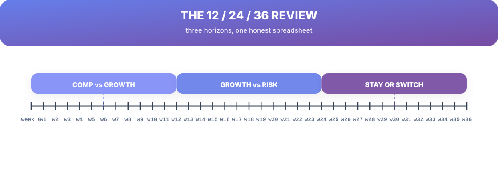
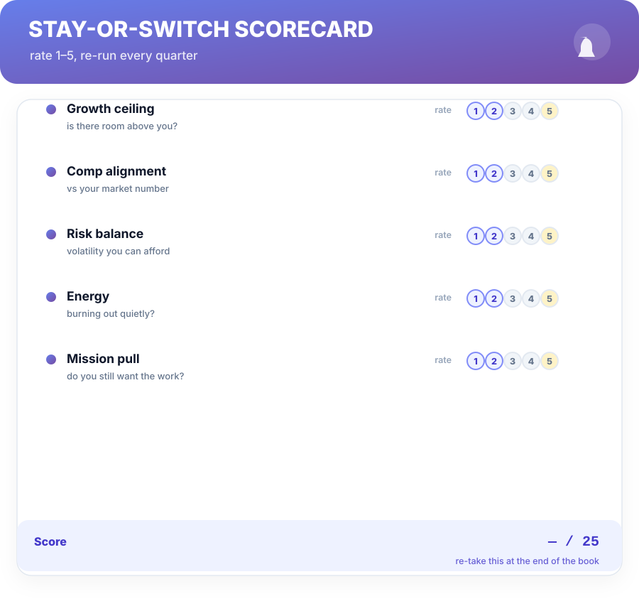

# Chapter 11. The 12/24/36 Model

## Scenario

Anjali has the leverage now. She has a market number, visibility, a current employer who just came back with a counter… and she's staring at the decision PowerPoint in her head with no structure. Stay or switch? And if stay, for how long?

The 12/24/36 model turns that anxiety into a spreadsheet — three timed questions that answer *when* to decide, before you decide *what*.

## Three horizons, one honest table

Compensation decisions decay on three different clocks. Review them on each:

- **12 months — Comp vs Growth.** Is pay catching up to your market number, *and* is there a level above you in reach? If comp lags but growth is real, staying is rational for another horizon. If neither is moving, you already know.
- **24 months — Growth vs Risk.** Is the growth path real, or is it "next cycle" again? How much risk can you actually afford — company health, your runway, the market? The question changes from "do I stay" to "what's the growth worth."
- **36 months — Stay or Switch.** The long look. Are the tethers (team, mission, commute, equity vests) holding you — or is it inertia? By 36 months, a company that hasn't promoted you or moved your comp is telling you the answer with its actions.

## The scorecard that runs the review

Keep it to five rows so the review stays honest and fast — rate each 1–5, quarterly:

1. **Growth ceiling** — is there real room above you?
2. **Comp alignment** — versus your know-your-number figure.
3. **Risk balance** — volatility you can afford, not just survive.
4. **Energy** — the quiet one. Burning out quietly is a decision too, and a slow one.
5. **Mission pull** — do you still want this work?

Any row at 1–2 for two consecutive reviews is a signal. Two simultaneous low rows is the exit track lighting up.

## Decide with the calendar, not the mood

The whole model exists to make *staying* a decision rather than a drift. Companies count on drift — on raises arriving at cost-of-living intervals, on "next cycle," on the tethers tightening slowly. The 12/24/36 review puts a calendar on the counter-inertia: **you will have this conversation with yourself every quarter, on paper, with numbers.**

**Key number —** set your review dates in your calendar now: quarterly scorecard + the 12/24/36 timeline. The model is free; the calendar is where it's earned.

## Short version

- 12/24/36: comp-vs-growth, growth-vs-risk, stay-or-switch — three clocks, three honest questions.
- The five-row scorecard (growth, comp, risk, energy, mission) keeps the review fast and truthful.
- Decide on a calendar, not on a mood — drift is a decision too, just a hidden one.
- Set the quarterly review dates now.

## Do this

Set four calendar events named **"Stay-or-switch review"** — quarterly for the next year — each with the five-row scorecard attached. Then run the first one today. Twenty minutes, five ratings, and the exit-timeline line written down. That's the whole model, running.

## Knowledge check

1. What three questions do the 12 / 24 / 36 horizons ask?
2. Why does the scorecard stay at five rows?
3. Why is "staying" usually a decision — and what keeps it hidden?