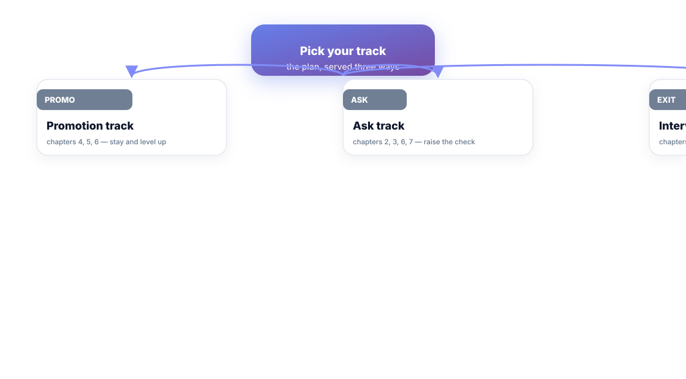
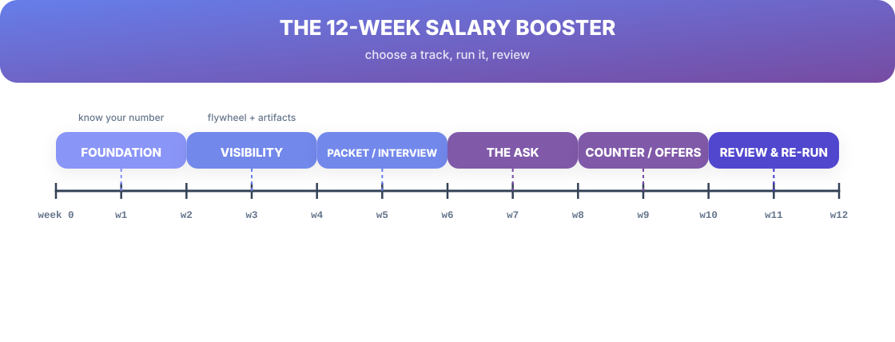

# Chapter 12. The 12-Week Salary Booster

## Scenario

Priya, Dev, and Anjali have the same problem now: every chapter this book taught them is *compounding*, but only if run as one machine. Priya's asked before without a plan and got a pat on the head. Dev's researched promotion cycles forever. Anjali has a resume but no calendar.

All three need the same thing: the whole system, sequenced, on twelve weeks. That's this chapter.

## Choose your track first

The system serves three situations; pick your track before week 1, then stay on it:

- **Promotion track** (Dev): chapters 4, 5, 6 — level up where you sit.
- **Ask track** (Priya): chapters 2, 3, 6, 7 — raise the check without leaving.
- **Interview track** (Anjali): chapters 8, 9, 10 — let the market set the number.

You can change tracks later. What you can't do is run all three at once — that's how a plan becomes a busy calendar.

## The twelve weeks

**Weeks 1–2 · Foundation.** Know your number (Ch 3). Evidence bank current (Ch 1). Comp stack written (Ch 2). Nothing else matters until the number is on paper — every later week spends it.

**Weeks 3–4 · Visibility.** Flywheel running (Ch 5): two artifacts shipped, packaging block booked. Alignment to leadership metrics checked.

**Weeks 5–6 · Build.** Promotion track: live packet mapped to the rubric (Ch 4). Interview track: STAR stories + three kinds of questions (Ch 9). Ask track: sponsor conversation scheduled (Ch 6).

**Weeks 7–8 · The Ask.** Track-specific move: packet submitted on cycle (promo), the one-line ask delivered (ask), applications + mocks live (interview).

**Weeks 9–10 · The Maze.** Counter-offer exits primed (Ch 7) or negotiation moves rehearsed (Ch 10). The refusal scripts go on a card.

**Weeks 11–12 · Review & Re-run.** Self-audit (the scorecard in the back), stay-or-switch re-run (Ch 11), and the next quarter's ritual booked. The system either produced a yes — or produced the exact roadmap to a bigger yes next cycle.

## The plan is the product

The plan has one virtue over every "career advice" listicle: it's a *sequence*. The number comes before the ask, the ask before the maze, the review before the repeat. Skipping a week doesn't break the plan; it re-sequences it — the evidence bank and the number are always the price of entry to weeks that follow.

## Short version

- Pick one track — promotion, ask, or interview — before week 1.
- The sequence: foundation (1–2) → visibility (3–4) → build (5–6) → ask (7–8) → maze (9–10) → review & re-run (11–12).
- The plan is a sequence, not a list; the number and evidence bank gate every later week.
- No this-cycle win is ever wasted — it becomes the next cycle's roadmap.

## Do this

Today: write your track at the top of a sheet, copy the six phase rows from the figure with your dates in the cells, and schedule week 1's two-hour foundation block this week. Record your track, start date, and this-cycle target in the cheat sheet in the back. The plan is now alive — even if this cycle ends in a no, you own the roadmap.

## Knowledge check

1. What are the three tracks, and why must you pick one?
2. Which two assets gate every later week, and why?
3. What does weeks 11–12 produce when the answer this cycle is "no"?