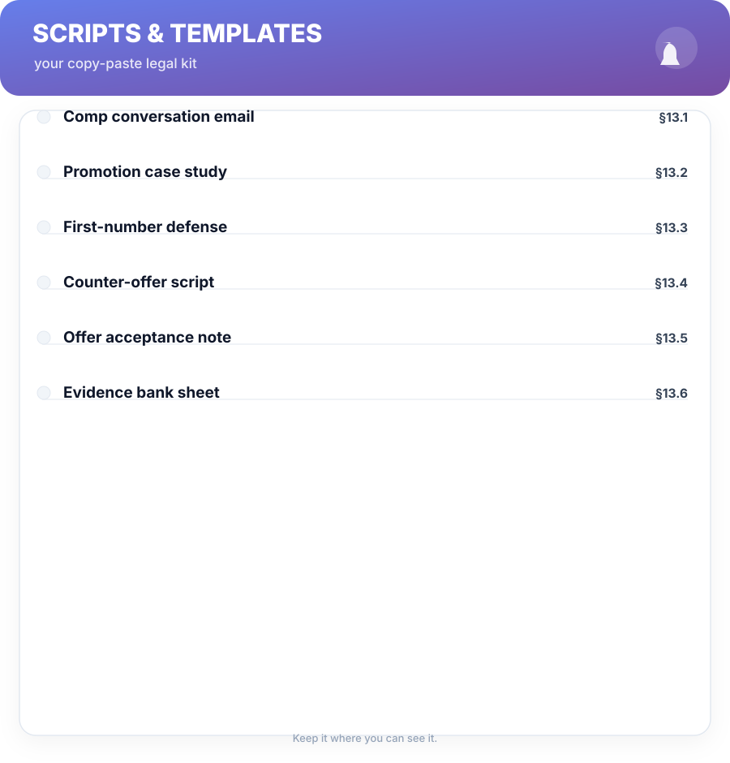

# Chapter 13. Scripts & Templates

## Scenario

Every earlier chapter names a conversation; this one gives you the actual lines. Fill in your numbers, adapt the tone to your shop, and use them as-is. These scripts are deliberately dry — the point is to sound like a professional engineer with homework, not a broadcast debater.

---

## §13.1 The comp conversation email

Use this to open the ask track (Ch 6) on paper, so the meeting starts calmly.

**Subject:** Compensation — a review of my package

> Hi [Manager],
>
> Now that my [year/cycle] contributions are wrapped up, I'd like to discuss my compensation. Based on the market and the evidence in my review packet, I believe my package should be [target: 18–22% / level change] this cycle.
>
> Could we set aside 30 minutes this week? I'll bring the numbers.

**Rule:** no number attached in the email beyond the target range you can defend. The meeting is where the detail lives — Chapter 3's ritual makes the number defensible in the first sentence.

## §13.2 Promotion case study template

The spine of a packet (Ch 4), one page per win:

> **Title:** [e.g., Cut billing failure rate 40%]
> **Level this proves:** [rubric phrase, Ch 4]
> **Situation:** [team/problem, 1–2 lines]
> **I owned:** [scope, users, systems]
> **Action:** [what you did, outcome-first]
> **Result & metric:** [before → after, the number]
> **Leadership value:** [one hook to the metric they're measured on]

## §13.3 First-number defense

The load-bearing line from Chapter 10 when they fish for your number:

> *"I'd rather respond to the full offer first — what's budgeted for the role?"*

If pressed, the researched anchor from Chapter 3:

> *"Market for this level and stack in [city/remote] is around [range]. I'd expect an offer to land there, then we talk components."*

## §13.4 Counter-offer script (Ch 7)

> *"I understand the band this cycle. What would the package need to look like for the level I prepared — and what's the timeline for that?"*

Budget refusal variant:

> *"I hear the budget's tight. Then let's agree the timeline — same numbers, next cycle. Put it in writing and I'm happy to stay focused."*

## §13.5 Offer acceptance note

Written, warm, and it *traps the offer on paper* (Ch 10):

> **Subject:** Accepting [Role]
>
> Hi [Recruiter/Hiring Manager],
>
> Thank you — I'm accepting the offer for [Role] at [base], with the [equity/other] discussed. I confirm start date [date]. Please send the formal documents over; looking forward to starting well.

## §13.6 Evidence bank sheet

Your Chapter 1 list, structured so it feeds Chapters 4, 8, and 9 with zero rework:

| Result (outcome-first) | Metric (before → after) | My role | Manager can repeat? | STAR-ready? |
| :--- | :--- | :--- | :--- | :--- |
| Cut pipeline failure rate 30% | 4.1% → 2.9% | owned | yes | yes |

**Rule across every script: state the line, then stop talking.** The silence after a counter or an ask is where the other person decides. Every script in this book assumes you practice that silence twice before you deploy it once.

## Short version

- Six templates cover the ask, the counter, the negotiation, and the acceptance.
- Every line is written to sound like an engineer with homework — dry, calm, number-backed.
- Templates are starting points; your Chapter 3 number is what gives them weight.
- The one universal rule: say the line, then silence.

## Do this

Fill in the templates for your current situation this week — pick your track from Chapter 12 and complete exactly the scripts that track needs. Then read them aloud once and cut one sentence each. The leaner the line, the more it lands.