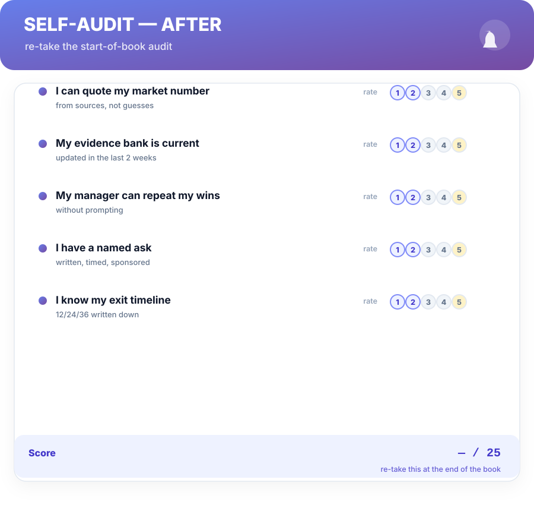
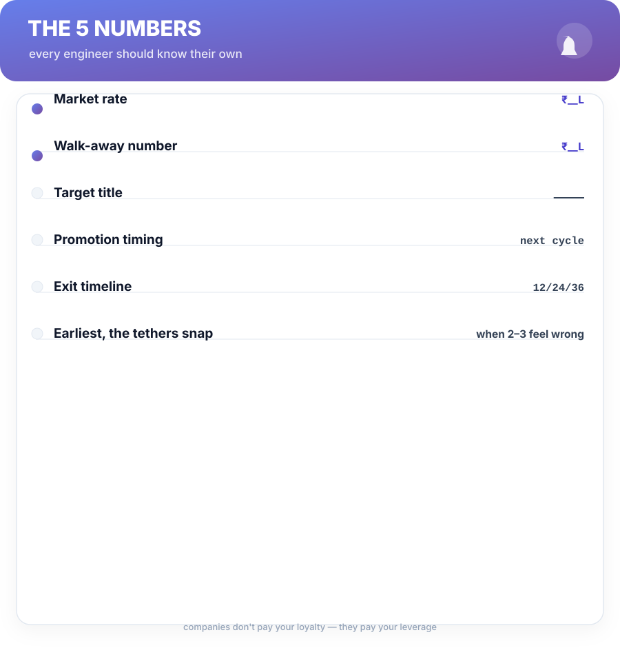

# Back Matter

## Self-Audit — After

You took a version of this at the start of the book. Run it again before you declare yourself done — the comparison is the whole point.

**What changed between then and now?** If your score moved, that's the system working. If it didn't, re-read the chapters the low rows point to — the scorecard names your next quarter for free.

---

## The 5 Numbers

Every engineer should know their own five numbers by heart. Fill in slots — the blank is the point of the figure.

1. **Market rate** — your researched number (Ch 3).
2. **Walk-away number** — the package you'd decline below (Ch 10).
3. **Target title** — the level you're building proof toward (Ch 4).
4. **Promotion timing** — your company's cycle, mapped to the ask calendar (Ch 6).
5. **Exit timeline** — your 12/24/36 decision date (Ch 11).

Companies don't pay your loyalty. They pay your leverage. The blank line under each number is the leverage you're carrying.

---

## FAQ

**"My company doesn't do off-cycle raises."**

The cycle is the machine (Ch 2). Your leverage is the *jump* the cycle is designed to contain — the packet, the number, the exit. Off-cycle isn't your target; the next cycle's *size* is.

**"I'm remote — does this still work?"**

Remote actually helps the visibility mechanics (Ch 1, 5): the artifact is *more* of the story when you're not in the room. You're judged on evidence by default — feed it deliberately.

**"Is quitting for a raise really reliable?"**

The exit track is reliable because it's priced by the market, not reviewed by the band. But it costs risk. The 12/24/36 model (Ch 11) decides *when* the arithmetic flips, so you switch on a number, not a mood.

**"What about equity / RSUs?"**

Equity is a real part of the stack but the worst thing to *ask* about conversationally (Ch 2). Negotiate it at grant time and offer time — when the committee writes the schedule. The 5 numbers on your desk are all INR, not RSUs, for a reason: they're the ones you can verify.

**"It's too early to negotiate — I'm a junior."**

Negotiation isn't a title; it's a habit. Even juniors set the pattern with the offer conversation (Ch 10). But junior year's real leverage is growth (Ch 4) — never trade a promotion track for a cosmetic 10% bump.

---

## Glossary

| Term | Meaning |
| :--- | :--- |
| **Band** | The salary range a level lives in — the real ceiling on raises in role (Ch 2). |
| **Evidence bank** | Your living list of work-as-results, the raw material for packets, bullets, and stories (Ch 1). |
| **First-Number Defense** | Refusing to state your number before the offer is on paper (Ch 10). |
| **Flywheel** | The visibility loop: do → package → get seen → get repeated (Ch 5). |
| **Leverage Stack** | *Value → Visibility → Leverage* — this book's spine (front matter). |
| **Market-rate ritual** | Research, estimate, check quarterly, act on signal (Ch 3). |
| **Nightmare card** | How a move goes wrong, and the fix — one per chapter. |
| **Sponsor** | Someone who stakes reputation to shift a decision for you (Ch 6). |
| **12/24/36** | Comp-vs-growth, growth-vs-risk, stay-or-switch (Ch 11). |

---

## Knowledge Check — Answers

**Ch 1:** 1) Perceived value — what decision-makers *believe* you produce. 2) Who sees your work; how it's framed; what your manager can repeat. 3) Invisible work isn't a market item — evidence, not merit, is what the system prices.

**Ch 2:** 1) A raise is bounded by your band and review cycle; an offer is priced to the market band at offer time — and negotiable. 2) The company pool × your personal rating; your peer ratings drive the number. 3) Don't fight the band with conversation; time asks to cycles; negotiate the unsent offer hardest.

**Ch 3:** 1) Research → estimate within 10% → check quarterly → act on signal. 2) The aggregator average — it looks authoritative while mixing levels, cities, and stacks. 3) ≥10%, sustained. The gap tells you *when* to act, not which track to run.

**Ch 4:** 1) An underwriting decision on a written case — proof you already operate at the level. 2) Draft → map to rubric → sponsor review → submit on cycle → pre-brief the room. 3) Turn them into your next two quarters' work — build the evidence the empty lines demand.

**Ch 5:** 1) Do visible work → package it → get it seen → get it repeated. 2) Can you put a number on the win? 3) Leadership attention is the scarce resource — matching it makes your win matter more, this quarter.

**Ch 6:** 1) A sponsor shifts decisions and stakes their reputation; a manager administers your role. 2) Enrollment months early builds a co-owned case before the fixed cycle starts. 3) *"Based on… what would it take for you to support it?"* — silence after it, because talking fills the space yourself.

**Ch 7:** 1) Counter ("what would it take"), split the gap, retreat to the system. 2) Budgets aren't moral debates — they price *when*, so negotiate timeline and price. 3) One ask, then silence.

**Ch 8:** 1) Keyword screener, 8-second recruiter, hiring manager — all three index outcomes first. 2) The screener and the eight-second reader process the first clause; the result must be it. 3) Every bank entry is already a result-sentence — bullets become transcription.

**Ch 9:** 1) Coding (deliberate practice), behavioral (STAR stories from evidence), system design (one drawn architecture). 2) Situation, Task, Action, Result — your evidence bank is the raw material. 3) Calibration, not certification — debrief on the three axes and fix one per round.

**Ch 10:** 1) Whoever states the first number sets the range. 2) First-Number Defense, time-block the gap, exploding-offer defense, written-offer anchor. 3) Ask for it in writing and table it; unverifiable deadlines compress decisions.

**Ch 11:** 1) Comp vs growth (12), growth vs risk (24), stay or switch (36). 2) It keeps the review fast, honest, and quarterly-repeatable — five rows you'll actually fill. 3) Staying without a review is drift; company incentives hide the decision, the calendar exposes it.

**Ch 12:** 1) Promotion, ask, interview — running all three at once turns a plan into a busy calendar. 2) Know-your-number and the live evidence bank; every later week spends them. 3) The exact roadmap for a bigger yes next cycle — the scorecard and the plan roll forward.

---

## The Postcard

**VALUE** — produce and record real, hard evidence of value.
**VISIBILITY** — make it impossible to miss, aligned to what leaders measure.
**LEVERAGE** — convert attention into a letter, a band, or an offer.
**SYSTEM** — know your number; check quarterly; act on signal.
**EXIT** — the hammer you never have to swing.

*Run the ritual. Fill the five lines. Review on a calendar. The rest is just hours.*

— end of Salary Booster · v1.0 · a living book · refinements free to buyers —